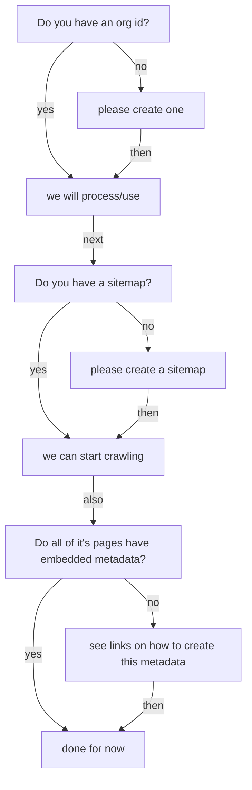

# Onboarding a new data repository
## decision-tree:

### Do you have a ROR or re3data or other organizational ID?
#### yes: please supply and we will parse it, then just ask for the fields it did not contain
#### no: please create one: with one or both of these:
* re3data.org/[suggest](https://www.re3data.org/suggest)
* ror.org/[request](https://docs.google.com/forms/d/e/1FAIpQLSdJYaMTCwS7muuTa-B_CnAtCSkKzt19lkirAKG4u7umH9Nosg/viewform)
##### as this ID can be reused much more easily than all the text

### We will need your repository's sitemap URL, do you have one?
#### yes: please provide the URL so we can crawl your metadata
#### no: more on that [here](https://github.com/ESIPFed/science-on-schema.org/blob/master/guides/GETTING-STARTED.md#sitemaps)
#### you can also provide a robots.txt to limit scraping of your metadata

### Do you provide dataset landing pages, with metadata as suggested in the ESIPFed Sci on schema.org site?
#### no: Here is a [Getting Started](https://github.com/ESIPFed/science-on-schema.org/blob/master/guides/GETTING-STARTED.md) and some [example json-LD](https://github.com/ESIPFed/science-on-schema.org/tree/master/examples/dataset) to start with
