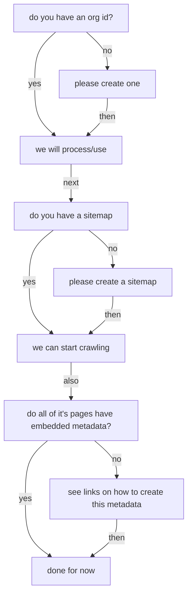

# [GeoCODES](https://www.earthcube.org/geocodes)/[DeCODER](https://www.earthcube.org/decoder)
# Onboarding a new data repository
## decision-tree:

### Do you have a ROR or re3data or other organizational ID?

Identifiers look like: e.g. for IEDA
   
re3
: `https://www.re3data.org/repository/r3d100010578`

ror:
:  `https://ror.org/02fjjnc15`

They are utilized for:  both jump starting getting your org info without having to ask several times, and to unambiguously ID your org, which will help with citation and much more.

A complete list of identifiers for our partners is [here](https://github.com/earthcube/ec/blob/master/crawl/CDF_Sites1.tsv)
  
  
- [ ] yes: please supply and we will parse it, then just ask for the fields it did not contain
    * enter here ________________
- [ ] no: please create one: with one or both of these:  
   * The guidance on how to create an identifier is here:
       * re3data.org/[suggest](https://www.re3data.org/suggest)
       * ror.org/[request](https://docs.google.com/forms/d/e/1FAIpQLSdJYaMTCwS7muuTa-B_CnAtCSkKzt19lkirAKG4u7umH9Nosg/viewform)

### We will need your repository's sitemap URL, do you have one?
#### yes: please provide so we can crawl your metadata
#### no: more on that [here](https://github.com/ESIPFed/science-on-schema.org/blob/master/guides/GETTING-STARTED.md#sitemaps)

#### you can also provide a robots.txt to limit scraping of your metadata

### Do you provide dataset landing pages, with metadata as suggested in the ESIPFed Sci on schema.org site?
#### no: here are some [examples](https://github.com/ESIPFed/science-on-schema.org/tree/master/examples/dataset) to start with

If you do not yet have schema.org Dataset metadata on your site, here is the Science On Schema [Getting Started](https://github.com/ESIPFed/science-on-schema.org/blob/master/guides/GETTING-STARTED.md) guidance. Even if you do have landing page, review the guidance.

Now, if you have  schema.org Dataset data on your site, we are going to ask you to test the information in some tools,  and provide the links in the onboarding document.

If you have not developed schema.org Dataset metadata, it can look complex, but it can be minimal, initially. But we would hope that Science On Schema can be used to more fully describe your data. If you are a partner, we can work with you on developing this information.
