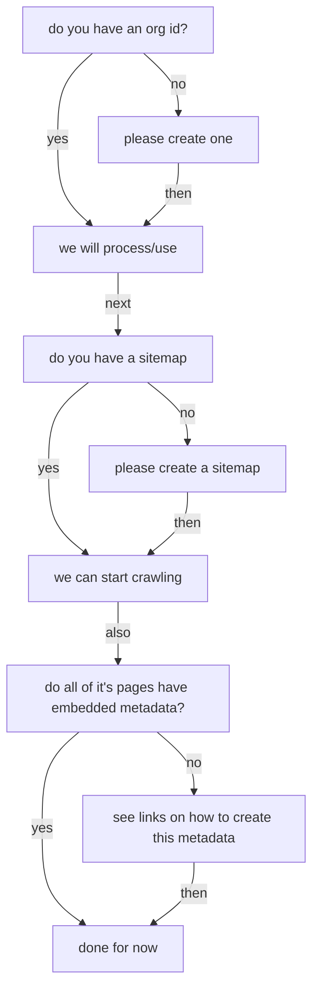

# Onboarding a new data repository
## decision-tree:

### Do you have a ROR or re3data or other organizational ID?
Identifiers look like, and are utilized for:  (NOTE: add link to actual earthcube identifier)

re3
: `re3data.org/suggest`

ror:
:  `ror.org/request`
  
  
- [ ] yes: please supply and we will parse it, then just ask for the fields it did not contain
    * enter here ________________
- [ ] no: please create one: with one or both of these:  
   * Please create an ID at:
       * re3data.org/[suggest](https://www.re3data.org/suggest)
       * ror.org/[request](https://docs.google.com/forms/d/e/1FAIpQLSdJYaMTCwS7muuTa-B_CnAtCSkKzt19lkirAKG4u7umH9Nosg/viewform)

### likely- will need your repositories sitemap url, do you have one?
#### yes: please provide so we can crawl your metadata
#### no: more on that [here](https://github.com/ESIPFed/science-on-schema.org/blob/master/guides/GETTING-STARTED.md#sitemaps)
#### you can also provide a robots.txt to limit scraping of your metadata

### Do you provide dataset landing pages, with metadata as suggested in the ESIPFed Sci on schema.org site?
#### no: here are some [examples](https://github.com/ESIPFed/science-on-schema.org/tree/master/examples/dataset) to start with
