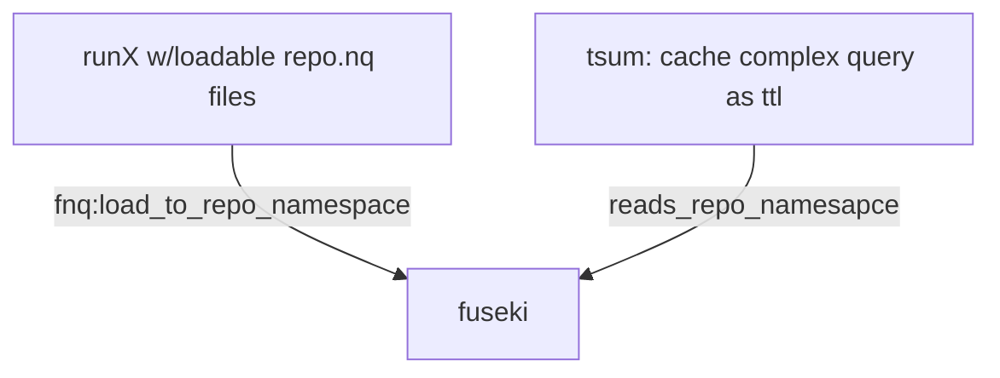

## summarization workflow

```mermaid
flowchart TD;
runX[runX w/loadable repo.nq files] -- fnq:load_to_repo_namespace --> F[fuseki];
tsum[tsum: cache complex query as ttl] -- reads_repo_namesapce --> F;

```

