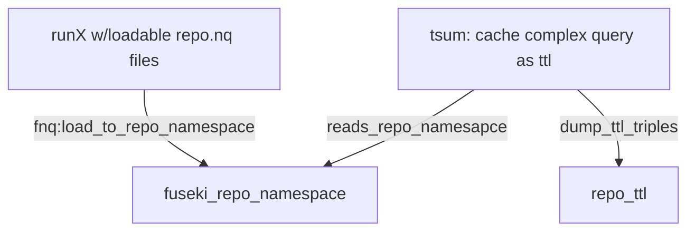

## summarization workflow

### summarize_repo.sh runs:
#### fnq.py on a repo, to load the quads into repo namespace in fuseki
#### tsum.py for repo, to read that namesapce and dump summary ttl triples

