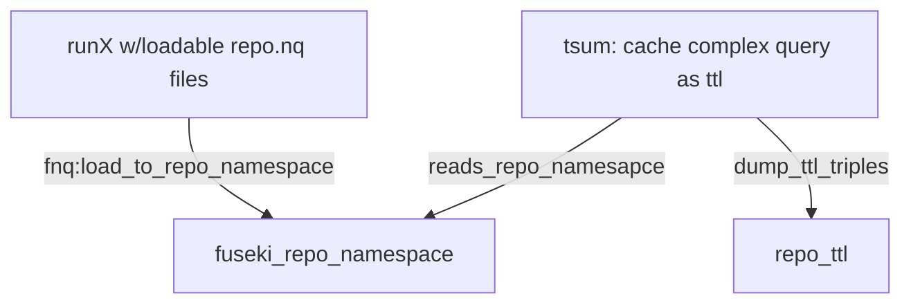
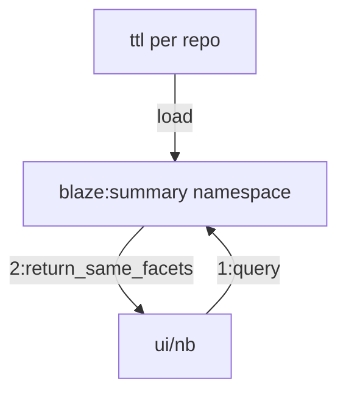
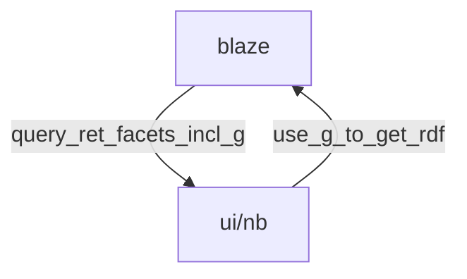

## - 1:make summary triples

### [summarize_repo.sh](https://github.com/MBcode/ec/blob/master/summarize_repo.sh) runs:
#### [fnq.py](https://github.com/MBcode/ec/blob/master/fnq.py) on a repo, to load the quads into repo namespace in fuseki
#### [tsum.py](https://github.com/MBcode/ec/blob/master/tsum.py) for repo, to read that namespace and dump summary ttl triples

  
  
  
## - 2:use for fast sparql on summary namespace

  
## - also: get RDF from endpoint
### which gets rid of need for a duplicate cache

## - ps. triples from a crawl/s
### [runX](https://github.com/gleanerio/gleaner/issues/126) 'quads' could come from gleaner or extruct crawls, now
