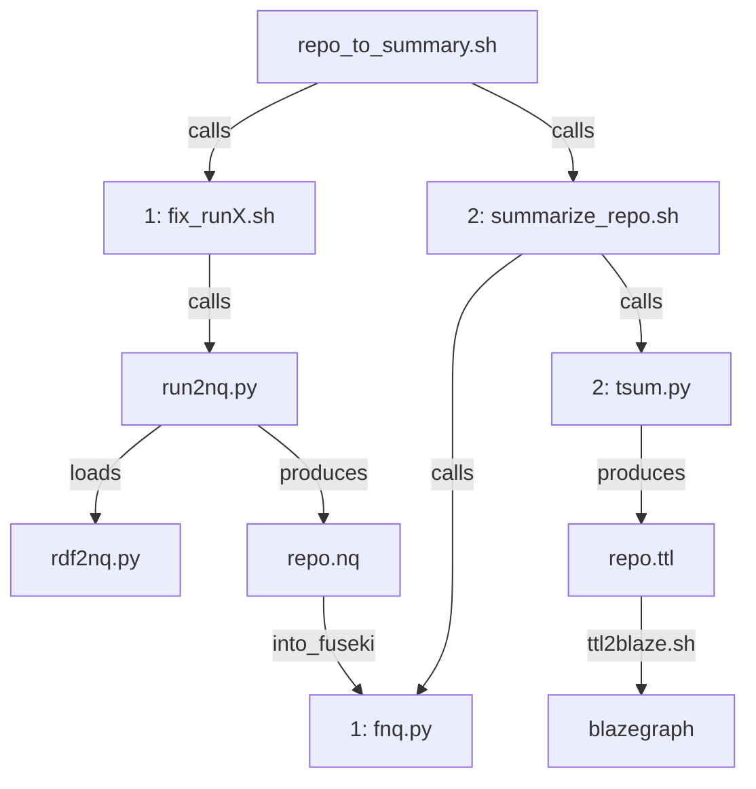

## what you call to run summarization

#### from getting (gleaner) crawler's quad/repo  through making the summary triples, and loading them

```mermaid
flowchart TD;
R2S[repo_to_summary.sh]  -- calls --> G[1: fix_runX.sh];
G -- calls --> r2n[run2nq.py] -- loads --> rdf2[rdf2nq.py];
R2S -- calls --> SR[2: summarize_repo.sh];
SR -- calls --> F1[1: fnq.py];
SR -- calls --> F2[2: tsum.py] -- produces --> RT[repo.ttl] -- ttl2blaze.sh --> B[blazegraph];
r2n -- produces --> nq[repo.nq] -- into_fuseki --> F1;
```
