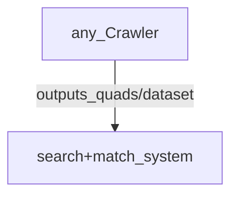

## uncoupled systems
### just passing the data, and not depending on same redundant store and it's naming practices

 
### soon I will write about having the system that does the crawling, check it's (logs for) validation
