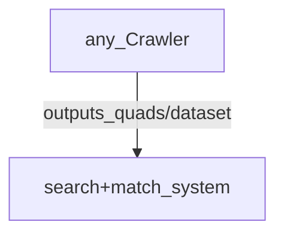

## uncoupled systems
### just passing the data, and not depending on same redundant store and it's naming practices

 
### soon I will write about having the system that does the crawling, check it's own (logs for) validation

### before that, I started to break out most of the [testing utils](https://github.com/MBcode/dc/blob/main/dct.py) that got really overblown because of the un-needed system we are about to uncouple

#### We do have other doc pages, so maybe some of that could go here:  [https://github.com/earthcube/geocodes_documentation/wiki](https://github.com/earthcube/geocodes_documentation/wiki)
