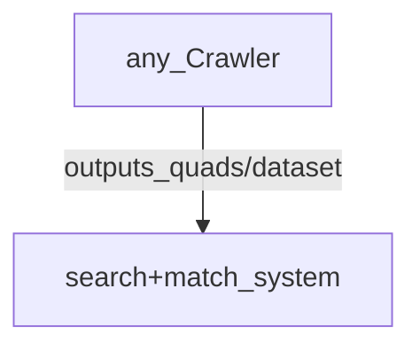

## uncoupled systems
### just passing the data, and not depending on same redundant store and it's naming practices

```mermaid
flowchart TD 
C[any_Crawler] -- outputs_quads/dataset --> S[search+match_system]
```
 
