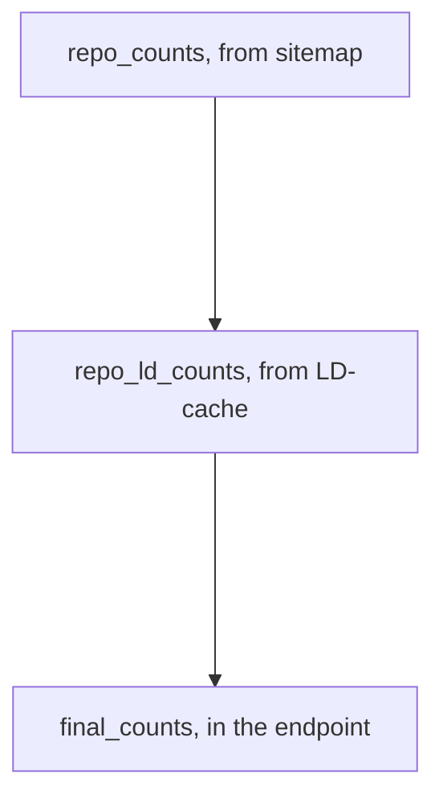
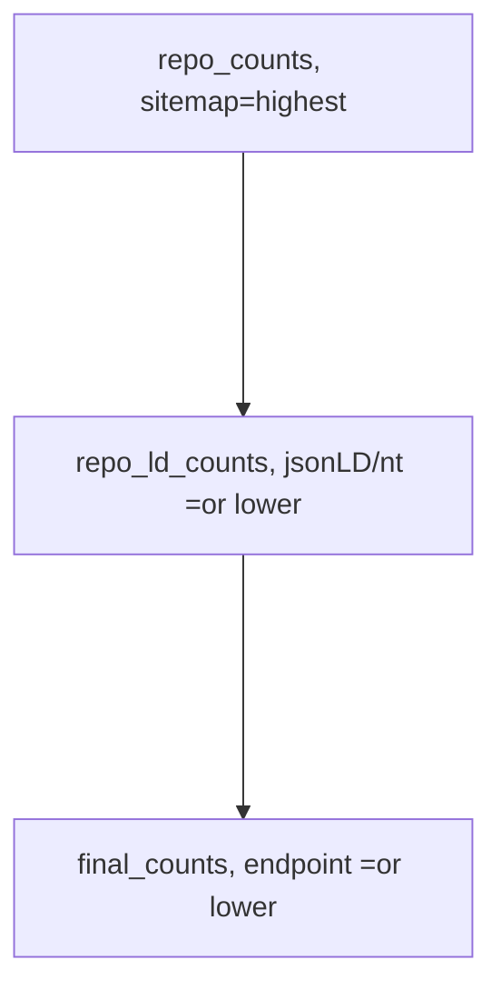

# GeoCODES ingest pipeline testing:

Update: Might be able to get which URNs went missing along with counts, btw all stages w/files names with the URN=shah UUID

Also, looks like can get some listings w/o depending on s3fs, wich is in utils now; from test/[counts](http://geocodes.ddns.net/ec/test/counts/)/bucket_files.py

Be able to 1) check how many of the expected datasets from the sitemap make it to differt stages
then 2) go back and see that some of what made it are correct/valid and similar to expected/saved test-set values  3) best way to get a test set sample

```python
ec.init_sparql()
```
```python
ec.setup_sitemap()
```


```python
ec.setup_s3fs() #now sets up web based access
```

Now can get web based count dropoffs all in one call:


```python
 dropoff,lose_s2m, lose_m2u= ec.crawl_dropoff("https://raw.githubusercontent.com/earthcube/GeoCODES-Metadata/mb_sample/metadata/Dataset/standard/sitemap.xml",
                    "https://oss.geocodes-dev.earthcube.org/citesting","http://ideational.ddns.net:3030/geocodes_demo_datasets/sparql")
 print(dropoff)
```

    INFO:root:Getting https://raw.githubusercontent.com/earthcube/GeoCODES-Metadata/mb_sample/metadata/Dataset/standard/sitemap.xml


    summoned-URNs:['09517b808d22d1e828221390c845b6edef7e7a40', '11316929f925029101493e8a05d043b0ae829559', '1c1d4cefef851335a3311a6e3f964deaab6098e6', '23006491dd1bec061f6ab39e43278123ed59e359', '261c022db9edea9e4fc025987f1826ee7a704f06', '2a328e672986c936715c52e82c519b9c34c6fafa', '40d84a8722ddae799976a0714a7af73576d7f8c0', '44999966af64df27587cae4aec4a744e51ad852b', '4af74d8dd359a14000f48c3f6a1309d39d5142ce', '5288b5aa49d11829c5ab6777bb769cba4f40bd03', '67e446d6f86ce88ead6335842a7a9d610a03b071', '7435cba44745748adfe80192c389f77d66d0e909', '7b72dec10f2359b1ab72fa3b409b4f8e691cb699', '8d045db20860bef9ddb33e856f95c31d6eca8206', '8e590ac37fd8ff4442522304057a328fad5f5098', '9a17d3fe8da1fe10866333f856986df012bff341', 'b2fb074695be7e40d5ad5d524d92bba32325249b', 'b62d103d4812ac2df9f2f148d9f4a3933b51abb3', 'bcc801ddac04636689f5bcca5dd6910ae4f548d7', 'ce020471830dc75cb1639eae403a883f9072bb60', 'd8e168385b0f8e0c562af2c185d804e6a35aa248', 'ed2951175523219d05de578b6065cea156c68545', 'f4752b57d0e5434c4452136725294f755700313c', 'fe3c7c4f7ca08495b8962e079920c06676d5a166', 'fe897ff59f2f8478c24e6d17ea28df48c3bc8f69']
    milled-URNs:['09517b808d22d1e828221390c845b6edef7e7a40', '11316929f925029101493e8a05d043b0ae829559', '1c1d4cefef851335a3311a6e3f964deaab6098e6', '23006491dd1bec061f6ab39e43278123ed59e359', '261c022db9edea9e4fc025987f1826ee7a704f06', '2a328e672986c936715c52e82c519b9c34c6fafa', '40d84a8722ddae799976a0714a7af73576d7f8c0', '44999966af64df27587cae4aec4a744e51ad852b', '4af74d8dd359a14000f48c3f6a1309d39d5142ce', '5288b5aa49d11829c5ab6777bb769cba4f40bd03', '67e446d6f86ce88ead6335842a7a9d610a03b071', '7435cba44745748adfe80192c389f77d66d0e909', '7b72dec10f2359b1ab72fa3b409b4f8e691cb699', '8d045db20860bef9ddb33e856f95c31d6eca8206', '8e590ac37fd8ff4442522304057a328fad5f5098', '9a17d3fe8da1fe10866333f856986df012bff341', 'b2fb074695be7e40d5ad5d524d92bba32325249b', 'b62d103d4812ac2df9f2f148d9f4a3933b51abb3', 'bcc801ddac04636689f5bcca5dd6910ae4f548d7', 'ce020471830dc75cb1639eae403a883f9072bb60', 'd8e168385b0f8e0c562af2c185d804e6a35aa248', 'ed2951175523219d05de578b6065cea156c68545', 'f4752b57d0e5434c4452136725294f755700313c', 'fe3c7c4f7ca08495b8962e079920c06676d5a166', 'fe897ff59f2f8478c24e6d17ea28df48c3bc8f69']
    expected-URNs:['urn:7b72dec10f2359b1ab72fa3b409b4f8e691cb699', 'urn:b2fb074695be7e40d5ad5d524d92bba32325249b', 'urn:11316929f925029101493e8a05d043b0ae829559', 'urn:9a17d3fe8da1fe10866333f856986df012bff341', 'urn:40d84a8722ddae799976a0714a7af73576d7f8c0', 'urn:4af74d8dd359a14000f48c3f6a1309d39d5142ce', 'urn:fe897ff59f2f8478c24e6d17ea28df48c3bc8f69', 'urn:b62d103d4812ac2df9f2f148d9f4a3933b51abb3', 'urn:09517b808d22d1e828221390c845b6edef7e7a40', 'urn:ce020471830dc75cb1639eae403a883f9072bb60', 'urn:f4752b57d0e5434c4452136725294f755700313c', 'urn:d8e168385b0f8e0c562af2c185d804e6a35aa248', 'urn:1c1d4cefef851335a3311a6e3f964deaab6098e6', 'urn:bcc801ddac04636689f5bcca5dd6910ae4f548d7', 'urn:67e446d6f86ce88ead6335842a7a9d610a03b071', 'urn:509e465d0793506b237cea8069c3cb2d276fe9c2', 'urn:44999966af64df27587cae4aec4a744e51ad852b', 'urn:8e590ac37fd8ff4442522304057a328fad5f5098', 'urn:8d045db20860bef9ddb33e856f95c31d6eca8206', 'urn:fe3c7c4f7ca08495b8962e079920c06676d5a166', 'urn:23006491dd1bec061f6ab39e43278123ed59e359', 'urn:5288b5aa49d11829c5ab6777bb769cba4f40bd03', 'urn:ed2951175523219d05de578b6065cea156c68545', 'urn:7435cba44745748adfe80192c389f77d66d0e909', 'urn:2a328e672986c936715c52e82c519b9c34c6fafa', 'urn:261c022db9edea9e4fc025987f1826ee7a704f06']
    summoned:25-0=>milled:25--1=>graph:26
    sitemap:10 =>summoned:25-0=>milled:25--1=>graph:26


and to spot_check the workflow against a gold standard, can also include those checks:
```python
dropoff,lose_s2m, s_check, lose_m2u, m_check= ec.spot_crawl_dropoff("https://raw.githubusercontent.com/earthcube/GeoCODES-Metadata/mb_sample/metadata/Dataset/standard/sitemap.xml",
                    "https://oss.geocodes-dev.earthcube.org/citesting","http://ideational.ddns.net:3030/geocodes_demo_datasets/sparql")
print(dropoff)
```

    INFO:root:Getting https://raw.githubusercontent.com/earthcube/GeoCODES-Metadata/mb_sample/metadata/Dataset/standard/sitemap.xml


    summoned-URNs:['09517b808d22d1e828221390c845b6edef7e7a40', '11316929f925029101493e8a05d043b0ae829559', '1c1d4cefef851335a3311a6e3f964deaab6098e6', '23006491dd1bec061f6ab39e43278123ed59e359', '261c022db9edea9e4fc025987f1826ee7a704f06', '2a328e672986c936715c52e82c519b9c34c6fafa', '40d84a8722ddae799976a0714a7af73576d7f8c0', '44999966af64df27587cae4aec4a744e51ad852b', '4af74d8dd359a14000f48c3f6a1309d39d5142ce', '5288b5aa49d11829c5ab6777bb769cba4f40bd03', '67e446d6f86ce88ead6335842a7a9d610a03b071', '7435cba44745748adfe80192c389f77d66d0e909', '7b72dec10f2359b1ab72fa3b409b4f8e691cb699', '8d045db20860bef9ddb33e856f95c31d6eca8206', '8e590ac37fd8ff4442522304057a328fad5f5098', '9a17d3fe8da1fe10866333f856986df012bff341', 'b2fb074695be7e40d5ad5d524d92bba32325249b', 'b62d103d4812ac2df9f2f148d9f4a3933b51abb3', 'bcc801ddac04636689f5bcca5dd6910ae4f548d7', 'ce020471830dc75cb1639eae403a883f9072bb60', 'd8e168385b0f8e0c562af2c185d804e6a35aa248', 'ed2951175523219d05de578b6065cea156c68545', 'f4752b57d0e5434c4452136725294f755700313c', 'fe3c7c4f7ca08495b8962e079920c06676d5a166', 'fe897ff59f2f8478c24e6d17ea28df48c3bc8f69']
    milled-URNs:['09517b808d22d1e828221390c845b6edef7e7a40', '11316929f925029101493e8a05d043b0ae829559', '1c1d4cefef851335a3311a6e3f964deaab6098e6', '23006491dd1bec061f6ab39e43278123ed59e359', '261c022db9edea9e4fc025987f1826ee7a704f06', '2a328e672986c936715c52e82c519b9c34c6fafa', '40d84a8722ddae799976a0714a7af73576d7f8c0', '44999966af64df27587cae4aec4a744e51ad852b', '4af74d8dd359a14000f48c3f6a1309d39d5142ce', '5288b5aa49d11829c5ab6777bb769cba4f40bd03', '67e446d6f86ce88ead6335842a7a9d610a03b071', '7435cba44745748adfe80192c389f77d66d0e909', '7b72dec10f2359b1ab72fa3b409b4f8e691cb699', '8d045db20860bef9ddb33e856f95c31d6eca8206', '8e590ac37fd8ff4442522304057a328fad5f5098', '9a17d3fe8da1fe10866333f856986df012bff341', 'b2fb074695be7e40d5ad5d524d92bba32325249b', 'b62d103d4812ac2df9f2f148d9f4a3933b51abb3', 'bcc801ddac04636689f5bcca5dd6910ae4f548d7', 'ce020471830dc75cb1639eae403a883f9072bb60', 'd8e168385b0f8e0c562af2c185d804e6a35aa248', 'ed2951175523219d05de578b6065cea156c68545', 'f4752b57d0e5434c4452136725294f755700313c', 'fe3c7c4f7ca08495b8962e079920c06676d5a166', 'fe897ff59f2f8478c24e6d17ea28df48c3bc8f69']
    expected-URNs:['urn:7b72dec10f2359b1ab72fa3b409b4f8e691cb699', 'urn:b2fb074695be7e40d5ad5d524d92bba32325249b', 'urn:11316929f925029101493e8a05d043b0ae829559', 'urn:9a17d3fe8da1fe10866333f856986df012bff341', 'urn:40d84a8722ddae799976a0714a7af73576d7f8c0', 'urn:4af74d8dd359a14000f48c3f6a1309d39d5142ce', 'urn:fe897ff59f2f8478c24e6d17ea28df48c3bc8f69', 'urn:b62d103d4812ac2df9f2f148d9f4a3933b51abb3', 'urn:09517b808d22d1e828221390c845b6edef7e7a40', 'urn:ce020471830dc75cb1639eae403a883f9072bb60', 'urn:f4752b57d0e5434c4452136725294f755700313c', 'urn:d8e168385b0f8e0c562af2c185d804e6a35aa248', 'urn:1c1d4cefef851335a3311a6e3f964deaab6098e6', 'urn:bcc801ddac04636689f5bcca5dd6910ae4f548d7', 'urn:67e446d6f86ce88ead6335842a7a9d610a03b071', 'urn:509e465d0793506b237cea8069c3cb2d276fe9c2', 'urn:44999966af64df27587cae4aec4a744e51ad852b', 'urn:8e590ac37fd8ff4442522304057a328fad5f5098', 'urn:8d045db20860bef9ddb33e856f95c31d6eca8206', 'urn:fe3c7c4f7ca08495b8962e079920c06676d5a166', 'urn:23006491dd1bec061f6ab39e43278123ed59e359', 'urn:5288b5aa49d11829c5ab6777bb769cba4f40bd03', 'urn:ed2951175523219d05de578b6065cea156c68545', 'urn:7435cba44745748adfe80192c389f77d66d0e909', 'urn:2a328e672986c936715c52e82c519b9c34c6fafa', 'urn:261c022db9edea9e4fc025987f1826ee7a704f06']
    summoned:25-0=>milled:25--1=>graph:26
    read_sd:https://raw.githubusercontent.com/earthcube/GeoCODES-Metadata/mb_sample/metadata/Dataset/standard/milled/geocodes_demo_datasets/09517b808d22d1e828221390c845b6edef7e7a40.rdf
    read_sd:https://oss.geocodes-dev.earthcube.org/citesting/milled/geocodes_demo_datasets/09517b808d22d1e828221390c845b6edef7e7a40.rdf
    read_sd:https://raw.githubusercontent.com/earthcube/GeoCODES-Metadata/mb_sample/metadata/Dataset/standard/milled/geocodes_demo_datasets/11316929f925029101493e8a05d043b0ae829559.rdf
    read_sd:https://oss.geocodes-dev.earthcube.org/citesting/milled/geocodes_demo_datasets/11316929f925029101493e8a05d043b0ae829559.rdf
    read_sd:https://raw.githubusercontent.com/earthcube/GeoCODES-Metadata/mb_sample/metadata/Dataset/standard/milled/geocodes_demo_datasets/1c1d4cefef851335a3311a6e3f964deaab6098e6.rdf
    read_sd:https://oss.geocodes-dev.earthcube.org/citesting/milled/geocodes_demo_datasets/1c1d4cefef851335a3311a6e3f964deaab6098e6.rdf
    read_sd:https://raw.githubusercontent.com/earthcube/GeoCODES-Metadata/mb_sample/metadata/Dataset/standard/milled/geocodes_demo_datasets/23006491dd1bec061f6ab39e43278123ed59e359.rdf
    read_sd:https://oss.geocodes-dev.earthcube.org/citesting/milled/geocodes_demo_datasets/23006491dd1bec061f6ab39e43278123ed59e359.rdf
    read_sd:https://raw.githubusercontent.com/earthcube/GeoCODES-Metadata/mb_sample/metadata/Dataset/standard/milled/geocodes_demo_datasets/261c022db9edea9e4fc025987f1826ee7a704f06.rdf
    read_sd:https://oss.geocodes-dev.earthcube.org/citesting/milled/geocodes_demo_datasets/261c022db9edea9e4fc025987f1826ee7a704f06.rdf
    read_sd:https://raw.githubusercontent.com/earthcube/GeoCODES-Metadata/mb_sample/metadata/Dataset/standard/milled/geocodes_demo_datasets/2a328e672986c936715c52e82c519b9c34c6fafa.rdf
    read_sd:https://oss.geocodes-dev.earthcube.org/citesting/milled/geocodes_demo_datasets/2a328e672986c936715c52e82c519b9c34c6fafa.rdf
    read_sd:https://raw.githubusercontent.com/earthcube/GeoCODES-Metadata/mb_sample/metadata/Dataset/standard/milled/geocodes_demo_datasets/40d84a8722ddae799976a0714a7af73576d7f8c0.rdf
    read_sd:https://oss.geocodes-dev.earthcube.org/citesting/milled/geocodes_demo_datasets/40d84a8722ddae799976a0714a7af73576d7f8c0.rdf
    read_sd:https://raw.githubusercontent.com/earthcube/GeoCODES-Metadata/mb_sample/metadata/Dataset/standard/milled/geocodes_demo_datasets/44999966af64df27587cae4aec4a744e51ad852b.rdf
    read_sd:https://oss.geocodes-dev.earthcube.org/citesting/milled/geocodes_demo_datasets/44999966af64df27587cae4aec4a744e51ad852b.rdf
    read_sd:https://raw.githubusercontent.com/earthcube/GeoCODES-Metadata/mb_sample/metadata/Dataset/standard/milled/geocodes_demo_datasets/4af74d8dd359a14000f48c3f6a1309d39d5142ce.rdf
    read_sd:https://oss.geocodes-dev.earthcube.org/citesting/milled/geocodes_demo_datasets/4af74d8dd359a14000f48c3f6a1309d39d5142ce.rdf
    read_sd:https://raw.githubusercontent.com/earthcube/GeoCODES-Metadata/mb_sample/metadata/Dataset/standard/milled/geocodes_demo_datasets/5288b5aa49d11829c5ab6777bb769cba4f40bd03.rdf
    read_sd:https://oss.geocodes-dev.earthcube.org/citesting/milled/geocodes_demo_datasets/5288b5aa49d11829c5ab6777bb769cba4f40bd03.rdf
    read_sd:https://raw.githubusercontent.com/earthcube/GeoCODES-Metadata/mb_sample/metadata/Dataset/standard/milled/geocodes_demo_datasets/67e446d6f86ce88ead6335842a7a9d610a03b071.rdf
    read_sd:https://oss.geocodes-dev.earthcube.org/citesting/milled/geocodes_demo_datasets/67e446d6f86ce88ead6335842a7a9d610a03b071.rdf
    read_sd:https://raw.githubusercontent.com/earthcube/GeoCODES-Metadata/mb_sample/metadata/Dataset/standard/milled/geocodes_demo_datasets/7435cba44745748adfe80192c389f77d66d0e909.rdf
    read_sd:https://oss.geocodes-dev.earthcube.org/citesting/milled/geocodes_demo_datasets/7435cba44745748adfe80192c389f77d66d0e909.rdf
    read_sd:https://raw.githubusercontent.com/earthcube/GeoCODES-Metadata/mb_sample/metadata/Dataset/standard/milled/geocodes_demo_datasets/7b72dec10f2359b1ab72fa3b409b4f8e691cb699.rdf
    read_sd:https://oss.geocodes-dev.earthcube.org/citesting/milled/geocodes_demo_datasets/7b72dec10f2359b1ab72fa3b409b4f8e691cb699.rdf
    read_sd:https://raw.githubusercontent.com/earthcube/GeoCODES-Metadata/mb_sample/metadata/Dataset/standard/milled/geocodes_demo_datasets/8d045db20860bef9ddb33e856f95c31d6eca8206.rdf
    read_sd:https://oss.geocodes-dev.earthcube.org/citesting/milled/geocodes_demo_datasets/8d045db20860bef9ddb33e856f95c31d6eca8206.rdf
    read_sd:https://raw.githubusercontent.com/earthcube/GeoCODES-Metadata/mb_sample/metadata/Dataset/standard/milled/geocodes_demo_datasets/8e590ac37fd8ff4442522304057a328fad5f5098.rdf
    read_sd:https://oss.geocodes-dev.earthcube.org/citesting/milled/geocodes_demo_datasets/8e590ac37fd8ff4442522304057a328fad5f5098.rdf
    read_sd:https://raw.githubusercontent.com/earthcube/GeoCODES-Metadata/mb_sample/metadata/Dataset/standard/milled/geocodes_demo_datasets/9a17d3fe8da1fe10866333f856986df012bff341.rdf
    read_sd:https://oss.geocodes-dev.earthcube.org/citesting/milled/geocodes_demo_datasets/9a17d3fe8da1fe10866333f856986df012bff341.rdf
    read_sd:https://raw.githubusercontent.com/earthcube/GeoCODES-Metadata/mb_sample/metadata/Dataset/standard/milled/geocodes_demo_datasets/b2fb074695be7e40d5ad5d524d92bba32325249b.rdf
    read_sd:https://oss.geocodes-dev.earthcube.org/citesting/milled/geocodes_demo_datasets/b2fb074695be7e40d5ad5d524d92bba32325249b.rdf
    read_sd:https://raw.githubusercontent.com/earthcube/GeoCODES-Metadata/mb_sample/metadata/Dataset/standard/milled/geocodes_demo_datasets/b62d103d4812ac2df9f2f148d9f4a3933b51abb3.rdf
    read_sd:https://oss.geocodes-dev.earthcube.org/citesting/milled/geocodes_demo_datasets/b62d103d4812ac2df9f2f148d9f4a3933b51abb3.rdf
    read_sd:https://raw.githubusercontent.com/earthcube/GeoCODES-Metadata/mb_sample/metadata/Dataset/standard/milled/geocodes_demo_datasets/bcc801ddac04636689f5bcca5dd6910ae4f548d7.rdf
    read_sd:https://oss.geocodes-dev.earthcube.org/citesting/milled/geocodes_demo_datasets/bcc801ddac04636689f5bcca5dd6910ae4f548d7.rdf
    read_sd:https://raw.githubusercontent.com/earthcube/GeoCODES-Metadata/mb_sample/metadata/Dataset/standard/milled/geocodes_demo_datasets/ce020471830dc75cb1639eae403a883f9072bb60.rdf
    read_sd:https://oss.geocodes-dev.earthcube.org/citesting/milled/geocodes_demo_datasets/ce020471830dc75cb1639eae403a883f9072bb60.rdf
    read_sd:https://raw.githubusercontent.com/earthcube/GeoCODES-Metadata/mb_sample/metadata/Dataset/standard/milled/geocodes_demo_datasets/d8e168385b0f8e0c562af2c185d804e6a35aa248.rdf
    read_sd:https://oss.geocodes-dev.earthcube.org/citesting/milled/geocodes_demo_datasets/d8e168385b0f8e0c562af2c185d804e6a35aa248.rdf
    read_sd:https://raw.githubusercontent.com/earthcube/GeoCODES-Metadata/mb_sample/metadata/Dataset/standard/milled/geocodes_demo_datasets/ed2951175523219d05de578b6065cea156c68545.rdf
    read_sd:https://oss.geocodes-dev.earthcube.org/citesting/milled/geocodes_demo_datasets/ed2951175523219d05de578b6065cea156c68545.rdf
    read_sd:https://raw.githubusercontent.com/earthcube/GeoCODES-Metadata/mb_sample/metadata/Dataset/standard/milled/geocodes_demo_datasets/f4752b57d0e5434c4452136725294f755700313c.rdf
    read_sd:https://oss.geocodes-dev.earthcube.org/citesting/milled/geocodes_demo_datasets/f4752b57d0e5434c4452136725294f755700313c.rdf
    read_sd:https://raw.githubusercontent.com/earthcube/GeoCODES-Metadata/mb_sample/metadata/Dataset/standard/milled/geocodes_demo_datasets/fe3c7c4f7ca08495b8962e079920c06676d5a166.rdf
    read_sd:https://oss.geocodes-dev.earthcube.org/citesting/milled/geocodes_demo_datasets/fe3c7c4f7ca08495b8962e079920c06676d5a166.rdf
    read_sd:https://raw.githubusercontent.com/earthcube/GeoCODES-Metadata/mb_sample/metadata/Dataset/standard/milled/geocodes_demo_datasets/fe897ff59f2f8478c24e6d17ea28df48c3bc8f69.rdf
    read_sd:https://oss.geocodes-dev.earthcube.org/citesting/milled/geocodes_demo_datasets/fe897ff59f2f8478c24e6d17ea28df48c3bc8f69.rdf
    sitemap:10 =>summoned:25-0=>milled:25--1=>graph:26

```python
print(f'check those that did not make it from summoned to milled:{s_check}')
print(f'check those that did not make it from milled to graph:{m_check}')
```

    check those that did not make it from summoned to milled:[]
    check those that did not make it from milled to graph:[True, True, True, True, True, True, True, True, True, True, True, True, True, True, True, True, True, True, True, True, True, True, True, True, True]


This above can be done over every sitemap, and m_check will still work

If many sitemaps go into the same graph in one run, use the last part of this section to split them out:


```python
breakdown= ec.get_graph_per_repo()
print(breakdown)
```

    got:290425 graphs
          3 milled:geocodes_demo_datasets
          5 milled:amgeo
         83 milled:iris
        182 milled:neon
        697 milled:lipidverse
        842 milled:usap-dc
        892 milled:designsafe
       1379 milled:linked.earth
       1649 milled:r2r
       1806 milled:cchdo
       1823 milled:earthchem
       2615 milled:opentopography
       5646 milled:hydroshare
       7807 milled:edi
      10793 milled:iedadata
      12743 milled:magic
      12902 milled:bco-dmo
      13379 milled:ucar

## all of the above should be able to replace all the original counts code below

# 1) Checking counts along the way:

repo_counts(from sitemap) -> repo_ld_counts(from LD-cache) -> final_counts(in the endpoint)



Then unit/end-to-end spot testing of crawl products, to check that code changes don't change outputs

#Load the github.com/earthcube/earthcube_utilities 
 for now the staging version


```python
%load_ext rpy2.ipython
%load_ext google.colab.data_table
import httpimport
with httpimport.github_repo('MBcode', 'ec'):
  import ec
```

# Start by seeing how many records are expected from each repository
To be harvested by google-datasetsearch or GeoCODES only happens if the repository has a 'sitemap.xml' listing the dataset landing pages, which have jsonld in them, that they want indexed, so the search engine can find dataset resources of interest So we start by crawling the sitemaps, (but just this time) we will only record the number of records, so we can know how many to expect from each repository, during in the next parts of the ingestion pipeline


```python
named_sitemaps={ "ssdb.iodp": "https://ssdb.iodp.org/dataset/sitemap.xml",
#"balto": "http://balto.opendap.org/opendap/site_map.txt ",
"linked.earth": "http://wiki.linked.earth/sitemap.xml",
"lipdverse": "https://lipdverse.org/sitemap.xml",
"iris": "http://ds.iris.edu/files/sitemap.xml",
"unavco": "https://www.unavco.org/data/doi/sitemap.xml",
"ucar": "https://data.ucar.edu/sitemap.xml",
"opencoredata": "http://opencoredata.org/sitemap.xml",
"magic": "https://www2.earthref.org/MagIC/contributions.sitemap.xml",
#"neotomadb": "http://data.neotomadb.org/sitemap.xml",
"earthchem": "https://ecl.earthchem.org/sitemap.xml",
#"xdomes": "https://xdomes.tamucc.edu/srr/sensorML/sitemap.xml",
#"neon": "https://geodex.org/neon_prodcodes_sm.xml",
"designsafe": "https://www.designsafe-ci.org/sitemap.xml ",
"unidata": "https://www.unidata.ucar.edu/sitemap.xml",
"r2r": "https://service-dev.rvdata.us/api/sitemap/",
"geocodes_demo_dataset": "https://raw.githubusercontent.com/earthcube/GeoCODES-Metadata/gh-pages/metadata/Dataset/sitemap.xml",
"usap-dc": "https://www.usap-dc.org/view/dataset/sitemap.xml",
"cchodo": "https://cchdo.ucsd.edu/sitemap.xml",
"amgeo": "https://amgeo-dev.colorado.edu/sitemap.xml"}

```


```python
sitemaps=list(named_sitemaps.values())
repos=list(named_sitemaps.keys())
#sitemaps, repos
```


```python
ec.setup_sitemap()
```


```python
#sitemaps_count = ec.sitemaps_count(sitemaps)
#sitemaps_count  #will used cached values for now
```


```python
sitemap_count
```


    {'http://datadiscoverystudio.org/sitemap/CinergiSiteIndex.xml': 0,
     'http://ds.iris.edu/files/sitemap.xml': 0,
     'http://opencoredata.org/sitemap.xml': 83388,
     'http://wiki.linked.earth/sitemap.xml': 18634,
     'https://cchdo.ucsd.edu/sitemap.xml': 5040,
     'https://data.ucar.edu/sitemap.xml': 17005,
     'https://ecl.earthchem.org/sitemap.xml': 920,
     'https://geodex.org/neon_prodcodes_sm.xml': 0,
     'https://lipdverse.org/sitemap.xml': 704,
     'https://object.cloud.sdsc.edu/v1/AUTH_85f46aa78936477d8e71b186269414e8/gleaner-summoned': 0,
     'https://raw.githubusercontent.com/earthcube/GeoCODES-Metadata/gh-pages/metadata/Dataset/sitemap.xml': 0,
     'https://service-dev.rvdata.us/api/sitemap/': 0,
     'https://ssdb.iodp.org/dataset/sitemap.xml': 25241,
     'https://www.unavco.org/data/doi/sitemap.xml': 0,
     'https://www.unidata.ucar.edu/sitemap.xml': 211,
     'https://www.usap-dc.org/view/dataset/sitemap.xml': 0,
     'https://www2.earthref.org/MagIC/contributions.sitemap.xml': 0,
     'https://xdomes.tamucc.edu/srr/sensorML/sitemap.xml': 0}


# Next see how many made it into our LinkedData-cache
Once we capture the jsonld from each landing page, we cache that LinkedData as is, and then in another RDF format: .nt ntriples, that is easier to concatenate and to load into a triplestore


```python
ec.setup_s3fs()
```


```python
import s3fs
```


```python
oss = s3fs.S3FileSystem(
      anon=True,
      key="",
      secret="",
      client_kwargs = {"endpoint_url":"https://oss.geodex.org"}
   )
```


```python
summoned =oss.ls('gleaner/summoned')
milled =oss.ls('gleaner/milled')
```


```python
for repo in summoned:
  fa=oss.ls(repo)
  fnum=len(fa)
  print(f'repo:{repo} has {fnum} files')
```

    repo:gleaner/summoned/amgeo has 5 files
    repo:gleaner/summoned/aquadocs has 1 files
    repo:gleaner/summoned/bco-dmo has 13221 files
    repo:gleaner/summoned/bcodmo has 12484 files
    repo:gleaner/summoned/cchdo has 4235 files
    repo:gleaner/summoned/designsafe has 352 files
    repo:gleaner/summoned/earthchem has 1549 files
    repo:gleaner/summoned/edi has 14338 files
    repo:gleaner/summoned/geocodes_demo_datasets has 8 files
    repo:gleaner/summoned/getiedadataorg has 7206 files
    repo:gleaner/summoned/hydroshare has 15297 files
    repo:gleaner/summoned/ieda has 7774 files
    repo:gleaner/summoned/iedadata has 9347 files
    repo:gleaner/summoned/iris has 63 files
    repo:gleaner/summoned/linked.earth has 696 files
    repo:gleaner/summoned/lipdverse has 698 files
    repo:gleaner/summoned/magic has 10725 files
    repo:gleaner/summoned/neon has 181 files
    repo:gleaner/summoned/ocd has 104951 files
    repo:gleaner/summoned/opencoredata has 5894 files
    repo:gleaner/summoned/opentopo has 666 files
    repo:gleaner/summoned/opentopography has 702 files
    repo:gleaner/summoned/r2r has 1 files
    repo:gleaner/summoned/ssdb has 24124 files
    repo:gleaner/summoned/ssdb.iodp has 25225 files
    repo:gleaner/summoned/ucar has 1 files
    repo:gleaner/summoned/unavco has 13022 files
    repo:gleaner/summoned/usap-dc has 880 files
    repo:gleaner/summoned/wikilinkedearth has 1 files
    repo:gleaner/summoned/wwwbco-dmoorg has 11468 files
    repo:gleaner/summoned/wwwhydroshareorg has 4195 files


# Finally see how many get into the triplestore that backs 

Each dataset landing page's embeded ld+json jsonld record is put into it's own graph withen the store The graph is labeled with a UniversalResourceName [URN](https://en.wikipedia.org/wiki/Uniform_Resource_Name) which is made with a template of type urn:{type}:{repo}:... So we collect all the URNs, and count how many there are for each repository If we are very lucky, the sitemap count = LD-cache count = this count, but loosing a few from errors does happen


```python
ec.init_sparql()
df=ec.get_graphs()
```


```python
df
```

    Warning: total number of rows (290425) exceeds max_rows (20000). Falling back to pandas display.


  <div id="df-3bca6589-dbb3-43ac-93b9-2622b67ba66b">
    <div class="colab-df-container">
      <div>
<table border="1" class="dataframe">
  <thead>
    <tr style="text-align: right;">
      <th></th>
      <th>g</th>
    </tr>
  </thead>
  <tbody>
    <tr>
      <th>0</th>
      <td>urn:gleaner2:milled:opentopography:0047cda277b...</td>
    </tr>
    <tr>
      <th>1</th>
      <td>urn:gleaner2:milled:opentopography:00845ce0c33...</td>
    </tr>
    <tr>
      <th>2</th>
      <td>urn:gleaner2:milled:opentopography:008970cbb2d...</td>
    </tr>
    <tr>
      <th>3</th>
      <td>urn:gleaner2:milled:opentopography:00b839b8c22...</td>
    </tr>
    <tr>
      <th>4</th>
      <td>urn:gleaner2:milled:opentopography:01138abe87a...</td>
    </tr>
    <tr>
      <th>...</th>
      <td>...</td>
    </tr>
    <tr>
      <th>290420</th>
      <td>urn:gleaner:prov:r2r:ff91af0a990b49c6fa7cd71f1...</td>
    </tr>
    <tr>
      <th>290421</th>
      <td>urn:gleaner:prov:r2r:ffc3cd385505936a2df73626c...</td>
    </tr>
    <tr>
      <th>290422</th>
      <td>urn:gleaner:prov:r2r:ffc9b039d7a4c355a8cadf681...</td>
    </tr>
    <tr>
      <th>290423</th>
      <td>urn:gleaner:prov:r2r:ffdacfad983e5c8d8b0be4e87...</td>
    </tr>
    <tr>
      <th>290424</th>
      <td>http://www.bigdata.com/rdf#nullGraph</td>
    </tr>
  </tbody>
</table>
<p>290425 rows × 1 columns</p>


```python
#will do in pandas, but 1st pass was w/csv dump, like:
df.to_csv("graphs.csv")
```


```python
repoCounts=ec.os_system_("cut -d':' -f3,4 graphs.csv | grep milled | sort | uniq -c |sort -n")
repoCounts
```


    '      3 milled:geocodes_demo_datasets\n      5 milled:amgeo\n     83 milled:iris\n    182 milled:neon\n    697 milled:lipidverse\n    842 milled:usap-dc\n    892 milled:designsafe\n   1379 milled:linked.earth\n   1649 milled:r2r\n   1806 milled:cchdo\n   1823 milled:earthchem\n   2615 milled:opentopography\n   5646 milled:hydroshare\n   7807 milled:edi\n  10793 milled:iedadata\n  12743 milled:magic\n  12902 milled:bco-dmo\n  13379 milled:ucar\n'


```python
!cut -d':' -f3,4 graphs.csv | grep milled | sort | uniq -c |sort -n 
```

          3 milled:geocodes_demo_datasets
          5 milled:amgeo
         83 milled:iris
        182 milled:neon
        697 milled:lipidverse
        842 milled:usap-dc
        892 milled:designsafe
       1379 milled:linked.earth
       1649 milled:r2r
       1806 milled:cchdo
       1823 milled:earthchem
       2615 milled:opentopography
       5646 milled:hydroshare
       7807 milled:edi
      10793 milled:iedadata
      12743 milled:magic
      12902 milled:bco-dmo
      13379 milled:ucar


# Put in counts in store, so can query to get a table of the falloff between stages

repo_counts(from sitemap) -> repo_ld_counts(from LD-cache) -> final_counts(in the endpoint)


```python
#get all counts from sitemap/etc caches
repo_counts,repo_ld_counts,final_counts,      repo_df_loc =ec.repos2counts(repos)
```

    Getting http://geocodes.ddns.net/ec/crawl/sitemaps/ssdb.iodp.xml
    Getting http://geocodes.ddns.net/ec/crawl/sitemaps/linked.earth.xml
    Getting http://geocodes.ddns.net/ec/crawl/sitemaps/lipdverse.xml
    Getting http://geocodes.ddns.net/ec/crawl/sitemaps/iris.xml
    Getting http://geocodes.ddns.net/ec/crawl/sitemaps/unavco.xml
    Getting http://geocodes.ddns.net/ec/crawl/sitemaps/ucar.xml
    Getting https://opencoredata.org/sitemap_1.xml
    Getting https://opencoredata.org/sitemap_2.xml
    Getting https://opencoredata.org/sitemap_3.xml
    Getting https://opencoredata.org/sitemap_0.xml
    Getting http://geocodes.ddns.net/ec/crawl/sitemaps/magic.xml
    Getting http://geocodes.ddns.net/ec/crawl/sitemaps/earthchem.xml
    Getting http://geocodes.ddns.net/ec/crawl/sitemaps/designsafe.xml
    Getting http://geocodes.ddns.net/ec/crawl/sitemaps/unidata.xml
    Getting http://geocodes.ddns.net/ec/crawl/sitemaps/r2r.xml
    Getting http://geocodes.ddns.net/ec/crawl/sitemaps/geocodes_demo_dataset.xml
    Getting http://geocodes.ddns.net/ec/crawl/sitemaps/usap-dc.xml
    Getting http://geocodes.ddns.net/ec/crawl/sitemaps/cchodo.xml
    Getting http://geocodes.ddns.net/ec/crawl/sitemaps/amgeo.xml


```python
repo_counts
```


    {'amgeo': 5,
     'cchodo': 2520,
     'designsafe': 1638,
     'earthchem': 920,
     'geocodes_demo_dataset': 8,
     'iris': 28,
     'linked.earth': 18634,
     'lipdverse': 704,
     'magic': 4263,
     'opencoredata': 83388,
     'r2r': 44007,
     'ssdb.iodp': 25226,
     'ucar': 17506,
     'unavco': 5643,
     'unidata': 202,
     'usap-dc': 889}


```python
repo_ld_counts
```


    {'amgeo': '5',
     'aquadocs': '1',
     'bco-dmo': '13221',
     'bcodmo': '12484',
     'cchdo': '4235',
     'designsafe': '352',
     'earthchem': '1549',
     'edi': '14338',
     'geocodes_demo_datasets': '8',
     'getiedadataorg': '7206',
     'hydroshare': '15297',
     'ieda': '7774',
     'iedadata': '9347',
     'iris': '63',
     'linked.earth': '696',
     'lipdverse': '698',
     'magic': '10725',
     'neon': '181',
     'ocd': '104951',
     'opencoredata': '5894',
     'opentopo': '666',
     'opentopography': '702',
     'r2r': '1',
     'ssdb': '24124',
     'ssdb.iodp': '25225',
     'ucar': '1',
     'unavco': '13022',
     'usap-dc': '880',
     'wikilinkedearth': '1',
     'wwwbco-dmoorg': '11468',
     'wwwhydroshareorg': '4195'}


```python
final_counts
```


    {'': '7807',
     'adata': '10793',
     'agic': '12743',
     'amgeo': '5',
     'ap-dc': '842',
     'arthchem': '1823',
     'bco-dmo': '12902',
     'car': '13379',
     'cchdo': '1806',
     'geocodes_demo_datasets': '3',
     'hydroshare': '5646',
     'ignsafe': '892',
     'ked.earth': '1379',
     'pentopography': '2615',
     'pidverse': '697',
     'r2r': '1649',
     'ris': '83'}


```python
cmp2=ec.merge_dict_list(repo_counts,repo_ld_counts)
#cmp2
```


```python
#Now bring the expected, LD-cache, and final endpoint counts 
# into one comparable place, for each repo ..
cmp_all_stages=ec.merge_dict_list(cmp2,final_counts)
cmp_all_stages
```


    defaultdict(list,
                {'': ['7807'],
                 'adata': ['10793'],
                 'agic': ['12743'],
                 'amgeo': [[5, '5'], '5'],
                 'ap-dc': ['842'],
                 'aquadocs': [['1']],
                 'arthchem': ['1823'],
                 'bco-dmo': [['13221'], '12902'],
                 'bcodmo': [['12484']],
                 'car': ['13379'],
                 'cchdo': [['4235'], '1806'],
                 'cchodo': [[2520]],
                 'designsafe': [[1638, '352']],
                 'earthchem': [[920, '1549']],
                 'edi': [['14338']],
                 'geocodes_demo_dataset': [[8]],
                 'geocodes_demo_datasets': [['8'], '3'],
                 'getiedadataorg': [['7206']],
                 'hydroshare': [['15297'], '5646'],
                 'ieda': [['7774']],
                 'iedadata': [['9347']],
                 'ignsafe': ['892'],
                 'iris': [[28, '63']],
                 'ked.earth': ['1379'],
                 'linked.earth': [[18634, '696']],
                 'lipdverse': [[704, '698']],
                 'magic': [[4263, '10725']],
                 'neon': [['181']],
                 'ocd': [['104951']],
                 'opencoredata': [[83388, '5894']],
                 'opentopo': [['666']],
                 'opentopography': [['702']],
                 'pentopography': ['2615'],
                 'pidverse': ['697'],
                 'r2r': [[44007, '1'], '1649'],
                 'ris': ['83'],
                 'ssdb': [['24124']],
                 'ssdb.iodp': [[25226, '25225']],
                 'ucar': [[17506, '1']],
                 'unavco': [[5643, '13022']],
                 'unidata': [[202]],
                 'usap-dc': [[889, '880']],
                 'wikilinkedearth': [['1']],
                 'wwwbco-dmoorg': [['11468']],
                 'wwwhydroshareorg': [['4195']]})


