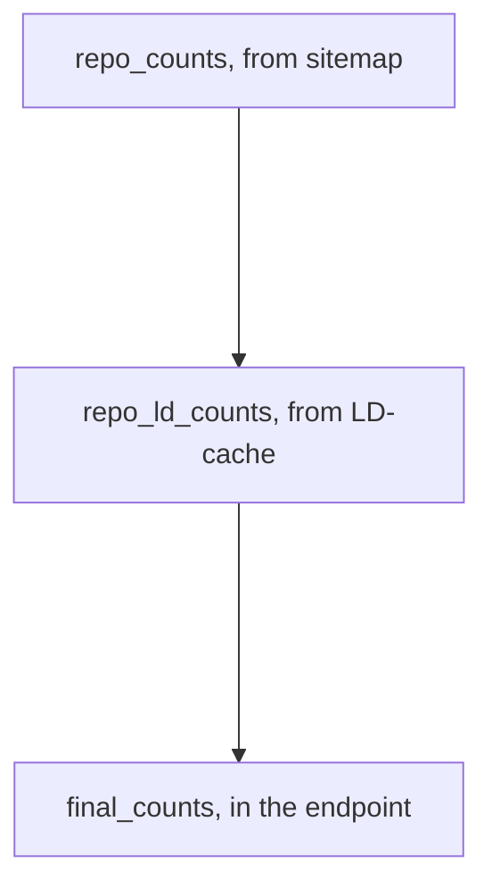
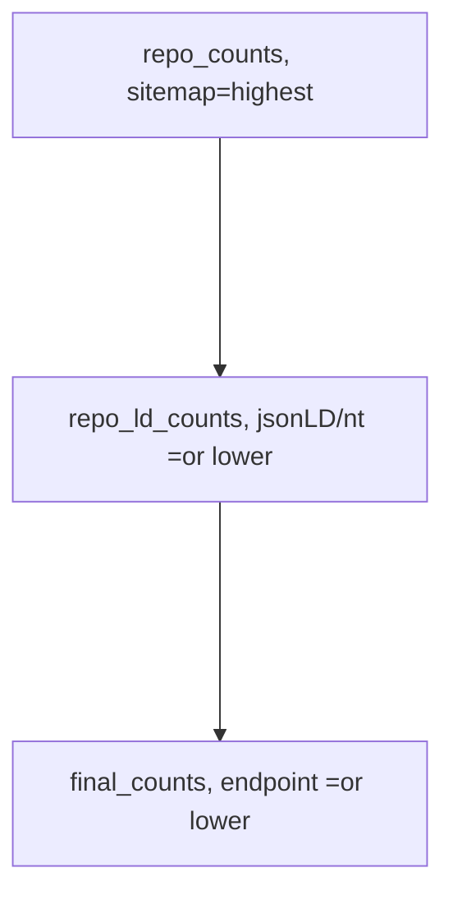
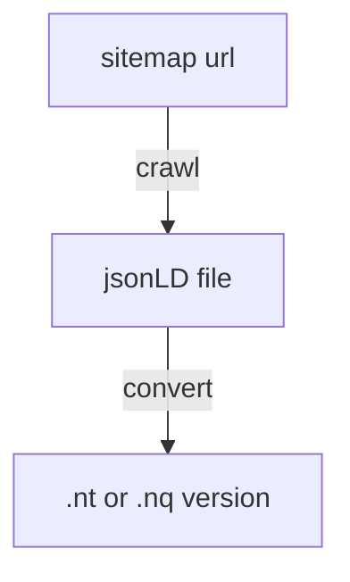
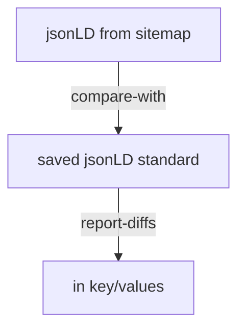
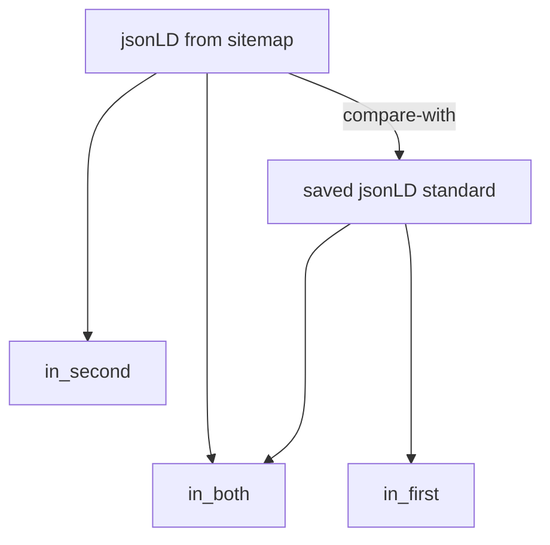
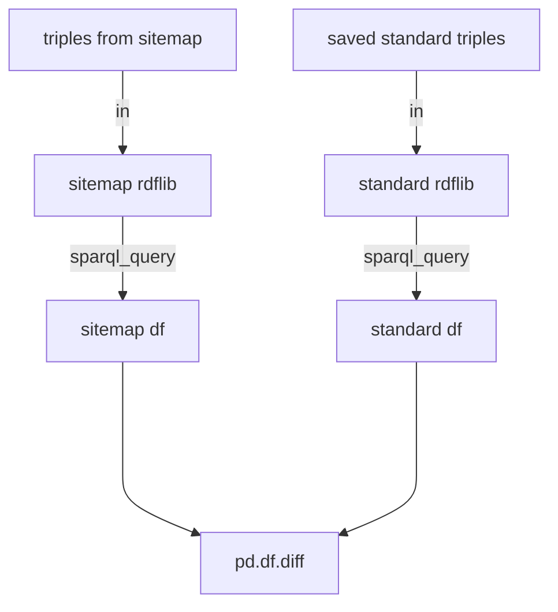
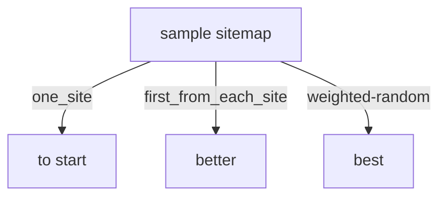

# GeoCODES ingest pipeline testing:

repo_counts(from sitemap) -> repo_ld_counts(from LD-cache) -> final_counts(in the endpoint)



Then unit/end-to-end spot testing of crawl products, to check that code changes don't change outputs

#Load the github.com/earthcube/earthcube_utilities 
 for now the staging version


```python
%load_ext rpy2.ipython
%load_ext google.colab.data_table
import httpimport
with httpimport.github_repo('MBcode', 'ec'):
  import ec
```

# Start by seeing how many records are expected from each repository
To be harvested by google-datasetsearch or GeoCODES only happens if the repository has a 'sitemap.xml' listing the dataset landing pages, which have jsonld in them, that they want indexed, so the search engine can find dataset resources of interest So we start by crawling the sitemaps, (but just this time) we will only record the number of records, so we can know how many to expect from each repository, during in the next parts of the ingestion pipeline


```python
named_sitemaps={ "ssdb.iodp": "https://ssdb.iodp.org/dataset/sitemap.xml",
#"balto": "http://balto.opendap.org/opendap/site_map.txt ",
"linked.earth": "http://wiki.linked.earth/sitemap.xml",
"lipdverse": "https://lipdverse.org/sitemap.xml",
"iris": "http://ds.iris.edu/files/sitemap.xml",
"unavco": "https://www.unavco.org/data/doi/sitemap.xml",
"ucar": "https://data.ucar.edu/sitemap.xml",
"opencoredata": "http://opencoredata.org/sitemap.xml",
"magic": "https://www2.earthref.org/MagIC/contributions.sitemap.xml",
#"neotomadb": "http://data.neotomadb.org/sitemap.xml",
"earthchem": "https://ecl.earthchem.org/sitemap.xml",
#"xdomes": "https://xdomes.tamucc.edu/srr/sensorML/sitemap.xml",
#"neon": "https://geodex.org/neon_prodcodes_sm.xml",
"designsafe": "https://www.designsafe-ci.org/sitemap.xml ",
"unidata": "https://www.unidata.ucar.edu/sitemap.xml",
"r2r": "https://service-dev.rvdata.us/api/sitemap/",
"geocodes_demo_dataset": "https://raw.githubusercontent.com/earthcube/GeoCODES-Metadata/gh-pages/metadata/Dataset/sitemap.xml",
"usap-dc": "https://www.usap-dc.org/view/dataset/sitemap.xml",
"cchodo": "https://cchdo.ucsd.edu/sitemap.xml",
"amgeo": "https://amgeo-dev.colorado.edu/sitemap.xml"}

```


```python
sitemaps=list(named_sitemaps.values())
repos=list(named_sitemaps.keys())
#sitemaps, repos
```


```python
ec.setup_sitemap()
```


```python
#sitemaps_count = ec.sitemaps_count(sitemaps)
#sitemaps_count  #will used cached values for now
```


```python
sitemap_count
```


    {'http://datadiscoverystudio.org/sitemap/CinergiSiteIndex.xml': 0,
     'http://ds.iris.edu/files/sitemap.xml': 0,
     'http://opencoredata.org/sitemap.xml': 83388,
     'http://wiki.linked.earth/sitemap.xml': 18634,
     'https://cchdo.ucsd.edu/sitemap.xml': 5040,
     'https://data.ucar.edu/sitemap.xml': 17005,
     'https://ecl.earthchem.org/sitemap.xml': 920,
     'https://geodex.org/neon_prodcodes_sm.xml': 0,
     'https://lipdverse.org/sitemap.xml': 704,
     'https://object.cloud.sdsc.edu/v1/AUTH_85f46aa78936477d8e71b186269414e8/gleaner-summoned': 0,
     'https://raw.githubusercontent.com/earthcube/GeoCODES-Metadata/gh-pages/metadata/Dataset/sitemap.xml': 0,
     'https://service-dev.rvdata.us/api/sitemap/': 0,
     'https://ssdb.iodp.org/dataset/sitemap.xml': 25241,
     'https://www.unavco.org/data/doi/sitemap.xml': 0,
     'https://www.unidata.ucar.edu/sitemap.xml': 211,
     'https://www.usap-dc.org/view/dataset/sitemap.xml': 0,
     'https://www2.earthref.org/MagIC/contributions.sitemap.xml': 0,
     'https://xdomes.tamucc.edu/srr/sensorML/sitemap.xml': 0}


# Next see how many made it into our LinkedData-cache
Once we capture the jsonld from each landing page, we cache that LinkedData as is, and then in another RDF format: .nt ntriples, that is easier to concatenate and to load into a triplestore


```python
ec.setup_s3fs()
```


```python
import s3fs
```


```python
oss = s3fs.S3FileSystem(
      anon=True,
      key="",
      secret="",
      client_kwargs = {"endpoint_url":"https://oss.geodex.org"}
   )
```


```python
summoned =oss.ls('gleaner/summoned')
milled =oss.ls('gleaner/milled')
```


```python
for repo in summoned:
  fa=oss.ls(repo)
  fnum=len(fa)
  print(f'repo:{repo} has {fnum} files')
```

    repo:gleaner/summoned/amgeo has 5 files
    repo:gleaner/summoned/aquadocs has 1 files
    repo:gleaner/summoned/bco-dmo has 13221 files
    repo:gleaner/summoned/bcodmo has 12484 files
    repo:gleaner/summoned/cchdo has 4235 files
    repo:gleaner/summoned/designsafe has 352 files
    repo:gleaner/summoned/earthchem has 1549 files
    repo:gleaner/summoned/edi has 14338 files
    repo:gleaner/summoned/geocodes_demo_datasets has 8 files
    repo:gleaner/summoned/getiedadataorg has 7206 files
    repo:gleaner/summoned/hydroshare has 15297 files
    repo:gleaner/summoned/ieda has 7774 files
    repo:gleaner/summoned/iedadata has 9347 files
    repo:gleaner/summoned/iris has 63 files
    repo:gleaner/summoned/linked.earth has 696 files
    repo:gleaner/summoned/lipdverse has 698 files
    repo:gleaner/summoned/magic has 10725 files
    repo:gleaner/summoned/neon has 181 files
    repo:gleaner/summoned/ocd has 104951 files
    repo:gleaner/summoned/opencoredata has 5894 files
    repo:gleaner/summoned/opentopo has 666 files
    repo:gleaner/summoned/opentopography has 702 files
    repo:gleaner/summoned/r2r has 1 files
    repo:gleaner/summoned/ssdb has 24124 files
    repo:gleaner/summoned/ssdb.iodp has 25225 files
    repo:gleaner/summoned/ucar has 1 files
    repo:gleaner/summoned/unavco has 13022 files
    repo:gleaner/summoned/usap-dc has 880 files
    repo:gleaner/summoned/wikilinkedearth has 1 files
    repo:gleaner/summoned/wwwbco-dmoorg has 11468 files
    repo:gleaner/summoned/wwwhydroshareorg has 4195 files


# Finally see how many get into the triplestore that backs 

Each dataset landing page's embeded ld+json jsonld record is put into it's own graph withen the store The graph is labeled with a UniversalResourceName [URN](https://en.wikipedia.org/wiki/Uniform_Resource_Name) which is made with a template of type urn:{type}:{repo}:... So we collect all the URNs, and count how many there are for each repository If we are very lucky, the sitemap count = LD-cache count = this count, but loosing a few from errors does happen


```python
ec.init_sparql()
df=ec.get_graphs()
```


```python
df
```

    Warning: total number of rows (290425) exceeds max_rows (20000). Falling back to pandas display.


  <div id="df-3bca6589-dbb3-43ac-93b9-2622b67ba66b">
    <div class="colab-df-container">
      <div>
<style scoped>
    .dataframe tbody tr th:only-of-type {
        vertical-align: middle;
    }

    .dataframe tbody tr th {
        vertical-align: top;
    }

    .dataframe thead th {
        text-align: right;
    }
</style>
<table border="1" class="dataframe">
  <thead>
    <tr style="text-align: right;">
      <th></th>
      <th>g</th>
    </tr>
  </thead>
  <tbody>
    <tr>
      <th>0</th>
      <td>urn:gleaner2:milled:opentopography:0047cda277b...</td>
    </tr>
    <tr>
      <th>1</th>
      <td>urn:gleaner2:milled:opentopography:00845ce0c33...</td>
    </tr>
    <tr>
      <th>2</th>
      <td>urn:gleaner2:milled:opentopography:008970cbb2d...</td>
    </tr>
    <tr>
      <th>3</th>
      <td>urn:gleaner2:milled:opentopography:00b839b8c22...</td>
    </tr>
    <tr>
      <th>4</th>
      <td>urn:gleaner2:milled:opentopography:01138abe87a...</td>
    </tr>
    <tr>
      <th>...</th>
      <td>...</td>
    </tr>
    <tr>
      <th>290420</th>
      <td>urn:gleaner:prov:r2r:ff91af0a990b49c6fa7cd71f1...</td>
    </tr>
    <tr>
      <th>290421</th>
      <td>urn:gleaner:prov:r2r:ffc3cd385505936a2df73626c...</td>
    </tr>
    <tr>
      <th>290422</th>
      <td>urn:gleaner:prov:r2r:ffc9b039d7a4c355a8cadf681...</td>
    </tr>
    <tr>
      <th>290423</th>
      <td>urn:gleaner:prov:r2r:ffdacfad983e5c8d8b0be4e87...</td>
    </tr>
    <tr>
      <th>290424</th>
      <td>http://www.bigdata.com/rdf#nullGraph</td>
    </tr>
  </tbody>
</table>
<p>290425 rows × 1 columns</p>
</div>
      <button class="colab-df-convert" onclick="convertToInteractive('df-3bca6589-dbb3-43ac-93b9-2622b67ba66b')"
              title="Convert this dataframe to an interactive table."
              style="display:none;">

  <svg xmlns="http://www.w3.org/2000/svg" height="24px"viewBox="0 0 24 24"
       width="24px">
    <path d="M0 0h24v24H0V0z" fill="none"/>
    <path d="M18.56 5.44l.94 2.06.94-2.06 2.06-.94-2.06-.94-.94-2.06-.94 2.06-2.06.94zm-11 1L8.5 8.5l.94-2.06 2.06-.94-2.06-.94L8.5 2.5l-.94 2.06-2.06.94zm10 10l.94 2.06.94-2.06 2.06-.94-2.06-.94-.94-2.06-.94 2.06-2.06.94z"/><path d="M17.41 7.96l-1.37-1.37c-.4-.4-.92-.59-1.43-.59-.52 0-1.04.2-1.43.59L10.3 9.45l-7.72 7.72c-.78.78-.78 2.05 0 2.83L4 21.41c.39.39.9.59 1.41.59.51 0 1.02-.2 1.41-.59l7.78-7.78 2.81-2.81c.8-.78.8-2.07 0-2.86zM5.41 20L4 18.59l7.72-7.72 1.47 1.35L5.41 20z"/>
  </svg>
      </button>

  <style>
    .colab-df-container {
      display:flex;
      flex-wrap:wrap;
      gap: 12px;
    }

    .colab-df-convert {
      background-color: #E8F0FE;
      border: none;
      border-radius: 50%;
      cursor: pointer;
      display: none;
      fill: #1967D2;
      height: 32px;
      padding: 0 0 0 0;
      width: 32px;
    }

    .colab-df-convert:hover {
      background-color: #E2EBFA;
      box-shadow: 0px 1px 2px rgba(60, 64, 67, 0.3), 0px 1px 3px 1px rgba(60, 64, 67, 0.15);
      fill: #174EA6;
    }

    [theme=dark] .colab-df-convert {
      background-color: #3B4455;
      fill: #D2E3FC;
    }

    [theme=dark] .colab-df-convert:hover {
      background-color: #434B5C;
      box-shadow: 0px 1px 3px 1px rgba(0, 0, 0, 0.15);
      filter: drop-shadow(0px 1px 2px rgba(0, 0, 0, 0.3));
      fill: #FFFFFF;
    }
  </style>

      <script>
        const buttonEl =
          document.querySelector('#df-3bca6589-dbb3-43ac-93b9-2622b67ba66b button.colab-df-convert');
        buttonEl.style.display =
          google.colab.kernel.accessAllowed ? 'block' : 'none';

        async function convertToInteractive(key) {
          const element = document.querySelector('#df-3bca6589-dbb3-43ac-93b9-2622b67ba66b');
          const dataTable =
            await google.colab.kernel.invokeFunction('convertToInteractive',
                                                     [key], {});
          if (!dataTable) return;

          const docLinkHtml = 'Like what you see? Visit the ' +
            '<a target="_blank" href=https://colab.research.google.com/notebooks/data_table.ipynb>data table notebook</a>'
            + ' to learn more about interactive tables.';
          element.innerHTML = '';
          dataTable['output_type'] = 'display_data';
          await google.colab.output.renderOutput(dataTable, element);
          const docLink = document.createElement('div');
          docLink.innerHTML = docLinkHtml;
          element.appendChild(docLink);
        }
      </script>
    </div>
  </div>


```python
#will do in pandas, but 1st pass was w/csv dump, like:
df.to_csv("graphs.csv")
```


```python
repoCounts=ec.os_system_("cut -d':' -f3,4 graphs.csv | grep milled | sort | uniq -c |sort -n")
repoCounts
```


    '      3 milled:geocodes_demo_datasets\n      5 milled:amgeo\n     83 milled:iris\n    182 milled:neon\n    697 milled:lipidverse\n    842 milled:usap-dc\n    892 milled:designsafe\n   1379 milled:linked.earth\n   1649 milled:r2r\n   1806 milled:cchdo\n   1823 milled:earthchem\n   2615 milled:opentopography\n   5646 milled:hydroshare\n   7807 milled:edi\n  10793 milled:iedadata\n  12743 milled:magic\n  12902 milled:bco-dmo\n  13379 milled:ucar\n'


```python
!cut -d':' -f3,4 graphs.csv | grep milled | sort | uniq -c |sort -n 
```

          3 milled:geocodes_demo_datasets
          5 milled:amgeo
         83 milled:iris
        182 milled:neon
        697 milled:lipidverse
        842 milled:usap-dc
        892 milled:designsafe
       1379 milled:linked.earth
       1649 milled:r2r
       1806 milled:cchdo
       1823 milled:earthchem
       2615 milled:opentopography
       5646 milled:hydroshare
       7807 milled:edi
      10793 milled:iedadata
      12743 milled:magic
      12902 milled:bco-dmo
      13379 milled:ucar


# Put in counts in store, so can query to get a table of the falloff between stages

repo_counts(from sitemap) -> repo_ld_counts(from LD-cache) -> final_counts(in the endpoint)


```python
#get all counts from sitemap/etc caches
repo_counts,repo_ld_counts,final_counts,      repo_df_loc =ec.repos2counts(repos)
```

    Getting http://geocodes.ddns.net/ec/crawl/sitemaps/ssdb.iodp.xml
    Getting http://geocodes.ddns.net/ec/crawl/sitemaps/linked.earth.xml
    Getting http://geocodes.ddns.net/ec/crawl/sitemaps/lipdverse.xml
    Getting http://geocodes.ddns.net/ec/crawl/sitemaps/iris.xml
    Getting http://geocodes.ddns.net/ec/crawl/sitemaps/unavco.xml
    Getting http://geocodes.ddns.net/ec/crawl/sitemaps/ucar.xml
    Getting https://opencoredata.org/sitemap_1.xml
    Getting https://opencoredata.org/sitemap_2.xml
    Getting https://opencoredata.org/sitemap_3.xml
    Getting https://opencoredata.org/sitemap_0.xml
    Getting http://geocodes.ddns.net/ec/crawl/sitemaps/magic.xml
    Getting http://geocodes.ddns.net/ec/crawl/sitemaps/earthchem.xml
    Getting http://geocodes.ddns.net/ec/crawl/sitemaps/designsafe.xml
    Getting http://geocodes.ddns.net/ec/crawl/sitemaps/unidata.xml
    Getting http://geocodes.ddns.net/ec/crawl/sitemaps/r2r.xml
    Getting http://geocodes.ddns.net/ec/crawl/sitemaps/geocodes_demo_dataset.xml
    Getting http://geocodes.ddns.net/ec/crawl/sitemaps/usap-dc.xml
    Getting http://geocodes.ddns.net/ec/crawl/sitemaps/cchodo.xml
    Getting http://geocodes.ddns.net/ec/crawl/sitemaps/amgeo.xml


```python
repo_counts
```


    {'amgeo': 5,
     'cchodo': 2520,
     'designsafe': 1638,
     'earthchem': 920,
     'geocodes_demo_dataset': 8,
     'iris': 28,
     'linked.earth': 18634,
     'lipdverse': 704,
     'magic': 4263,
     'opencoredata': 83388,
     'r2r': 44007,
     'ssdb.iodp': 25226,
     'ucar': 17506,
     'unavco': 5643,
     'unidata': 202,
     'usap-dc': 889}


```python
repo_ld_counts
```


    {'amgeo': '5',
     'aquadocs': '1',
     'bco-dmo': '13221',
     'bcodmo': '12484',
     'cchdo': '4235',
     'designsafe': '352',
     'earthchem': '1549',
     'edi': '14338',
     'geocodes_demo_datasets': '8',
     'getiedadataorg': '7206',
     'hydroshare': '15297',
     'ieda': '7774',
     'iedadata': '9347',
     'iris': '63',
     'linked.earth': '696',
     'lipdverse': '698',
     'magic': '10725',
     'neon': '181',
     'ocd': '104951',
     'opencoredata': '5894',
     'opentopo': '666',
     'opentopography': '702',
     'r2r': '1',
     'ssdb': '24124',
     'ssdb.iodp': '25225',
     'ucar': '1',
     'unavco': '13022',
     'usap-dc': '880',
     'wikilinkedearth': '1',
     'wwwbco-dmoorg': '11468',
     'wwwhydroshareorg': '4195'}


```python
final_counts
```


    {'': '7807',
     'adata': '10793',
     'agic': '12743',
     'amgeo': '5',
     'ap-dc': '842',
     'arthchem': '1823',
     'bco-dmo': '12902',
     'car': '13379',
     'cchdo': '1806',
     'geocodes_demo_datasets': '3',
     'hydroshare': '5646',
     'ignsafe': '892',
     'ked.earth': '1379',
     'pentopography': '2615',
     'pidverse': '697',
     'r2r': '1649',
     'ris': '83'}


```python
cmp2=ec.merge_dict_list(repo_counts,repo_ld_counts)
#cmp2
```


```python
#Now bring the expected, LD-cache, and final endpoint counts 
# into one comparable place, for each repo ..
cmp_all_stages=ec.merge_dict_list(cmp2,final_counts)
cmp_all_stages
```


    defaultdict(list,
                {'': ['7807'],
                 'adata': ['10793'],
                 'agic': ['12743'],
                 'amgeo': [[5, '5'], '5'],
                 'ap-dc': ['842'],
                 'aquadocs': [['1']],
                 'arthchem': ['1823'],
                 'bco-dmo': [['13221'], '12902'],
                 'bcodmo': [['12484']],
                 'car': ['13379'],
                 'cchdo': [['4235'], '1806'],
                 'cchodo': [[2520]],
                 'designsafe': [[1638, '352']],
                 'earthchem': [[920, '1549']],
                 'edi': [['14338']],
                 'geocodes_demo_dataset': [[8]],
                 'geocodes_demo_datasets': [['8'], '3'],
                 'getiedadataorg': [['7206']],
                 'hydroshare': [['15297'], '5646'],
                 'ieda': [['7774']],
                 'iedadata': [['9347']],
                 'ignsafe': ['892'],
                 'iris': [[28, '63']],
                 'ked.earth': ['1379'],
                 'linked.earth': [[18634, '696']],
                 'lipdverse': [[704, '698']],
                 'magic': [[4263, '10725']],
                 'neon': [['181']],
                 'ocd': [['104951']],
                 'opencoredata': [[83388, '5894']],
                 'opentopo': [['666']],
                 'opentopography': [['702']],
                 'pentopography': ['2615'],
                 'pidverse': ['697'],
                 'r2r': [[44007, '1'], '1649'],
                 'ris': ['83'],
                 'ssdb': [['24124']],
                 'ssdb.iodp': [[25226, '25225']],
                 'ucar': [[17506, '1']],
                 'unavco': [[5643, '13022']],
                 'unidata': [[202]],
                 'usap-dc': [[889, '880']],
                 'wikilinkedearth': [['1']],
                 'wwwbco-dmoorg': [['11468']],
                 'wwwhydroshareorg': [['4195']]})


# Now, Compare some steps against expected values

from sitemap-url to the 2 parts of the LD-cache and final endpoint graph

url -> jsonld (compare w/pre extracted), ntriples (compare w/pre converted),
 
 and w/graph triples
 That can be found hitting the search, via sparql_nb's ec.txt_qry(text), incl timing

 then other related data/tools/etc are also as expected

Can compare each step in isolation, and all the way through

[Some near misses still have same meaning in next step]


```python
ec.first(repo_df_loc)
```


    'amgeo'


read from csv table of urls and expected results, to be kept in github documention  ;either csv or org, both editable


```python
#read from csv table of urls and expected results, to be kept in github documention  ;either csv or org, both editable
```


```python
#should/will be:
amgeo=ec.sitemap_all_pages(sitemaps[-1])
amgeo
```

    Getting https://amgeo-dev.colorado.edu/sitemap.xml


    0    https://amgeo-dev.colorado.edu/static/data/dat...
    1    https://amgeo-dev.colorado.edu/static/data/dat...
    2    https://amgeo-dev.colorado.edu/static/data/dat...
    3    https://amgeo-dev.colorado.edu/static/data/dat...
    4    https://amgeo-dev.colorado.edu/static/data/dat...
    Name: loc, dtype: object


```python
amgeo[0]
```


    'https://amgeo-dev.colorado.edu/static/data/data-01-01-2013-12-30-00.html'


```python
ec.init_rdflib()
```


```python
#do a crawl of a url
ld1=ec.url2jsonLD(amgeo[0])
ld1
```


    {'@context': 'https://schema.org/',
     '@type': 'Dataset',
     'about': 'AMGeO Assimilative Maps',
     'author': {'@type': 'Organization',
      'email': 'amgeo@colorado.edu',
      'logo': 'https://amgeo.colorado.edu/static/img/amgeosmall.svg',
      'name': 'AMGeO'},
     'citation': 'AMGeO Collaboration. (2019). A Collaborative Data Science Platform for the Geospace Community: Assimilative Mapping of Geospace Observations (AMGeO) v1.0.0. Zenodo. https://doi.org/10.5281/zenodo.3564914',
     'description': 'AMGeO helps combine diverse high-latitude geospace observations. The purpose of AMGeO is to make the latest geospace data science tool accessible to scientists and students.',
     'distribution': {'@type': 'DataDownload',
      'contentUrl': 'https://amgeo-dev.colorado.edu/static/data/01-01-2013-12-30-00.nc',
      'encodingFormat': 'application/x-hdf5'},
     'keywords': ['polar ionosphere',
      'magnetosphere-ionosphere coupling',
      'ionospheric electrodynamics'],
     'name': 'AMGeO Assimilative Maps for 2013-01-01T12:30:00',
     'spatialCoverage': {'@type': 'Place',
      'geo': {'@type': 'GeoShape',
       'box': '49.99975367385476 0.0 88.33332306974395 360.0'}},
     'temporalCoverage': '2013-01-01T12:30:00',
     'url': 'https://amgeo-dev.colorado.edu/static/data/data-01-01-2013-12-30-00.html',
     'variableMeasured': [{'@type': 'PropertyValue',
       'name': 'Electric Field (eastward)',
       'unitText': 'V/m'},
      {'@type': 'PropertyValue',
       'name': 'Electric Field (equatorward)',
       'unitText': 'V/m'},
      {'@type': 'PropertyValue',
       'name': 'Ovation Pyme Hall Conductance',
       'unitText': 'mho'},
      {'@type': 'PropertyValue',
       'name': 'Ovation Pyme Pedersen Conductance',
       'unitText': 'mho'},
      {'@type': 'PropertyValue', 'name': 'Electric Potential', 'unitText': 'V'},
      {'@type': 'PropertyValue',
       'name': 'Hemisphere Integrated Joule Heating',
       'unitText': 'GW'},
      {'@type': 'PropertyValue',
       'name': 'Joule Heating (E-field^2*Pedersen)',
       'unitText': 'mW/m^2'},
      {'@type': 'PropertyValue',
       'name': 'Ion Drift Velocity (eastward)',
       'unitText': 'm/s'},
      {'@type': 'PropertyValue',
       'name': 'Ion Drift Velocity (equatorward)',
       'unitText': 'm/s'}],
     'version': 'v2_beta'}


```python
#retrieve associated gold standard version
ld2=ec.wget2("http://geocodes.ddns.net/ld/amgeo/data-01-01-2013-12-30-00.html.jsonld","ld1gold.jsonld")
ld2
```


    '{\n  "@context": "https://schema.org/",\n  "@type": "Dataset",\n  "about": "AMGeO Assimilative Maps",\n  "author": {\n    "@type": "Organization",\n    "email": "amgeo@colorado.edu",\n    "logo": "https://amgeo.colorado.edu/static/img/amgeosmall.svg",\n    "name": "AMGeO"\n  },\n  "citation": "AMGeO Collaboration. (2019). A Collaborative Data Science Platform for the Geospace Community: Assimilative Mapping of Geospace Observations (AMGeO) v1.0.0. Zenodo. https://doi.org/10.5281/zenodo.3564914",\n  "description": "AMGeO helps combine diverse high-latitude geospace observations. The purpose of AMGeO is to make the latest geospace data science tool accessible to scientists and students.",\n  "distribution": {\n    "@type": "DataDownload",\n    "contentUrl": "https://amgeo-dev.colorado.edu/static/data/01-01-2013-12-30-00.nc",\n    "encodingFormat": "application/x-hdf5"\n  },\n  "keywords": [\n    "polar ionosphere",\n    "magnetosphere-ionosphere coupling",\n    "ionospheric electrodynamics"\n  ],\n  "name": "AMGeO Assimilative Maps for 2013-01-01T12:30:00",\n  "spatialCoverage": {\n    "@type": "Place",\n    "geo": {\n      "@type": "GeoShape",\n      "box": "49.99975367385476 0.0 88.33332306974395 360.0"\n    }\n  },\n  "temporalCoverage": "2013-01-01T12:30:00",\n  "url": "https://amgeo-dev.colorado.edu/static/data/data-01-01-2013-12-30-00.html",\n  "variableMeasured": [\n    {\n      "@type": "PropertyValue",\n      "name": "Electric Field (eastward)",\n      "unitText": "V/m"\n    },\n    {\n      "@type": "PropertyValue",\n      "name": "Electric Field (equatorward)",\n      "unitText": "V/m"\n    },\n    {\n      "@type": "PropertyValue",\n      "name": "Ovation Pyme Hall Conductance",\n      "unitText": "mho"\n    },\n    {\n      "@type": "PropertyValue",\n      "name": "Ovation Pyme Pedersen Conductance",\n      "unitText": "mho"\n    },\n    {\n      "@type": "PropertyValue",\n      "name": "Electric Potential",\n      "unitText": "V"\n    },\n    {\n      "@type": "PropertyValue",\n      "name": "Hemisphere Integrated Joule Heating",\n      "unitText": "GW"\n    },\n    {\n      "@type": "PropertyValue",\n      "name": "Joule Heating (E-field^2*Pedersen)",\n      "unitText": "mW/m^2"\n    },\n    {\n      "@type": "PropertyValue",\n      "name": "Ion Drift Velocity (eastward)",\n      "unitText": "m/s"\n    },\n    {\n      "@type": "PropertyValue",\n      "name": "Ion Drift Velocity (equatorward)",\n      "unitText": "m/s"\n    }\n  ],\n  "version": "v2_beta"\n}\n'


```python
import json
ld1j=json.dumps(ld1, ensure_ascii=True, indent=2)
ec.put_txtfile("ld1.jsonld",ld1j)
```


    2435


```python
#for both jsonld and ntriples comparison, either via direct or ttl file or graph comparison:
ec.diff_nt_g("ld1.jsonld","ld1gold.jsonld") #working on wrapper that prints out: in_both, in_first, in_second 
```

This comes from https://github.com/RDFLib/rdflib/blob/master/rdflib/compare.py so we should be able to get similar output

Another way we could check the whole sample at onece (first), is to run the search sparql_query.txt on all the sampled triples loaded into  rdflib, and compare with a gold-standard's query, then focus in on the URNs that did not show up


There also could be changed values, but then we should check if the live crawl got any updated dataset metdadata as well


```python
!wc ld1.jsonld ld1gold.jsonld
```

      80  211 2435 ld1.jsonld
      81  211 2436 ld1gold.jsonld
     161  422 4871 total


```python
#for this maybe sort keys and forgiving diff
#!diff -wB ld1.jsonld ld1gold.jsonld |wc
#with ntriple comparison have seen ttl help
```


```python
#to make sure hasn't changed w/gold stnd, look at df['lastmod']
```


```python
amgeo.to_csv("amgeo.csv")
!ls -la
```

    total 44
    drwxr-xr-x 1 root root 4096 Jul 14 16:47 .
    drwxr-xr-x 1 root root 4096 Jul 14 14:15 ..
    -rw-r--r-- 1 root root  380 Jul 14 16:47 amgeo.csv
    drwxr-xr-x 4 root root 4096 Jul  6 13:21 .config
    -rw-r--r-- 1 root root  368 Jul 14 03:50 graph.txt
    -rw-r--r-- 1 root root 2436 May  9 18:39 ld1gold.jsonld
    -rw-r--r-- 1 root root 2435 Jul 14 14:55 ld1.jsonld
    -rw-r--r-- 1 root root 5533 Jul 14 16:16 log
    drwxr-xr-x 1 root root 4096 Jul  6 13:22 sample_data
    -rw-r--r-- 1 root root  956 Jul 14 03:15 summoned.txt

A few ways to sample datasets,  
to be put in a gold_standard in github to campare with


For most repositories will still need a sampling stradegy, and to check the gold-standard metadata set,
[before](https://github.com/MBcode/ec/tree/master/test/standard) it can be checked into the [part of github](https://github.com/earthcube/GeoCODES-Metadata) that the testing workflow will use

```python
#can use this as a basis for an expected_urls.csv in https://github.com/MBcode/ec/tree/master/test 
!cat amgeo.csv
```

    ,loc
    0,https://amgeo-dev.colorado.edu/static/data/data-01-01-2013-12-30-00.html
    1,https://amgeo-dev.colorado.edu/static/data/data-01-06-2013-17-30-00.html
    2,https://amgeo-dev.colorado.edu/static/data/data-02-06-2013-12-30-00.html
    3,https://amgeo-dev.colorado.edu/static/data/data-02-06-2013-13-30-00.html
    4,https://amgeo-dev.colorado.edu/static/data/data-03-17-2015-18-00-00.html


To get a bigger sampling for ec/test/[expected_urls.csv](https://github.com/MBcode/ec/blob/master/test/expected_urls.csv) 

could easily take a few from each repo, at least 1/1k


```python
repo_df_loc
```


    {'amgeo': 0    https://amgeo-dev.colorado.edu/static/data/dat...
     1    https://amgeo-dev.colorado.edu/static/data/dat...
     2    https://amgeo-dev.colorado.edu/static/data/dat...
     3    https://amgeo-dev.colorado.edu/static/data/dat...
     4    https://amgeo-dev.colorado.edu/static/data/dat...
     Name: loc, dtype: object,
     'cchodo': 0                http://cchdo.ucsd.edu/search/map
     1           http://cchdo.ucsd.edu/search/advanced
     2                   http://cchdo.ucsd.edu/contact
     3                  http://cchdo.ucsd.edu/citation
     4                    http://cchdo.ucsd.edu/policy
                               ...                    
     2515      http://cchdo.ucsd.edu/cruise/49TU9107_2
     2516    http://cchdo.ucsd.edu/cruise/316N198212_2
     2517      http://cchdo.ucsd.edu/cruise/49TU9210_1
     2518      http://cchdo.ucsd.edu/cruise/49TU9310_1
     2519    http://cchdo.ucsd.edu/cruise/33AT20120419
     Name: loc, Length: 2520, dtype: object,
     'designsafe': 0                           https://www.designsafe-ci.org
     1                           https://fiu.designsafe-ci.org
     2                        https://lehigh.designsafe-ci.org
     3                         https://mechs.designsafe-ci.org
     4                   https://oregonstate.designsafe-ci.org
                                   ...                        
     1633               https://www.designsafe-ci.org/podcast/
     1634                   https://www.designsafe-ci.org/faq/
     1635               https://www.designsafe-ci.org/covid19/
     1636    https://www.designsafe-ci.org/covid19/coronavi...
     1637    https://www.designsafe-ci.org/conferences/2021...
     Name: loc, Length: 1638, dtype: object,
     'earthchem': 0         https://ecl.earthchem.org/view.php?id=6
     1        https://ecl.earthchem.org/view.php?id=65
     2        https://ecl.earthchem.org/view.php?id=66
     3        https://ecl.earthchem.org/view.php?id=67
     4        https://ecl.earthchem.org/view.php?id=68
                               ...                    
     915    https://ecl.earthchem.org/view.php?id=2064
     916    https://ecl.earthchem.org/view.php?id=2065
     917    https://ecl.earthchem.org/view.php?id=2068
     918    https://ecl.earthchem.org/view.php?id=2070
     919    https://ecl.earthchem.org/view.php?id=2071
     Name: loc, Length: 920, dtype: object,
     'geocodes_demo_dataset': 0    https://raw.githubusercontent.com/earthcube/Ge...
     1    https://raw.githubusercontent.com/earthcube/Ge...
     2    https://raw.githubusercontent.com/earthcube/Ge...
     3    https://raw.githubusercontent.com/earthcube/Ge...
     4    https://raw.githubusercontent.com/earthcube/Ge...
     5    https://raw.githubusercontent.com/earthcube/Ge...
     6    https://raw.githubusercontent.com/earthcube/Ge...
     7    https://raw.githubusercontent.com/earthcube/Ge...
     Name: loc, dtype: object,
     'iris': 0                       http://ds.iris.edu/ds/products/
     1                   http://ds.iris.edu/ds/products/emc/
     2            http://ds.iris.edu/ds/products/eventplots/
     3               http://ds.iris.edu/ds/products/syngine/
     4                   http://ds.iris.edu/ds/products/gmv/
     5        http://ds.iris.edu/ds/products/backprojection/
     6          http://ds.iris.edu/ds/products/globalstacks/
     7                  http://ds.iris.edu/ds/products/esec/
     8            http://ds.iris.edu/ds/products/infrasound/
     9                 http://ds.iris.edu/ds/products/aswms/
     10              http://ds.iris.edu/ds/products/sws-dbs/
     11          http://ds.iris.edu/ds/products/aftershocks/
     12                 http://ds.iris.edu/ds/products/ears/
     13    http://ds.iris.edu/ds/products/envelopefunctions/
     14             http://ds.iris.edu/ds/products/eqenergy/
     15    http://ds.iris.edu/ds/products/sourcetimefunct...
     16    http://ds.iris.edu/ds/products/shakemoviesynth...
     17         http://ds.iris.edu/ds/products/momenttensor/
     18            http://ds.iris.edu/ds/products/ancc-ciei/
     19    http://ds.iris.edu/ds/products/globalempirical...
     20                 http://ds.iris.edu/ds/products/emtf/
     21        http://ds.iris.edu/ds/products/noise-toolkit/
     22            http://ds.iris.edu/ds/products/seissound/
     23              http://ds.iris.edu/ds/products/emerald/
     24       http://ds.iris.edu/ds/products/eventbulletins/
     25             http://ds.iris.edu/ds/products/filmchip/
     26          http://ds.iris.edu/ds/products/calibration/
     27        http://ds.iris.edu/ds/products/stationdigest/
     Name: loc, dtype: object,
     'linked.earth': 0                       http://wiki.linked.earth/Main_Page
     1        http://wiki.linked.earth/File:Asia-BIGELS.pale...
     2                http://wiki.linked.earth/Dataset_Tutorial
     3           http://wiki.linked.earth/File:TutorialFig1.png
     4           http://wiki.linked.earth/File:TutorialFig2.png
                                    ...                        
     18629    http://wiki.linked.earth/File:TwitterPoll_Spel...
     18630    http://wiki.linked.earth/File:TwitterPoll_Spel...
     18631    http://wiki.linked.earth/File:TwitterPoll_Radi...
     18632    http://wiki.linked.earth/File:TwitterPoll_Radi...
     18633                      http://wiki.linked.earth/Newvar
     Name: loc, Length: 18634, dtype: object,
     'lipdverse': 0      http://lipdverse.org/Temp12k/1_0_2/117_723A.Go...
     1      http://lipdverse.org/Temp12k/1_0_2/161_976.Mar...
     2      http://lipdverse.org/Temp12k/1_0_2/165_1002C.H...
     3      http://lipdverse.org/Temp12k/1_0_2/2005-804-00...
     4      http://lipdverse.org/Temp12k/1_0_2/31Lake.Eisn...
                                  ...                        
     699    http://lipdverse.org/Temp12k/1_0_2/Yarnyshnoe....
     700    http://lipdverse.org/Temp12k/1_0_2/Ylimysneva....
     701    http://lipdverse.org/Temp12k/1_0_2/Zabieniec.P...
     702    http://lipdverse.org/Temp12k/1_0_2/Zalozhtsy.B...
     703    http://lipdverse.org/Temp12k/1_0_2/Zbudovskabl...
     Name: loc, Length: 704, dtype: object,
     'magic': 0       https://earthref.org/MagIC/11131
     1       https://earthref.org/MagIC/11846
     2       https://earthref.org/MagIC/11858
     3       https://earthref.org/MagIC/11860
     4       https://earthref.org/MagIC/11874
                           ...               
     4258    https://earthref.org/MagIC/19205
     4259    https://earthref.org/MagIC/19206
     4260    https://earthref.org/MagIC/19207
     4261    https://earthref.org/MagIC/19212
     4262    https://earthref.org/MagIC/19214
     Name: loc, Length: 4263, dtype: object,
     'opencoredata': 0        https://opencoredata.org/id/csdco/do/b7545a859...
     1        https://opencoredata.org/id/csdco/do/b757042e7...
     2        https://opencoredata.org/id/csdco/do/b75754032...
     3        https://opencoredata.org/id/csdco/do/b75a7f475...
     4        https://opencoredata.org/id/csdco/do/b75d599b0...
                                    ...                        
     83383                  https://opencoredata.org/about.html
     83384             https://opencoredata.org/docs/about.html
     83385            https://opencoredata.org/docs/search.html
     83386                  https://opencoredata.org/index.html
     83387                 https://opencoredata.org/search.html
     Name: loc, Length: 83388, dtype: object,
     'r2r': 0        https://dev.rvdata.us/search/fileset/100135
     1        https://dev.rvdata.us/search/fileset/100136
     2        https://dev.rvdata.us/search/fileset/100137
     3        https://dev.rvdata.us/search/fileset/100138
     4        https://dev.rvdata.us/search/fileset/100139
                                 ...                     
     44002    https://dev.rvdata.us/search/fileset/148766
     44003    https://dev.rvdata.us/search/fileset/148767
     44004    https://dev.rvdata.us/search/fileset/148768
     44005    https://dev.rvdata.us/search/fileset/148769
     44006    https://dev.rvdata.us/search/fileset/148770
     Name: loc, Length: 44007, dtype: object,
     'ssdb.iodp': 0                   https://ssdb.iodp.org/dataset
     1        https://ssdb.iodp.org/dataset/?id=100001
     2        https://ssdb.iodp.org/dataset/?id=100002
     3        https://ssdb.iodp.org/dataset/?id=100003
     4        https://ssdb.iodp.org/dataset/?id=100004
                                ...                   
     25221    https://ssdb.iodp.org/dataset/?id=128511
     25222    https://ssdb.iodp.org/dataset/?id=128512
     25223    https://ssdb.iodp.org/dataset/?id=128513
     25224    https://ssdb.iodp.org/dataset/?id=128514
     25225    https://ssdb.iodp.org/dataset/?id=128515
     Name: loc, Length: 25226, dtype: object,
     'ucar': 0        https://data.ucar.edu/dataset/0-1-degree-paral...
     1        https://data.ucar.edu/dataset/0-1-degree-paral...
     2        https://data.ucar.edu/dataset/100-years-of-pro...
     3        https://data.ucar.edu/dataset/100-years-of-pro...
     4        https://data.ucar.edu/dataset/100-years-of-pro...
                                    ...                        
     17501    https://data.ucar.edu/dataset/zooplankton-abun...
     17502    https://data.ucar.edu/dataset/zooplankton-abun...
     17503    https://data.ucar.edu/dataset/zooplankton-abun...
     17504    https://data.ucar.edu/dataset/zooplankton-data...
     17505    https://data.ucar.edu/dataset/zooplankton-dens...
     Name: loc, Length: 17506, dtype: object,
     'unavco': 0        https://www.unavco.org/data/doi/10.7283/T5X928QS
     1       https://www.unavco.org/data/doi/10.7283/0XHG-T159
     2       https://www.unavco.org/data/doi/10.7283/2DMR-AP19
     3       https://www.unavco.org/data/doi/10.7283/XGQB-NY54
     4       https://www.unavco.org/data/doi/10.7283/Z1FH-4N09
                                   ...                        
     5638     https://www.unavco.org/data/doi/10.7283/T5RX99HT
     5639     https://www.unavco.org/data/doi/10.7283/T55719FQ
     5640     https://www.unavco.org/data/doi/10.7283/T5X928ZX
     5641     https://www.unavco.org/data/doi/10.7283/T590225F
     5642     https://www.unavco.org/data/doi/10.7283/T5P55KWB
     Name: loc, Length: 5643, dtype: object,
     'unidata': 0                          https://www.unidata.ucar.edu/
     1                     https://www.unidata.ucar.edu/data/
     2        https://www.unidata.ucar.edu/data/DataFlow.html
     3      https://www.unidata.ucar.edu/software/ldm/ldm-...
     4                https://www.unidata.ucar.edu/data/dmrc/
                                  ...                        
     197    https://www.unidata.ucar.edu/committees/steering/
     198    https://www.unidata.ucar.edu/committees/orient...
     199    https://www.unidata.ucar.edu/committees/stratc...
     200                 https://www.unidata.ucar.edu/travel/
     201    https://www.unidata.ucar.edu/events/2009UsersW...
     Name: loc, Length: 202, dtype: object,
     'usap-dc': 0      https://www.usap-dc.org/view/dataset/600001
     1      https://www.usap-dc.org/view/dataset/600002
     2      https://www.usap-dc.org/view/dataset/600003
     3      https://www.usap-dc.org/view/dataset/600004
     4      https://www.usap-dc.org/view/dataset/600005
                               ...                     
     884    https://www.usap-dc.org/view/dataset/609655
     885    https://www.usap-dc.org/view/dataset/609656
     886    https://www.usap-dc.org/view/dataset/609659
     887    https://www.usap-dc.org/view/dataset/609660
     888    https://www.usap-dc.org/view/dataset/609667
     Name: loc, Length: 889, dtype: object}


```python
def first(l):
  return ec.first(list(l))
```


```python
firsts=list(map(first,repo_df_loc.values()))
firsts #potentially add to list of standard intermediates, to save, for later comparison
#len(repo_df_loc)
#repo_df_loc.keys()
```


    ['https://ssdb.iodp.org/dataset',
     'http://wiki.linked.earth/Main_Page',
     'http://lipdverse.org/Temp12k/1_0_2/117_723A.Godad.2011.html',
     'http://ds.iris.edu/ds/products/',
     'https://www.unavco.org/data/doi/10.7283/T5X928QS',
     'https://data.ucar.edu/dataset/0-1-degree-parallel-ocean-program-pop-output-for-eastern-equatorial-indian-ocean-and-western-in',
     'https://opencoredata.org/id/csdco/do/b7545a85958138c02a97ca54352ad4ef89309545e6e68fec0bdd52cefaa3292b.jsonld',
     'https://earthref.org/MagIC/11131',
     'https://ecl.earthchem.org/view.php?id=6',
     'https://www.designsafe-ci.org',
     'https://www.unidata.ucar.edu/',
     'https://dev.rvdata.us/search/fileset/100135',
     'https://raw.githubusercontent.com/earthcube/GeoCODES-Metadata/main/metadata/Dataset/argo.json',
     'https://www.usap-dc.org/view/dataset/600001',
     'http://cchdo.ucsd.edu/search/map',
     'https://amgeo-dev.colorado.edu/static/data/data-01-01-2013-12-30-00.html']


```python
def repo2repocounts(repo):
    rc=repo_counts.get(repo)
    if not rc:
        rc=1 #
    return rc

def repo_sample(repo):
    import random
    rcount=repo2repocounts(repo)
    sn = int(rcount / 10000) 
    n=min(max(sn, 1),5)
    print(f'for {repo} choose {n} from {rcount}')
    seq=list(repo_df_loc[repo])
    return random.sample(seq, n)
```


```python
expected_urls=list(map(repo_sample,repos))
ec.flatten(expected_urls)
```

    for ssdb.iodp choose 2 from 25226
    for linked.earth choose 1 from 18634
    for lipdverse choose 1 from 704
    for iris choose 1 from 28
    for unavco choose 1 from 5643
    for ucar choose 1 from 17506
    for opencoredata choose 5 from 83388
    for magic choose 1 from 4263
    for earthchem choose 1 from 920
    for designsafe choose 1 from 1638
    for unidata choose 1 from 202
    for r2r choose 4 from 44007
    for geocodes_demo_dataset choose 1 from 8
    for usap-dc choose 1 from 889
    for cchodo choose 1 from 2520
    for amgeo choose 1 from 5


    ['https://ssdb.iodp.org/dataset/?id=127708',
     'https://ssdb.iodp.org/dataset/?id=122373',
     'http://wiki.linked.earth/LPDa97364db.temperature',
     'http://lipdverse.org/Temp12k/1_0_2/Hypkana.Hajkova.2016.html',
     'http://ds.iris.edu/ds/products/syngine/',
     'https://www.unavco.org/data/doi/10.7283/T5P55KQ3',
     'https://data.ucar.edu/dataset/ncep-fnl-operational-model-global-tropospheric-analyses-continuing-from-july-19991',
     'https://opencoredata.org/id/csdco/do/1641417e0a54773f37333f28c5a2a6a92e671516d74f61db22b0e5060b22ca93.jsonld',
     'https://opencoredata.org/id/csdco/do/6ab3e531c3a457eece22c664f2093b3597ac5235d437fbbb256e3b91cfe34fa1.jsonld',
     'https://opencoredata.org/id/csdco/do/8071d43f02c5911d49f9c3891716763d1fdd83cf3cca0b46b2091379831e4a59.jsonld',
     'https://opencoredata.org/id/csdco/do/58fd450c99452555e993e4ae782d34eb40ba48f414a640a7761ffa9eb8cd9c5a.jsonld',
     'https://opencoredata.org/id/csdco/do/b75a7f47538b1ee478276c9f0806cc4f4ee01325cea8eac62adcd1844ed8ef7e.jsonld',
     'https://earthref.org/MagIC/15809',
     'https://ecl.earthchem.org/view.php?id=1572',
     'https://www.designsafe-ci.org/data/browser/public/designsafe.storage.published/PRJ-2137',
     'https://www.unidata.ucar.edu/software/gempak/man/parm/apxB.html',
     'https://dev.rvdata.us/search/fileset/147162',
     'https://dev.rvdata.us/search/fileset/128289',
     'https://dev.rvdata.us/search/fileset/122831',
     'https://dev.rvdata.us/search/fileset/137436',
     'https://raw.githubusercontent.com/earthcube/GeoCODES-Metadata/main/metadata/Dataset/nwis-sites.json',
     'https://www.usap-dc.org/view/dataset/600073',
     'http://cchdo.ucsd.edu/cruise/49SU9402_2',
     'https://amgeo-dev.colorado.edu/static/data/data-01-06-2013-17-30-00.html']


