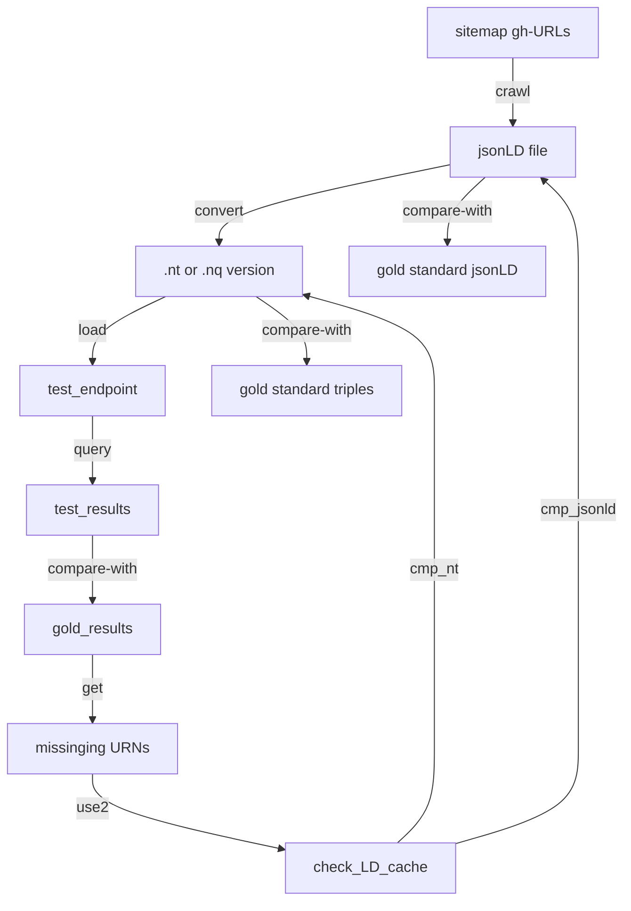

# From [ingestTesting.md](https://github.com/MBcode/ec/blob/master/test/ingestTesting.md) now split out and focusing on [testing.md](testing.md) 
### These .md version derived from [.ipynb](ingesttesting.ipynb) version, with a focus on documentation only, and adding diagrams
### Some extension of this with more on the gleaner calls [here](https://github.com/earthcube/ec/tree/dev_dv/test), to be [integrated](http://geocodes.ddns.net/ec/test/a22) soon

Has a few parts, that the doc could be broken into:

1) How the [counts.md](https://github.com/MBcode/ec/blob/master/test/counts.md) [code](http://geocodes.ddns.net/ec/test/counts/?C=M;O=D) from the repo-sitemaps sometimes fall off in the LD-cache jsonld&ntriples, then also not getting into the endpoint
2) Then from the original cut out spot testing [sec2.md](sec2.md), then reworked with [just new code and img below = testing.md](https://github.com/MBcode/ec/blob/master/test/testing.md); w/rewrite to just focus on that
3) How to best [sample.md](https://github.com/MBcode/ec/blob/master/test/sample.md) from the sitemaps, which has become a test set, w/the hash naming in ec/test/standard/ summoned&milled

### Got end-to-end expected [sparql](standard/qry1.txt)-to->[df](standard/queryResults1.csv)/[URNs](https://github.com/MBcode/ec/blob/master/test/standard/milled/geocodes_demo_datasets/URNs.txt), for 1st comparison below
next I use diff in df to find missing URNs, and look in LD-cache for them (bc of gleaner naming)
Check both jsonld and other rdf, with standard values
in [ingestTesting.md](https://github.com/MBcode/ec/blob/master/test/ingestTesting.md) sec 2, still have dictdiff and rdflib graph cmp
but now also have output from [blabel](https://github.com/aidhog/blabel/) that removes BlankNodes+some dups, for easier nt file comparison

### ./standard instances have been moved over[*](https://github.com/earthcube/GeoCODES-Metadata/tree/main/metadata/Dataset/json), but had schema testing, which will only be usefull for a repo-feedback dashboard
The current mb_ are just json, w/my naming, ec/test/standard has summoned .jsonld and milled .rdf to test against

### the expected_urls.csv or dataset_tests.csv will get finer grain, incl all the tests a dataset will go through
Right now I think most in standard will complete, but need to know which don't and why; will look at SR's look at this

We have a few test jsonld instances in 
[GeoCODES-Metadata](https://github.com/earthcube/GeoCODES-Metadatatree/main/metadata) that probably need their dataset_tests.csv to have finer grain expectations of the results of the tests; also to have the ability to have more than one test run; download, json conformance, and then to have some things that just go to a [repo-dashboard of warnings](repo-dashboard.md), like schema conformance.
 As long as it also tests well to turining into triples, and getting asserted in the triplestore, we should still do a text-bases search on it's strings.
 But even beyond conformance, the metadata has a way to go, to have better machine actionablitity.
 
### it also mentions monitoring, incl. crontab restarts and a more frequent check+log with check.py
Added slack app w/webhook url, so nagios can be sent to ecotech channel so we have more eyes on it

### other docs started [here](https://github.com/MBcode/ec/tree/master/doc)
