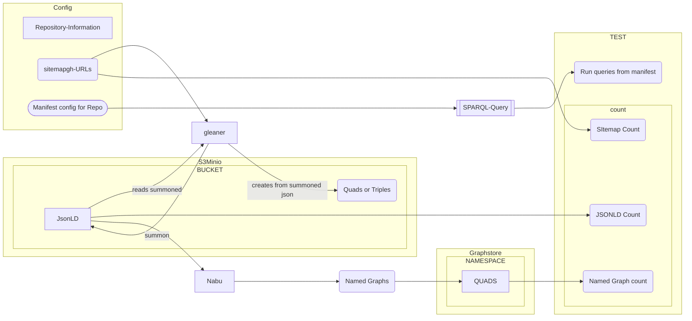
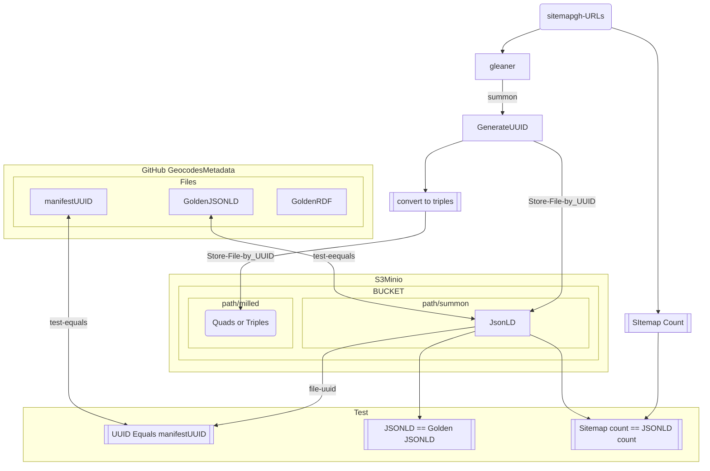
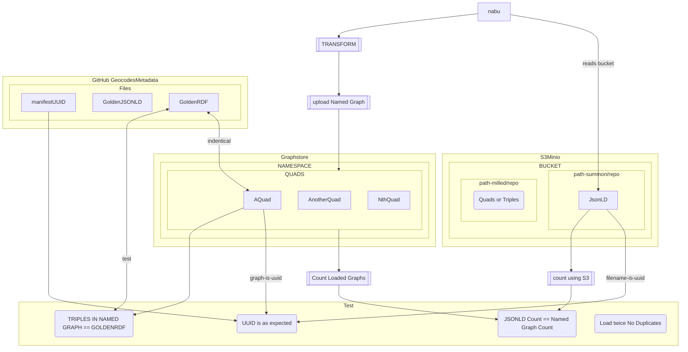
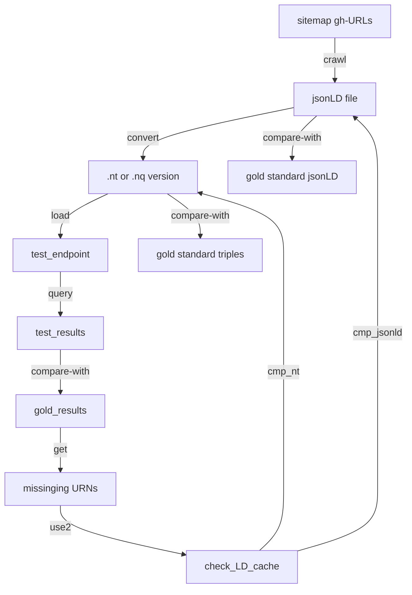

# From [ingestTesting.md](https://github.com/MBcode/ec/blob/master/test/ingestTesting.md) now split out and focusing on [testing.md](testing.md) 
### These .md version derived from [.ipynb](ingesttesting.ipynb) version, with a focus on documentation only, and adding diagrams

Here are the parts that the doc was broken into:

1) See how the [counts.md](https://github.com/MBcode/ec/blob/master/test/counts.md) [code](http://geocodes.ddns.net/ec/test/counts/?C=M;O=D) from the repo-sitemaps can fall off in the LD-cache(jsonld&ntriples), then while getting into the endpoint
2) Then from the original cut out spot testing [sec2.md](sec2.md), then reworked with [just new code and img below = testing.md](https://github.com/MBcode/ec/blob/master/test/testing.md); w/rewrite to just focus on that
3) How to best [sample.md](https://github.com/MBcode/ec/blob/master/test/sample.md) from the sitemaps, which has become a test set, w/the hash naming in ec/test/standard/ summoned&milled

### Below is an overview that is mostly on CI spot testing: 
being reworked in  [testing.md](testing.md) to better fit actual flow

## what gets passed into the Notebook
This should be read from/passed to the notebook. Suggest as a JSON structure. Needs to be short and Hashcoded url

|  Name | Description                                                           |
| ---------- |-----------------------------------------------------------------------|
| config name | name of config directory from glcon                                   |
| org        | short name or repo                                                    |
| sitemap | url of sitemap                                                        |
| s3 base | base of s3 url |
| graph base | base url of graph endpoint |
| s2 bucket | name of bucket |
| graph namespace | name of graph namespace |
| expected results | for testing we might pass in a set of (counts, etc) in json structure |
| pointer to csv | for CI testing  has queries, expected urn's |

## Data Loading 
Basic Data loading flight testing:
* Count 1.0 - Do counts match
    * Does the gleaner count match the sitemap count
    * Does the Named Graph Count match the JsonLD Count
* Identify missing information
  *  are there missing files between the steps?
      * This can be done as part of gleaner/nabu test scopes
### Report
* Gelaner Report
* Nabu Report
* SCHACL Validation reports (TBD) 
* count history if we have that in the provenance
 

This diagram changes a lot in: [testing.md](testing.md) 
The others also differ from present flow, but could be made to work more that way
 
## Gleaner
## Gleaner Tests
* Did we get as many as expected --> Does the gleaner count match the sitemap count
* Are the UUID generated as expected - Does the UUID Match the expected
* Did is summon correctly -- JSONLD  == Golden JSONLD
* If as CI Test Dataload, Run Queries from Manifest -- Do we get expected results
## Reporting:
* Sitemap URL
* Org Information
* sitemap count
* JSONLD Count
* Bucket name
* stats on summon
    * (jsonld count/ sitemap count)
* not harvested records from sitemap
* 

## Nabu
### Nabu Tests
* Did we get as many as expected --> Does the json count == named graph count
* Are the UUID generated as expected - Does the UUID Match the expected
* Did they transform as expected -- Named Graph Triples == Golden Triples
* dupes: when loaded twice are there duplicate triples
### Reporting:
* Org Information
* Converted Count
* Graph namespace and endpoint
* stats on nabu
* (named graph count/jsonld count)
* not converted records

## Functional  Conversion Testing

### Also in [Sec2](sec2.md): spot [testing.md)(testing.md)
### Got end-to-end expected [sparql](standard/qry1.txt)-to->[df](standard/queryResults1.csv)/[URNs](https://github.com/MBcode/ec/blob/master/test/standard/milled/geocodes_demo_datasets/URNs.txt), for 1st comparison below
next I use diff in df to find missing URNs, and look in LD-cache for them (bc of gleaner naming)
Check both jsonld and other rdf, with standard values
in [ingestTesting.md](https://github.com/MBcode/ec/blob/master/test/ingestTesting.md) sec 2, still have dictdiff and rdflib graph cmp
but now also have output from [blabel](https://github.com/aidhog/blabel/) that removes BlankNodes+some dups, for easier nt file comparison

### ./standard instances have been moved over[*](https://github.com/earthcube/GeoCODES-Metadata/tree/main/metadata/Dataset/json), but had schema testing, which will only be usefull for a repo-feedback dashboard
The current mb_ are just json, w/my naming, ec/test/standard has summoned .jsonld and milled .rdf to test against

### the expected_urls.csv or dataset_tests.csv will get finer grain, incl all the tests a dataset will go through
Right now I think most in standard will complete, but need to know which don't and why; will look at SR's look at this

We have a few test jsonld instances in 
[GeoCODES-Metadata](https://github.com/earthcube/GeoCODES-Metadatatree/main/metadata) that probably need their dataset_tests.csv to have finer grain expectations of the results of the tests; also to have the ability to have more than one test run; download, json conformance, and then to have some things that just go to a [repo-dashboard of warnings](repo-dashboard.md), like schema conformance.
 As long as it also tests well to turining into triples, and getting asserted in the triplestore, we should still do a text-bases search on it's strings.
 But even beyond conformance, the metadata has a way to go, to have better machine actionablitity.
 
### it also mentions monitoring, incl. crontab restarts and a more frequent check+log with check.py
Added slack app w/webhook url, so nagios can be sent to ecotech channel so we have more eyes on it

### Re-worked diagrams with more on the gleaner calls from [here](https://github.com/earthcube/ec/tree/dev_dv/test), [working in](http://geocodes.ddns.net/ec/test/a22) soon

### other docs started [here](https://github.com/MBcode/ec/tree/master/doc)
