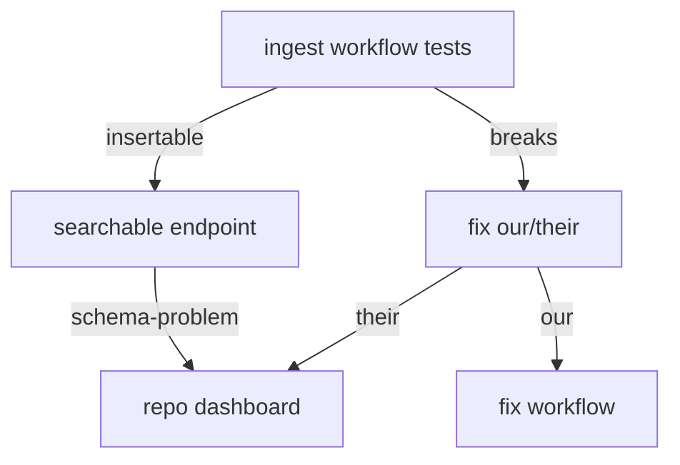
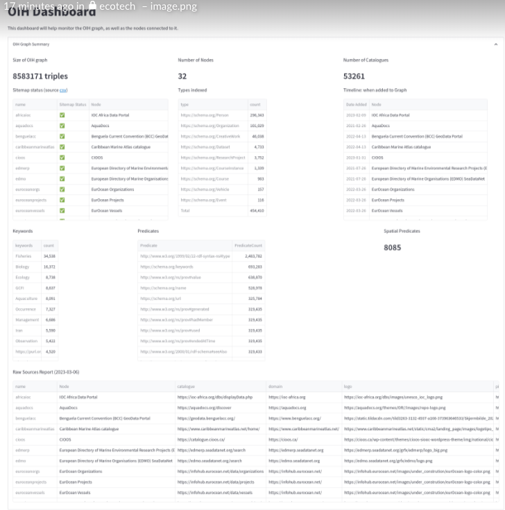

### Repository Feedback Dashboard

If the metadata can be downloaded and turned into triples with searchable text, it should go into the index to start to be found.

Every test after that should go back to the repositories, to show them the health of their metadata, via schema/shacl tests

Later we can try some entity annotation again, and also share that.

We could also make some fixes for their breaks (eg. I've made context fixes), and inform them

#### Validation by data of the workflow software
Had a mockup [here](https://github.com/earthcube/geocodes_documentation/wiki/DataValidationReportMockup)
Which is mostly in the utils that can be called by [spot_test.py](https://github.com/MBcode/ec/blob/master/test/spot_test.py#L62) and just needs a little cleaning up

## want to reuse this for reporting

