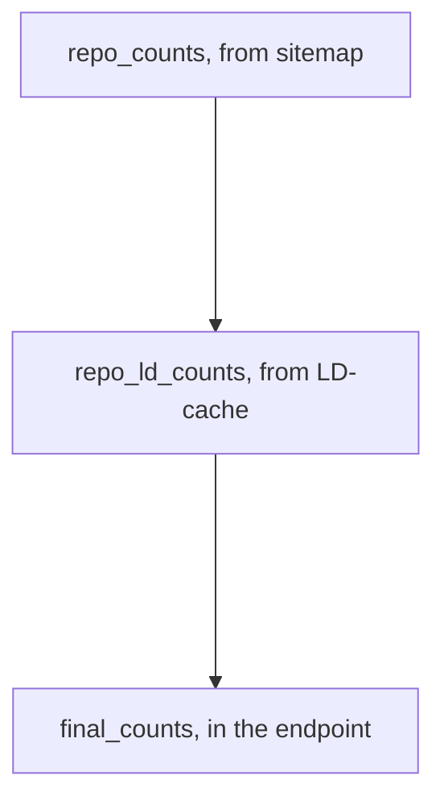
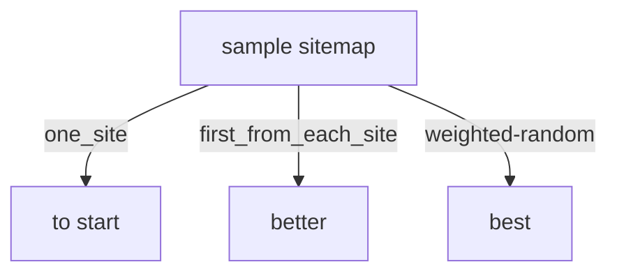

# GeoCODES ingest pipeline testing:

Be able to 1) check how many of the expected datasets from the sitemap make it to differt stages
then 2) go back and see that some of what made it are correct/valid and similar to expected/saved test-set values  3) best way to get a test set sample


# 1) Checking counts along the way:

repo_counts(from sitemap) -> repo_ld_counts(from LD-cache) -> final_counts(in the endpoint)



Then unit/end-to-end spot testing of crawl products, to check that code changes don't change outputs

#Load the github.com/earthcube/earthcube_utilities 
 for now the staging version


```python
%load_ext rpy2.ipython
%load_ext google.colab.data_table
import httpimport
with httpimport.github_repo('MBcode', 'ec'):
  import ec
```

# Start by seeing how many records are expected from each repository
To be harvested by google-datasetsearch or GeoCODES only happens if the repository has a 'sitemap.xml' listing the dataset landing pages, which have jsonld in them, that they want indexed, so the search engine can find dataset resources of interest So we start by crawling the sitemaps, (but just this time) we will only record the number of records, so we can know how many to expect from each repository, during in the next parts of the ingestion pipeline


```python
named_sitemaps={ "ssdb.iodp": "https://ssdb.iodp.org/dataset/sitemap.xml",
#"balto": "http://balto.opendap.org/opendap/site_map.txt ",
"linked.earth": "http://wiki.linked.earth/sitemap.xml",
"lipdverse": "https://lipdverse.org/sitemap.xml",
"iris": "http://ds.iris.edu/files/sitemap.xml",
"unavco": "https://www.unavco.org/data/doi/sitemap.xml",
"ucar": "https://data.ucar.edu/sitemap.xml",
"opencoredata": "http://opencoredata.org/sitemap.xml",
"magic": "https://www2.earthref.org/MagIC/contributions.sitemap.xml",
#"neotomadb": "http://data.neotomadb.org/sitemap.xml",
"earthchem": "https://ecl.earthchem.org/sitemap.xml",
#"xdomes": "https://xdomes.tamucc.edu/srr/sensorML/sitemap.xml",
#"neon": "https://geodex.org/neon_prodcodes_sm.xml",
"designsafe": "https://www.designsafe-ci.org/sitemap.xml ",
"unidata": "https://www.unidata.ucar.edu/sitemap.xml",
"r2r": "https://service-dev.rvdata.us/api/sitemap/",
"geocodes_demo_dataset": "https://raw.githubusercontent.com/earthcube/GeoCODES-Metadata/gh-pages/metadata/Dataset/sitemap.xml",
"usap-dc": "https://www.usap-dc.org/view/dataset/sitemap.xml",
"cchodo": "https://cchdo.ucsd.edu/sitemap.xml",
"amgeo": "https://amgeo-dev.colorado.edu/sitemap.xml"}

```


```python
sitemaps=list(named_sitemaps.values())
repos=list(named_sitemaps.keys())
#sitemaps, repos
```


```python
ec.setup_sitemap()
```


```python
#sitemaps_count = ec.sitemaps_count(sitemaps)
#sitemaps_count  #will used cached values for now
```


```python
sitemap_count
```


    {'http://datadiscoverystudio.org/sitemap/CinergiSiteIndex.xml': 0,
     'http://ds.iris.edu/files/sitemap.xml': 0,
     'http://opencoredata.org/sitemap.xml': 83388,
     'http://wiki.linked.earth/sitemap.xml': 18634,
     'https://cchdo.ucsd.edu/sitemap.xml': 5040,
     'https://data.ucar.edu/sitemap.xml': 17005,
     'https://ecl.earthchem.org/sitemap.xml': 920,
     'https://geodex.org/neon_prodcodes_sm.xml': 0,
     'https://lipdverse.org/sitemap.xml': 704,
     'https://object.cloud.sdsc.edu/v1/AUTH_85f46aa78936477d8e71b186269414e8/gleaner-summoned': 0,
     'https://raw.githubusercontent.com/earthcube/GeoCODES-Metadata/gh-pages/metadata/Dataset/sitemap.xml': 0,
     'https://service-dev.rvdata.us/api/sitemap/': 0,
     'https://ssdb.iodp.org/dataset/sitemap.xml': 25241,
     'https://www.unavco.org/data/doi/sitemap.xml': 0,
     'https://www.unidata.ucar.edu/sitemap.xml': 211,
     'https://www.usap-dc.org/view/dataset/sitemap.xml': 0,
     'https://www2.earthref.org/MagIC/contributions.sitemap.xml': 0,
     'https://xdomes.tamucc.edu/srr/sensorML/sitemap.xml': 0}


# 3) best way to get a test set sample
## A few ways to sample datasets,  
to be put in a gold_standard in github to campare with


For most repositories will still need a sampling stradegy, and to check the gold-standard metadata set,
[before](https://github.com/MBcode/ec/tree/master/test/standard) it can be checked into the [part of github](https://github.com/earthcube/GeoCODES-Metadata) that the testing workflow will use

```python
#can use this as a basis for an expected_urls.csv in https://github.com/MBcode/ec/tree/master/test 
!cat amgeo.csv
```

    ,loc
    0,https://amgeo-dev.colorado.edu/static/data/data-01-01-2013-12-30-00.html
    1,https://amgeo-dev.colorado.edu/static/data/data-01-06-2013-17-30-00.html
    2,https://amgeo-dev.colorado.edu/static/data/data-02-06-2013-12-30-00.html
    3,https://amgeo-dev.colorado.edu/static/data/data-02-06-2013-13-30-00.html
    4,https://amgeo-dev.colorado.edu/static/data/data-03-17-2015-18-00-00.html


To get a bigger sampling for ec/test/[expected_urls.csv](https://github.com/MBcode/ec/blob/master/test/expected_urls.csv) 

could easily take a few from each repo, at least 1/1k


```python
repo_df_loc
```


    {'amgeo': 0    https://amgeo-dev.colorado.edu/static/data/dat...
     1    https://amgeo-dev.colorado.edu/static/data/dat...
     2    https://amgeo-dev.colorado.edu/static/data/dat...
     3    https://amgeo-dev.colorado.edu/static/data/dat...
     4    https://amgeo-dev.colorado.edu/static/data/dat...
     Name: loc, dtype: object,
     'cchodo': 0                http://cchdo.ucsd.edu/search/map
     1           http://cchdo.ucsd.edu/search/advanced
     2                   http://cchdo.ucsd.edu/contact
     3                  http://cchdo.ucsd.edu/citation
     4                    http://cchdo.ucsd.edu/policy
                               ...                    
     2515      http://cchdo.ucsd.edu/cruise/49TU9107_2
     2516    http://cchdo.ucsd.edu/cruise/316N198212_2
     2517      http://cchdo.ucsd.edu/cruise/49TU9210_1
     2518      http://cchdo.ucsd.edu/cruise/49TU9310_1
     2519    http://cchdo.ucsd.edu/cruise/33AT20120419
     Name: loc, Length: 2520, dtype: object,
     'designsafe': 0                           https://www.designsafe-ci.org
     1                           https://fiu.designsafe-ci.org
     2                        https://lehigh.designsafe-ci.org
     3                         https://mechs.designsafe-ci.org
     4                   https://oregonstate.designsafe-ci.org
                                   ...                        
     1633               https://www.designsafe-ci.org/podcast/
     1634                   https://www.designsafe-ci.org/faq/
     1635               https://www.designsafe-ci.org/covid19/
     1636    https://www.designsafe-ci.org/covid19/coronavi...
     1637    https://www.designsafe-ci.org/conferences/2021...
     Name: loc, Length: 1638, dtype: object,
     'earthchem': 0         https://ecl.earthchem.org/view.php?id=6
     1        https://ecl.earthchem.org/view.php?id=65
     2        https://ecl.earthchem.org/view.php?id=66
     3        https://ecl.earthchem.org/view.php?id=67
     4        https://ecl.earthchem.org/view.php?id=68
                               ...                    
     915    https://ecl.earthchem.org/view.php?id=2064
     916    https://ecl.earthchem.org/view.php?id=2065
     917    https://ecl.earthchem.org/view.php?id=2068
     918    https://ecl.earthchem.org/view.php?id=2070
     919    https://ecl.earthchem.org/view.php?id=2071
     Name: loc, Length: 920, dtype: object,
     'geocodes_demo_dataset': 0    https://raw.githubusercontent.com/earthcube/Ge...
     1    https://raw.githubusercontent.com/earthcube/Ge...
     2    https://raw.githubusercontent.com/earthcube/Ge...
     3    https://raw.githubusercontent.com/earthcube/Ge...
     4    https://raw.githubusercontent.com/earthcube/Ge...
     5    https://raw.githubusercontent.com/earthcube/Ge...
     6    https://raw.githubusercontent.com/earthcube/Ge...
     7    https://raw.githubusercontent.com/earthcube/Ge...
     Name: loc, dtype: object,
     'iris': 0                       http://ds.iris.edu/ds/products/
     1                   http://ds.iris.edu/ds/products/emc/
     2            http://ds.iris.edu/ds/products/eventplots/
     3               http://ds.iris.edu/ds/products/syngine/
     4                   http://ds.iris.edu/ds/products/gmv/
     5        http://ds.iris.edu/ds/products/backprojection/
     6          http://ds.iris.edu/ds/products/globalstacks/
     7                  http://ds.iris.edu/ds/products/esec/
     8            http://ds.iris.edu/ds/products/infrasound/
     9                 http://ds.iris.edu/ds/products/aswms/
     10              http://ds.iris.edu/ds/products/sws-dbs/
     11          http://ds.iris.edu/ds/products/aftershocks/
     12                 http://ds.iris.edu/ds/products/ears/
     13    http://ds.iris.edu/ds/products/envelopefunctions/
     14             http://ds.iris.edu/ds/products/eqenergy/
     15    http://ds.iris.edu/ds/products/sourcetimefunct...
     16    http://ds.iris.edu/ds/products/shakemoviesynth...
     17         http://ds.iris.edu/ds/products/momenttensor/
     18            http://ds.iris.edu/ds/products/ancc-ciei/
     19    http://ds.iris.edu/ds/products/globalempirical...
     20                 http://ds.iris.edu/ds/products/emtf/
     21        http://ds.iris.edu/ds/products/noise-toolkit/
     22            http://ds.iris.edu/ds/products/seissound/
     23              http://ds.iris.edu/ds/products/emerald/
     24       http://ds.iris.edu/ds/products/eventbulletins/
     25             http://ds.iris.edu/ds/products/filmchip/
     26          http://ds.iris.edu/ds/products/calibration/
     27        http://ds.iris.edu/ds/products/stationdigest/
     Name: loc, dtype: object,
     'linked.earth': 0                       http://wiki.linked.earth/Main_Page
     1        http://wiki.linked.earth/File:Asia-BIGELS.pale...
     2                http://wiki.linked.earth/Dataset_Tutorial
     3           http://wiki.linked.earth/File:TutorialFig1.png
     4           http://wiki.linked.earth/File:TutorialFig2.png
                                    ...                        
     18629    http://wiki.linked.earth/File:TwitterPoll_Spel...
     18630    http://wiki.linked.earth/File:TwitterPoll_Spel...
     18631    http://wiki.linked.earth/File:TwitterPoll_Radi...
     18632    http://wiki.linked.earth/File:TwitterPoll_Radi...
     18633                      http://wiki.linked.earth/Newvar
     Name: loc, Length: 18634, dtype: object,
     'lipdverse': 0      http://lipdverse.org/Temp12k/1_0_2/117_723A.Go...
     1      http://lipdverse.org/Temp12k/1_0_2/161_976.Mar...
     2      http://lipdverse.org/Temp12k/1_0_2/165_1002C.H...
     3      http://lipdverse.org/Temp12k/1_0_2/2005-804-00...
     4      http://lipdverse.org/Temp12k/1_0_2/31Lake.Eisn...
                                  ...                        
     699    http://lipdverse.org/Temp12k/1_0_2/Yarnyshnoe....
     700    http://lipdverse.org/Temp12k/1_0_2/Ylimysneva....
     701    http://lipdverse.org/Temp12k/1_0_2/Zabieniec.P...
     702    http://lipdverse.org/Temp12k/1_0_2/Zalozhtsy.B...
     703    http://lipdverse.org/Temp12k/1_0_2/Zbudovskabl...
     Name: loc, Length: 704, dtype: object,
     'magic': 0       https://earthref.org/MagIC/11131
     1       https://earthref.org/MagIC/11846
     2       https://earthref.org/MagIC/11858
     3       https://earthref.org/MagIC/11860
     4       https://earthref.org/MagIC/11874
                           ...               
     4258    https://earthref.org/MagIC/19205
     4259    https://earthref.org/MagIC/19206
     4260    https://earthref.org/MagIC/19207
     4261    https://earthref.org/MagIC/19212
     4262    https://earthref.org/MagIC/19214
     Name: loc, Length: 4263, dtype: object,
     'opencoredata': 0        https://opencoredata.org/id/csdco/do/b7545a859...
     1        https://opencoredata.org/id/csdco/do/b757042e7...
     2        https://opencoredata.org/id/csdco/do/b75754032...
     3        https://opencoredata.org/id/csdco/do/b75a7f475...
     4        https://opencoredata.org/id/csdco/do/b75d599b0...
                                    ...                        
     83383                  https://opencoredata.org/about.html
     83384             https://opencoredata.org/docs/about.html
     83385            https://opencoredata.org/docs/search.html
     83386                  https://opencoredata.org/index.html
     83387                 https://opencoredata.org/search.html
     Name: loc, Length: 83388, dtype: object,
     'r2r': 0        https://dev.rvdata.us/search/fileset/100135
     1        https://dev.rvdata.us/search/fileset/100136
     2        https://dev.rvdata.us/search/fileset/100137
     3        https://dev.rvdata.us/search/fileset/100138
     4        https://dev.rvdata.us/search/fileset/100139
                                 ...                     
     44002    https://dev.rvdata.us/search/fileset/148766
     44003    https://dev.rvdata.us/search/fileset/148767
     44004    https://dev.rvdata.us/search/fileset/148768
     44005    https://dev.rvdata.us/search/fileset/148769
     44006    https://dev.rvdata.us/search/fileset/148770
     Name: loc, Length: 44007, dtype: object,
     'ssdb.iodp': 0                   https://ssdb.iodp.org/dataset
     1        https://ssdb.iodp.org/dataset/?id=100001
     2        https://ssdb.iodp.org/dataset/?id=100002
     3        https://ssdb.iodp.org/dataset/?id=100003
     4        https://ssdb.iodp.org/dataset/?id=100004
                                ...                   
     25221    https://ssdb.iodp.org/dataset/?id=128511
     25222    https://ssdb.iodp.org/dataset/?id=128512
     25223    https://ssdb.iodp.org/dataset/?id=128513
     25224    https://ssdb.iodp.org/dataset/?id=128514
     25225    https://ssdb.iodp.org/dataset/?id=128515
     Name: loc, Length: 25226, dtype: object,
     'ucar': 0        https://data.ucar.edu/dataset/0-1-degree-paral...
     1        https://data.ucar.edu/dataset/0-1-degree-paral...
     2        https://data.ucar.edu/dataset/100-years-of-pro...
     3        https://data.ucar.edu/dataset/100-years-of-pro...
     4        https://data.ucar.edu/dataset/100-years-of-pro...
                                    ...                        
     17501    https://data.ucar.edu/dataset/zooplankton-abun...
     17502    https://data.ucar.edu/dataset/zooplankton-abun...
     17503    https://data.ucar.edu/dataset/zooplankton-abun...
     17504    https://data.ucar.edu/dataset/zooplankton-data...
     17505    https://data.ucar.edu/dataset/zooplankton-dens...
     Name: loc, Length: 17506, dtype: object,
     'unavco': 0        https://www.unavco.org/data/doi/10.7283/T5X928QS
     1       https://www.unavco.org/data/doi/10.7283/0XHG-T159
     2       https://www.unavco.org/data/doi/10.7283/2DMR-AP19
     3       https://www.unavco.org/data/doi/10.7283/XGQB-NY54
     4       https://www.unavco.org/data/doi/10.7283/Z1FH-4N09
                                   ...                        
     5638     https://www.unavco.org/data/doi/10.7283/T5RX99HT
     5639     https://www.unavco.org/data/doi/10.7283/T55719FQ
     5640     https://www.unavco.org/data/doi/10.7283/T5X928ZX
     5641     https://www.unavco.org/data/doi/10.7283/T590225F
     5642     https://www.unavco.org/data/doi/10.7283/T5P55KWB
     Name: loc, Length: 5643, dtype: object,
     'unidata': 0                          https://www.unidata.ucar.edu/
     1                     https://www.unidata.ucar.edu/data/
     2        https://www.unidata.ucar.edu/data/DataFlow.html
     3      https://www.unidata.ucar.edu/software/ldm/ldm-...
     4                https://www.unidata.ucar.edu/data/dmrc/
                                  ...                        
     197    https://www.unidata.ucar.edu/committees/steering/
     198    https://www.unidata.ucar.edu/committees/orient...
     199    https://www.unidata.ucar.edu/committees/stratc...
     200                 https://www.unidata.ucar.edu/travel/
     201    https://www.unidata.ucar.edu/events/2009UsersW...
     Name: loc, Length: 202, dtype: object,
     'usap-dc': 0      https://www.usap-dc.org/view/dataset/600001
     1      https://www.usap-dc.org/view/dataset/600002
     2      https://www.usap-dc.org/view/dataset/600003
     3      https://www.usap-dc.org/view/dataset/600004
     4      https://www.usap-dc.org/view/dataset/600005
                               ...                     
     884    https://www.usap-dc.org/view/dataset/609655
     885    https://www.usap-dc.org/view/dataset/609656
     886    https://www.usap-dc.org/view/dataset/609659
     887    https://www.usap-dc.org/view/dataset/609660
     888    https://www.usap-dc.org/view/dataset/609667
     Name: loc, Length: 889, dtype: object}


```python
def first(l):
  return ec.first(list(l))
```


```python
firsts=list(map(first,repo_df_loc.values()))
firsts #potentially add to list of standard intermediates, to save, for later comparison
#len(repo_df_loc)
#repo_df_loc.keys()
```


    ['https://ssdb.iodp.org/dataset',
     'http://wiki.linked.earth/Main_Page',
     'http://lipdverse.org/Temp12k/1_0_2/117_723A.Godad.2011.html',
     'http://ds.iris.edu/ds/products/',
     'https://www.unavco.org/data/doi/10.7283/T5X928QS',
     'https://data.ucar.edu/dataset/0-1-degree-parallel-ocean-program-pop-output-for-eastern-equatorial-indian-ocean-and-western-in',
     'https://opencoredata.org/id/csdco/do/b7545a85958138c02a97ca54352ad4ef89309545e6e68fec0bdd52cefaa3292b.jsonld',
     'https://earthref.org/MagIC/11131',
     'https://ecl.earthchem.org/view.php?id=6',
     'https://www.designsafe-ci.org',
     'https://www.unidata.ucar.edu/',
     'https://dev.rvdata.us/search/fileset/100135',
     'https://raw.githubusercontent.com/earthcube/GeoCODES-Metadata/main/metadata/Dataset/argo.json',
     'https://www.usap-dc.org/view/dataset/600001',
     'http://cchdo.ucsd.edu/search/map',
     'https://amgeo-dev.colorado.edu/static/data/data-01-01-2013-12-30-00.html']


```python
def repo2repocounts(repo):
    rc=repo_counts.get(repo)
    if not rc:
        rc=1 #
    return rc

def repo_sample(repo):
    import random
    rcount=repo2repocounts(repo)
    sn = int(rcount / 10000) 
    n=min(max(sn, 1),5)
    print(f'for {repo} choose {n} from {rcount}')
    seq=list(repo_df_loc[repo])
    return random.sample(seq, n)
```


```python
expected_urls=list(map(repo_sample,repos))
ec.flatten(expected_urls)
```

    for ssdb.iodp choose 2 from 25226
    for linked.earth choose 1 from 18634
    for lipdverse choose 1 from 704
    for iris choose 1 from 28
    for unavco choose 1 from 5643
    for ucar choose 1 from 17506
    for opencoredata choose 5 from 83388
    for magic choose 1 from 4263
    for earthchem choose 1 from 920
    for designsafe choose 1 from 1638
    for unidata choose 1 from 202
    for r2r choose 4 from 44007
    for geocodes_demo_dataset choose 1 from 8
    for usap-dc choose 1 from 889
    for cchodo choose 1 from 2520
    for amgeo choose 1 from 5


    ['https://ssdb.iodp.org/dataset/?id=127708',
     'https://ssdb.iodp.org/dataset/?id=122373',
     'http://wiki.linked.earth/LPDa97364db.temperature',
     'http://lipdverse.org/Temp12k/1_0_2/Hypkana.Hajkova.2016.html',
     'http://ds.iris.edu/ds/products/syngine/',
     'https://www.unavco.org/data/doi/10.7283/T5P55KQ3',
     'https://data.ucar.edu/dataset/ncep-fnl-operational-model-global-tropospheric-analyses-continuing-from-july-19991',
     'https://opencoredata.org/id/csdco/do/1641417e0a54773f37333f28c5a2a6a92e671516d74f61db22b0e5060b22ca93.jsonld',
     'https://opencoredata.org/id/csdco/do/6ab3e531c3a457eece22c664f2093b3597ac5235d437fbbb256e3b91cfe34fa1.jsonld',
     'https://opencoredata.org/id/csdco/do/8071d43f02c5911d49f9c3891716763d1fdd83cf3cca0b46b2091379831e4a59.jsonld',
     'https://opencoredata.org/id/csdco/do/58fd450c99452555e993e4ae782d34eb40ba48f414a640a7761ffa9eb8cd9c5a.jsonld',
     'https://opencoredata.org/id/csdco/do/b75a7f47538b1ee478276c9f0806cc4f4ee01325cea8eac62adcd1844ed8ef7e.jsonld',
     'https://earthref.org/MagIC/15809',
     'https://ecl.earthchem.org/view.php?id=1572',
     'https://www.designsafe-ci.org/data/browser/public/designsafe.storage.published/PRJ-2137',
     'https://www.unidata.ucar.edu/software/gempak/man/parm/apxB.html',
     'https://dev.rvdata.us/search/fileset/147162',
     'https://dev.rvdata.us/search/fileset/128289',
     'https://dev.rvdata.us/search/fileset/122831',
     'https://dev.rvdata.us/search/fileset/137436',
     'https://raw.githubusercontent.com/earthcube/GeoCODES-Metadata/main/metadata/Dataset/nwis-sites.json',
     'https://www.usap-dc.org/view/dataset/600073',
     'http://cchdo.ucsd.edu/cruise/49SU9402_2',
     'https://amgeo-dev.colorado.edu/static/data/data-01-06-2013-17-30-00.html']


