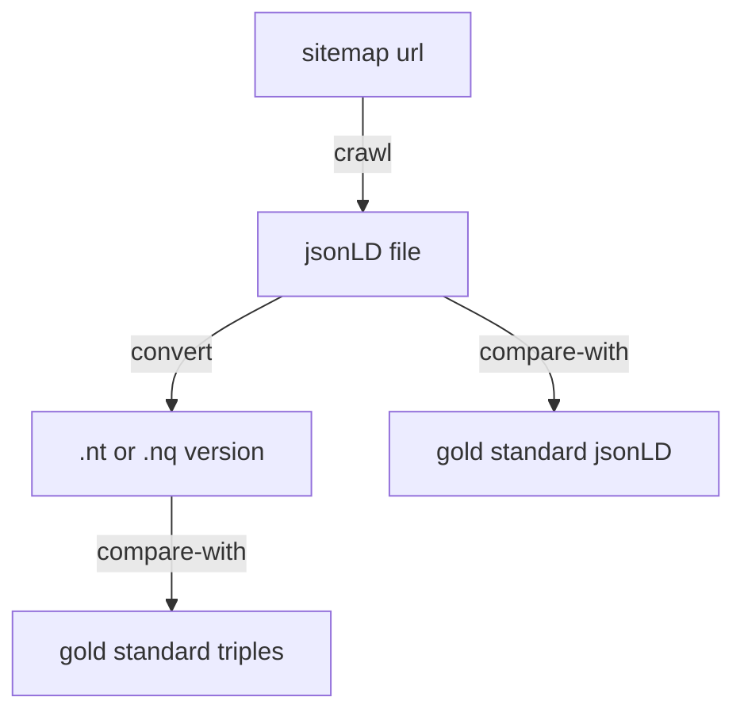
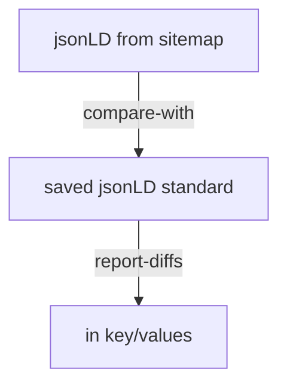
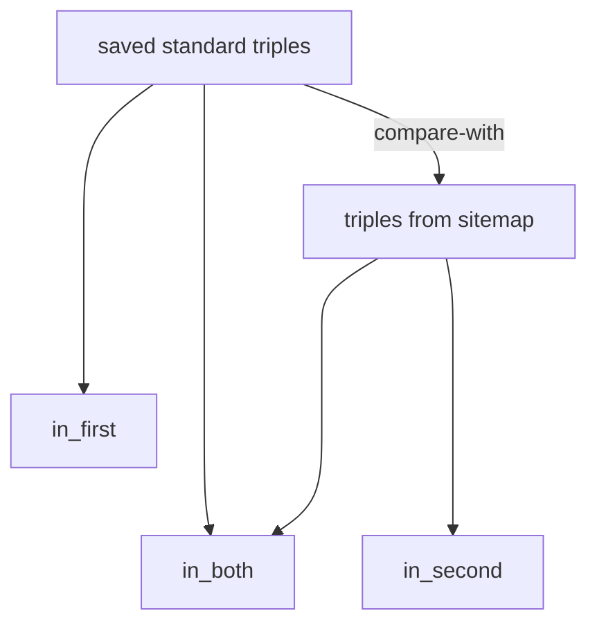
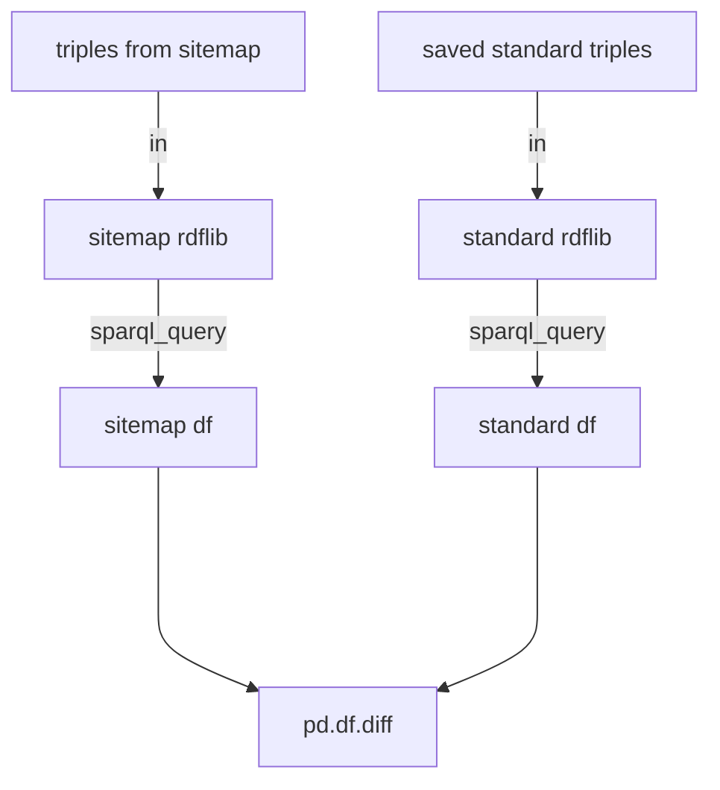
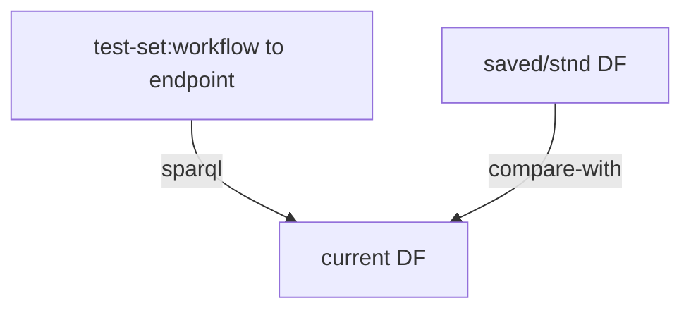

# GeoCODES ingest pipeline testing:

Be able to 1) check how many of the expected datasets from the sitemap make it to differt stages
then 2) go back and see that some of what made it are correct/valid and similar to expected/saved test-set values  3) best way to get a test set sample


# 1) Checking counts along the way: now in [counts.md](counts.md)

#Load the github.com/earthcube/earthcube_utilities 
 for now the staging version


```python
%load_ext rpy2.ipython
%load_ext google.colab.data_table
import httpimport
with httpimport.github_repo('MBcode', 'ec'):
  import ec
```

# Start by seeing how many records are expected from each repository
To be harvested by google-datasetsearch or GeoCODES only happens if the repository has a 'sitemap.xml' listing the dataset landing pages, which have jsonld in them, that they want indexed, so the search engine can find dataset resources of interest So we start by crawling the sitemaps, (but just this time) we will only record the number of records, so we can know how many to expect from each repository, during in the next parts of the ingestion pipeline


```python
named_sitemaps={ "ssdb.iodp": "https://ssdb.iodp.org/dataset/sitemap.xml",
#"balto": "http://balto.opendap.org/opendap/site_map.txt ",
"linked.earth": "http://wiki.linked.earth/sitemap.xml",
"lipdverse": "https://lipdverse.org/sitemap.xml",
"iris": "http://ds.iris.edu/files/sitemap.xml",
"unavco": "https://www.unavco.org/data/doi/sitemap.xml",
"ucar": "https://data.ucar.edu/sitemap.xml",
"opencoredata": "http://opencoredata.org/sitemap.xml",
"magic": "https://www2.earthref.org/MagIC/contributions.sitemap.xml",
#"neotomadb": "http://data.neotomadb.org/sitemap.xml",
"earthchem": "https://ecl.earthchem.org/sitemap.xml",
#"xdomes": "https://xdomes.tamucc.edu/srr/sensorML/sitemap.xml",
#"neon": "https://geodex.org/neon_prodcodes_sm.xml",
"designsafe": "https://www.designsafe-ci.org/sitemap.xml ",
"unidata": "https://www.unidata.ucar.edu/sitemap.xml",
"r2r": "https://service-dev.rvdata.us/api/sitemap/",
"geocodes_demo_dataset": "https://raw.githubusercontent.com/earthcube/GeoCODES-Metadata/gh-pages/metadata/Dataset/sitemap.xml",
"usap-dc": "https://www.usap-dc.org/view/dataset/sitemap.xml",
"cchodo": "https://cchdo.ucsd.edu/sitemap.xml",
"amgeo": "https://amgeo-dev.colorado.edu/sitemap.xml"}

```


```python
sitemaps=list(named_sitemaps.values())
repos=list(named_sitemaps.keys())
#sitemaps, repos
```


```python
ec.setup_sitemap()
```


```python
#get all counts from sitemap/etc caches
repo_counts,repo_ld_counts,final_counts,      repo_df_loc =ec.repos2counts(repos)
```

    Getting http://geocodes.ddns.net/ec/crawl/sitemaps/ssdb.iodp.xml
    Getting http://geocodes.ddns.net/ec/crawl/sitemaps/linked.earth.xml
    Getting http://geocodes.ddns.net/ec/crawl/sitemaps/lipdverse.xml
    Getting http://geocodes.ddns.net/ec/crawl/sitemaps/iris.xml
    Getting http://geocodes.ddns.net/ec/crawl/sitemaps/unavco.xml
    Getting http://geocodes.ddns.net/ec/crawl/sitemaps/ucar.xml
    Getting https://opencoredata.org/sitemap_1.xml
    Getting https://opencoredata.org/sitemap_2.xml
    Getting https://opencoredata.org/sitemap_3.xml
    Getting https://opencoredata.org/sitemap_0.xml
    Getting http://geocodes.ddns.net/ec/crawl/sitemaps/magic.xml
    Getting http://geocodes.ddns.net/ec/crawl/sitemaps/earthchem.xml
    Getting http://geocodes.ddns.net/ec/crawl/sitemaps/designsafe.xml
    Getting http://geocodes.ddns.net/ec/crawl/sitemaps/unidata.xml
    Getting http://geocodes.ddns.net/ec/crawl/sitemaps/r2r.xml
    Getting http://geocodes.ddns.net/ec/crawl/sitemaps/geocodes_demo_dataset.xml
    Getting http://geocodes.ddns.net/ec/crawl/sitemaps/usap-dc.xml
    Getting http://geocodes.ddns.net/ec/crawl/sitemaps/cchodo.xml
    Getting http://geocodes.ddns.net/ec/crawl/sitemaps/amgeo.xml


# 2) Now, Compare some steps against expected values

from sitemap-url to the 2 parts of the LD-cache and final endpoint graph

url -> jsonld (compare w/pre extracted), ntriples (compare w/pre converted),
 
 and w/graph triples
 That can be found hitting the search, via sparql_nb's ec.txt_qry(text), incl timing

 then other related data/tools/etc are also as expected

Can compare each step in isolation, and all the way through

[Some near misses still have same meaning in next step]

Below (details) has a crawl and cmp from ec utils, using an easily access/comparable ld-cache
The start of the gleaner details are at: https://github.com/earthcube/geocodes_documentation/wiki/DataLoadingValidationStory
Where we can run a small test set all the way through, but can't yet easily keep a dataset associated/find-it with it's crawl-url

```python
ec.first(repo_df_loc)
```


    'amgeo'


read from csv table of urls and expected results, to be kept in github documention  ;either csv or org, both editable


```python
#read from csv table of urls and expected results, to be kept in github documention  ;either csv or org, both editable
```


```python
#should/will be:
amgeo=ec.sitemap_all_pages(sitemaps[-1])
amgeo
```

    Getting https://amgeo-dev.colorado.edu/sitemap.xml


    0    https://amgeo-dev.colorado.edu/static/data/dat...
    1    https://amgeo-dev.colorado.edu/static/data/dat...
    2    https://amgeo-dev.colorado.edu/static/data/dat...
    3    https://amgeo-dev.colorado.edu/static/data/dat...
    4    https://amgeo-dev.colorado.edu/static/data/dat...
    Name: loc, dtype: object


```python
amgeo[0]
```


    'https://amgeo-dev.colorado.edu/static/data/data-01-01-2013-12-30-00.html'

Can sort by key, or load as dict, and get the diff there


```python
ec.init_rdflib()
```


For deeper key/value diffs could use: [deepdiff](https://pypi.org/project/deepdiff/)  or [Dictdiffer](https://dictdiffer.readthedocs.io/en/latest/)

```python
#do a crawl of a url
ld1=ec.url2jsonLD(amgeo[0])
ld1
```


    {'@context': 'https://schema.org/',
     '@type': 'Dataset',
     'about': 'AMGeO Assimilative Maps',
     'author': {'@type': 'Organization',
      'email': 'amgeo@colorado.edu',
      'logo': 'https://amgeo.colorado.edu/static/img/amgeosmall.svg',
      'name': 'AMGeO'},
     'citation': 'AMGeO Collaboration. (2019). A Collaborative Data Science Platform for the Geospace Community: Assimilative Mapping of Geospace Observations (AMGeO) v1.0.0. Zenodo. https://doi.org/10.5281/zenodo.3564914',
     'description': 'AMGeO helps combine diverse high-latitude geospace observations. The purpose of AMGeO is to make the latest geospace data science tool accessible to scientists and students.',
     'distribution': {'@type': 'DataDownload',
      'contentUrl': 'https://amgeo-dev.colorado.edu/static/data/01-01-2013-12-30-00.nc',
      'encodingFormat': 'application/x-hdf5'},
     'keywords': ['polar ionosphere',
      'magnetosphere-ionosphere coupling',
      'ionospheric electrodynamics'],
     'name': 'AMGeO Assimilative Maps for 2013-01-01T12:30:00',
     'spatialCoverage': {'@type': 'Place',
      'geo': {'@type': 'GeoShape',
       'box': '49.99975367385476 0.0 88.33332306974395 360.0'}},
     'temporalCoverage': '2013-01-01T12:30:00',
     'url': 'https://amgeo-dev.colorado.edu/static/data/data-01-01-2013-12-30-00.html',
     'variableMeasured': [{'@type': 'PropertyValue',
       'name': 'Electric Field (eastward)',
       'unitText': 'V/m'},
      {'@type': 'PropertyValue',
       'name': 'Electric Field (equatorward)',
       'unitText': 'V/m'},
      {'@type': 'PropertyValue',
       'name': 'Ovation Pyme Hall Conductance',
       'unitText': 'mho'},
      {'@type': 'PropertyValue',
       'name': 'Ovation Pyme Pedersen Conductance',
       'unitText': 'mho'},
      {'@type': 'PropertyValue', 'name': 'Electric Potential', 'unitText': 'V'},
      {'@type': 'PropertyValue',
       'name': 'Hemisphere Integrated Joule Heating',
       'unitText': 'GW'},
      {'@type': 'PropertyValue',
       'name': 'Joule Heating (E-field^2*Pedersen)',
       'unitText': 'mW/m^2'},
      {'@type': 'PropertyValue',
       'name': 'Ion Drift Velocity (eastward)',
       'unitText': 'm/s'},
      {'@type': 'PropertyValue',
       'name': 'Ion Drift Velocity (equatorward)',
       'unitText': 'm/s'}],
     'version': 'v2_beta'}


```python
#retrieve associated gold standard version
ld2=ec.wget2("http://geocodes.ddns.net/ld/amgeo/data-01-01-2013-12-30-00.html.jsonld","ld1gold.jsonld")
ld2
```


    '{\n  "@context": "https://schema.org/",\n  "@type": "Dataset",\n  "about": "AMGeO Assimilative Maps",\n  "author": {\n    "@type": "Organization",\n    "email": "amgeo@colorado.edu",\n    "logo": "https://amgeo.colorado.edu/static/img/amgeosmall.svg",\n    "name": "AMGeO"\n  },\n  "citation": "AMGeO Collaboration. (2019). A Collaborative Data Science Platform for the Geospace Community: Assimilative Mapping of Geospace Observations (AMGeO) v1.0.0. Zenodo. https://doi.org/10.5281/zenodo.3564914",\n  "description": "AMGeO helps combine diverse high-latitude geospace observations. The purpose of AMGeO is to make the latest geospace data science tool accessible to scientists and students.",\n  "distribution": {\n    "@type": "DataDownload",\n    "contentUrl": "https://amgeo-dev.colorado.edu/static/data/01-01-2013-12-30-00.nc",\n    "encodingFormat": "application/x-hdf5"\n  },\n  "keywords": [\n    "polar ionosphere",\n    "magnetosphere-ionosphere coupling",\n    "ionospheric electrodynamics"\n  ],\n  "name": "AMGeO Assimilative Maps for 2013-01-01T12:30:00",\n  "spatialCoverage": {\n    "@type": "Place",\n    "geo": {\n      "@type": "GeoShape",\n      "box": "49.99975367385476 0.0 88.33332306974395 360.0"\n    }\n  },\n  "temporalCoverage": "2013-01-01T12:30:00",\n  "url": "https://amgeo-dev.colorado.edu/static/data/data-01-01-2013-12-30-00.html",\n  "variableMeasured": [\n    {\n      "@type": "PropertyValue",\n      "name": "Electric Field (eastward)",\n      "unitText": "V/m"\n    },\n    {\n      "@type": "PropertyValue",\n      "name": "Electric Field (equatorward)",\n      "unitText": "V/m"\n    },\n    {\n      "@type": "PropertyValue",\n      "name": "Ovation Pyme Hall Conductance",\n      "unitText": "mho"\n    },\n    {\n      "@type": "PropertyValue",\n      "name": "Ovation Pyme Pedersen Conductance",\n      "unitText": "mho"\n    },\n    {\n      "@type": "PropertyValue",\n      "name": "Electric Potential",\n      "unitText": "V"\n    },\n    {\n      "@type": "PropertyValue",\n      "name": "Hemisphere Integrated Joule Heating",\n      "unitText": "GW"\n    },\n    {\n      "@type": "PropertyValue",\n      "name": "Joule Heating (E-field^2*Pedersen)",\n      "unitText": "mW/m^2"\n    },\n    {\n      "@type": "PropertyValue",\n      "name": "Ion Drift Velocity (eastward)",\n      "unitText": "m/s"\n    },\n    {\n      "@type": "PropertyValue",\n      "name": "Ion Drift Velocity (equatorward)",\n      "unitText": "m/s"\n    }\n  ],\n  "version": "v2_beta"\n}\n'


```python
import json
ld1j=json.dumps(ld1, ensure_ascii=True, indent=2)
ec.put_txtfile("ld1.jsonld",ld1j)
```


    2435


```python
#for both jsonld and ntriples comparison, either via direct or ttl file or graph comparison:
ec.diff_nt_g("ld1.jsonld","ld1gold.jsonld") #working on wrapper that prints out: in_both, in_first, in_second 
```

This comes from https://github.com/RDFLib/rdflib/blob/master/rdflib/compare.py so we should be able to get similar output

Another way we could check the whole sample at onece (first), is to run the search sparql_query.txt on all the sampled triples loaded into  rdflib, and compare with a gold-standard's query, then focus in on the URNs that did not show up


Could also run workflow into an endpoint, and query with sparqldataframe, then compare with a saved/stnd-df

We could start with this end-to-end testing if the query would catch everything expected from the test sample,
       then the missing URNs could help more directly look up gleaner ld-cache, vs having to load PROV to find it from sitemap/crawl urls.
Then can know missing test datasets URNs right away, and the next query should try to find everything we need for search
  and see if it is still available, (&can time it while we do this).
       
 We have a few  test jsonld instances in [GeoCODES-Metadata](https://github.com/earthcube/GeoCODES-Metadatatree/main/metadata) that probably need their dataset_tests.csv to have finer grain expectations of the results of the tests; also to have the ability to have more than one test run; download, json conformance, and then to have some things that just go to a [repo-dashboard of warnings](repo-dashboard.md), like schema conformance.  As long as it also tests well to turining into triples, and getting asserted in the triplestore, we should still do a text-bases search on it's strings. But even beyond conformance, the metadata has a way to go, to have better machine actionablitity.
       
As mentioned above the order of the tests should start with end-to-end, so we can find the URNs that didn't make it to compare with the gold-stadard sparql-search-df,  from that we can see where it got lost in the ld-cache (minio right now).  Then we can also run tests/check logs to figure out where it died; eg. did not download, wasn't proper json, or LD, didn't go to triples, didn't get synced via nabu?
       
We also need to have the other sparql (for eg. tools) done for this end-to-end test; as I still occasionally do not see tool matches where I would expect them.
       
Other than the search sparql_query.txt we can run some validation queries, as well, eg. from:
https://github.com/gleanerio/notebooks/blob/master/notebooks/validation/shacl_assay.ipynb
       But as mentioned this should (mostly?) go into a repo-feedback-dashboard

As a different kind of testing: that the services are healthy/live: I have 2 cron jobs, one to restart the endpoint every 4hrs, and another that checks every hour if it returns for a basic request, and if not will restart it.
KevinC also has a similar query via nagios, that will alert me, if these fail.  We could also look at mmonit.com 

```python
!wc ld1.jsonld ld1gold.jsonld
```

      80  211 2435 ld1.jsonld
      81  211 2436 ld1gold.jsonld
     161  422 4871 total


```python
#for this maybe sort keys and forgiving diff
#!diff -wB ld1.jsonld ld1gold.jsonld |wc
#with ntriple comparison have seen ttl help
```

There also could be changed values, but then we should check if the live crawl got any updated dataset metdadata as well

```python
#to make sure hasn't changed w/gold stnd, look at df['lastmod']
```


```python
amgeo.to_csv("amgeo.csv")
!ls -la
```

    total 44
    drwxr-xr-x 1 root root 4096 Jul 14 16:47 .
    drwxr-xr-x 1 root root 4096 Jul 14 14:15 ..
    -rw-r--r-- 1 root root  380 Jul 14 16:47 amgeo.csv
    drwxr-xr-x 4 root root 4096 Jul  6 13:21 .config
    -rw-r--r-- 1 root root  368 Jul 14 03:50 graph.txt
    -rw-r--r-- 1 root root 2436 May  9 18:39 ld1gold.jsonld
    -rw-r--r-- 1 root root 2435 Jul 14 14:55 ld1.jsonld
    -rw-r--r-- 1 root root 5533 Jul 14 16:16 log
    drwxr-xr-x 1 root root 4096 Jul  6 13:22 sample_data
    -rw-r--r-- 1 root root  956 Jul 14 03:15 summoned.txt

# 3) best way to get a test set sample, now in [sample.md](sample.md)
