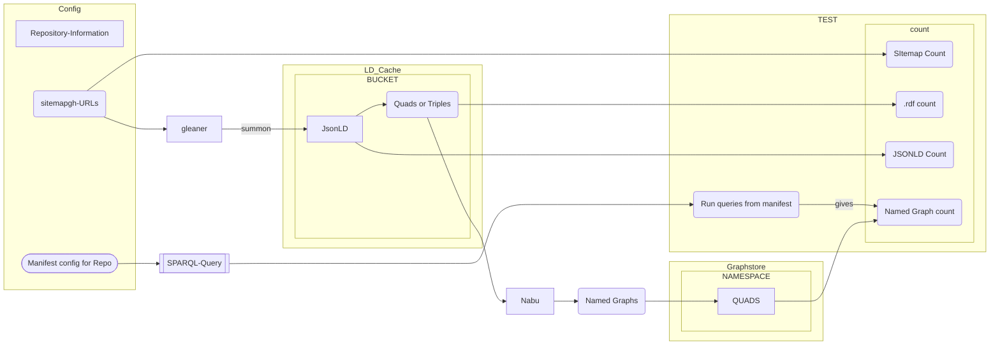
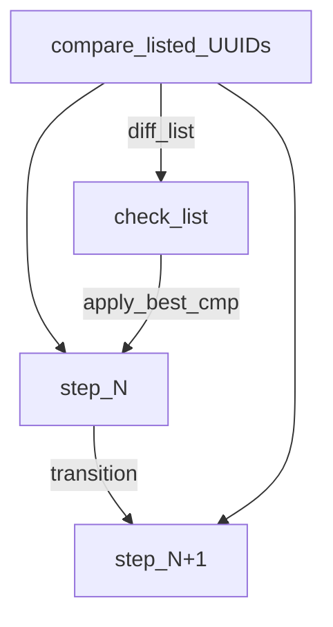

# From [ingestTesting.md](https://github.com/MBcode/ec/blob/master/test/ingestTesting.md) sec2: on (CI spot) testing
### The .md version derived from [.ipynb](ingesttesting.ipynb) version, with a focus on documentation only, and adding diagrams

Here are the parts that the doc was broken into:

1) How the [counts](https://github.com/MBcode/ec/blob/master/test/counts.md) from the repo-sitemaps sometimes fall off in the LD-cache (jsonld&ntriples), then also not getting into the endpoint
2) Then from the original cut of spot testing, but [now just new code and img below](https://github.com/MBcode/ec/blob/master/test/testing.md)=this page, is getting a rewrite to just focus on that
3) How to best [sample](https://github.com/MBcode/ec/blob/master/test/sample.md) from the sitemaps, which has become a test set, w/the hash naming in ec/test/standard/ summoned&milled


### Starting to split all content below into the [new-way](testing2.md) and the [old-way](testing1.md)
* [Old-way](testing1.md) was written first for spot testing
* [New-way](testing2.md) makes it more natural to do more testing all the time, and get a little more during spot testing

### Some differences
* New won't need expected URNs/sparql-results necessarily, because it only test the new fall-off from the stage before
* New has much better integration with non spot testing; which could have done counts as a backup
* New, non spot testing could have done more than just count falloff, always worth IDing which files got lost
   * and can do some integrity checks w/o having a gold stnd to compare against
* New still uses the old's check_urn_ jsonld|rdf but does it only when the next step is missing
* Old did a web check of LD, New does a web listing, so even easier to fill in extruct/riot backup for gleaner/nabu
  * Would like python to kick off gleaner|extruct then riot|nabu incl serving final quad, so less manual yaml setup
* New parses PROV to get sitemap URLs run and UUIDs generated, so sitemap optional, and can find falloff in that step now too

### Below is the new way then the old way, which I will delete in favor of the 2 links above

### .
### Have [expected_results.csv](https://github.com/MBcode/ec/blob/master/test/expected_results.csv) along w/a [sitemap.xml](https://github.com/MBcode/ec/blob/master/test/sitemap.xml) that we can add more bad cases to [compare](https://github.com/MBcode/ec/blob/master/ec.py#L2496)

### .
### .
### .
### .delete everything below this

### Sec2: CI spot testing.md

Everything below is done against a gold-standard to test the workflow, has the same function

Different checks will be used for production, where we only have expected [counts](counts.md)

## what gets passed into the Notebook
This should be read from/passed to the notebook. Suggest as a JSON structure. Needs to be short and Hashcoded url

Though would like it if gleaner/nabu could be run w/o having to touch so many places.

|  Name | Description                                                           |
| ---------- |-----------------------------------------------------------------------|
| config name | name of config directory from glcon                                   |
| org        | short name or repo                                                    |
| sitemap | url of sitemap                                                        |
| LD-cache base | base of s3 url |
|  bucket | name of bucket |
| graph base | base url of graph endpoint |
| graph namespace | name of graph namespace |
| expected results | for testing we might pass in a set of (counts, etc) in json structure |
| pointer to csv | for CI testing  has queries, expected urn's |

## Data Loading: 
### Run end to end, show missing, check in cache, then know count at every stage
Basic Data loading flight testing:
* After each workflow stages transition
    * Get the UUID based IDs for the elements on each side of the transition
    * Get both the change in counts, and specifically which IDs might have been lost
* Use UUID/URN for filename is missing start to check the version just before the transition
    * Check the tranistion worthiness of the earlir vesion
    * If workflow spot testing is being done against a standard, also compare with that
* Scoped software use / blame
    * Gleaner does the crawl into the LD-Cache & 'nabu' transforms the format to put it into 'endpoint'
    * Testing is done with earthcube_utils that use the config info to get the state on both sides of a transition
      * and if spot testing also have the standard comparison data around for closer check
    * If ntriples in cache, but not in endpoint, then blame 'nabu' for not syncing it
    * If the file for the URN is not in the LD-cache as .rdf, then blame nabu
    * If the file for the URN is not in the LD-cache as .jsonld, then blame gleaner


#### Scopes of workflow elements: Gleaner/nabu are the verbs transitioning the data-objects, that we can test for
* We always had the [counts.md](counts.md) fall off, but [now](http://geocodes.ddns.net/ec/test/counts/bucket_files.py) we can tell which of the intermediate data files are broken by diffs with expected listing, 
* then we can check the step before to see the transition worthiness of it
* and when we have expected results during workflow spot testing, we can also compare with that

The Config for normal crawls and spot testing each have a sitemap

Only spot testing of the workflow has expected results

The spot testing comparisons give the change in counts when compared with expected

normal crawls with no expected results need to use the [counts.md](counts.md) utils

spot tests, can still run this counts checking code, even though the comparison w/test set will give it

## How each workflow stage can be checked
given the available (data for) checks

## During a standard run best_compare will check worthiness for the transition
## During spot_testing of the workflow, we can also compare with the expected gold standard


### Report
* EC-Testing report of what made it through the Gleaner then nabu stages
   * Report counts at each stage
   * For workflow spot-testing can report any diffs as well
      * Endpoint comparison can give more than URN diffs.  We can track any value changes as well
      * Any graph that changes, when found can be diff'd with it's gold-standard version. To report those changes
* Count/diffs given with view of the scope of the workflow software
   * count(LD_cache jsonld missing or broken) assigned to gleaner
   * count(LD_cache ntriples missing or broken) assigned to nabu, if gleaner had the jsonld
   * count(QUADs missing) assigned to nabu, if earlier stage was there
      * (sitemap_count == spot expected URN_count) - (count_graphs(endpoint) == count(spot URNs expected)) == missing graphs/URNs
      * Can always get count.md number, but can only get diffs of broken by comparing with spot test gold standard
* SCHACL Validation reports [(TBD) for a repo_dashboard](repo-dashboard.md)

## Example of testing stages 
### where checks just get better during workflow spot check with standard data to compare with

### [counts.md](counts.md) now has crawl_dropoff() which can be done each time, 
It shows count-drop and URNs of files lost, and could do basic check for tranistion worthiness

### For spot checking a workflow, spot_crawl_dropoff() does all the above and checks with saved standard data
Here for a test-sitemap will also call all the check_urn_ jsonld|rdf if lost in next step
 
#### spot checks are done with one sitemap, while general runs can have many
 _when many sitemaps run, it can report from each names repo: in the quad store graphs, with: get_graph_per_repo()_
 
### .
### .
 
 _Above is an alternate way of doing the counts & checking compared to  below_ So I will incl/replace this soon

### .
### .

## Everything below here is starting with end to end testing, 
### where it goes back and checking the 2 middle stages if a problem
But [now](http://geocodes.ddns.net/ec/test/counts/bucket_files.py) we can always do a step by step check, that just gets better if we have standard data to compare with

## Data Loading: 
### Run end to end, show missing, check in cache, then know count at every stage
Basic Data loading flight testing:
* Run end to end, sitemap to endpoint
    * Query endpoint to get graph/filename URN names that might be missing
    * Gives you counts for the last step, and an easier way to lookup middle steps
* Use URN for filename in LD-cache to check to see if missing there as well
    * Check LD-cache for both types of RDF: summoned jsonld and milled ntriples
    * Will give us both the counts for these stages, and any diffs, to help debug process
* Scoped software use / blame
    * Gleaner & 'nabu' to get  sitemap to 'endpoint', and be able to find if all the expected graphs made it
    * Testing is done with earthcube_utils, that check the endpoint graphs against the expected, and check cache for missing
    * If ntriples in cache, but not in endpoint, then blame 'nabu' for not syncing it
    * If the file for the URN is not in the LD-cache as .rdf, then blame nabu
    * If the file for the URN is not in the LD-cache as .jsonld, then blame gleaner
    
#### Scopes of workflow elements: Gleaner/nabu are the verbs transitioning the data-objects, that we can test for
We can always get the [counts.md](counts.md) fall off, but we can best tell if the intermediate data files are broken by diffs with expected results during workflow spot testing. Though with URN listing from each stage we could [better check them in prod](http://geocodes.ddns.net/ec/test/counts/bucket_files.py).

The Config for normal crawls and spot testing each have a sitemap

Only spot testing of the workflow has expected results

The spot testing comparisons give the change in counts when compared with expected

normal crawls with no expected results need to use the [counts.md](counts.md) utils

spot tests, can still run this counts checking code, even though the comparison w/test set will give it

## Crawl-workflow (gleaner/nabu) spot tests
* Run query on test-endpoint to get graph-URNs and other expected values
* Compare retrieved URNs with expected, then use missing-URNs to look them up in the LD-Cache
* Look up both RDF formats (jsonld and ntriples) and compare with gold standard, return any diffs
```mermaid
flowchart LR
   subgraph LD_Cache
      RDF(Quads or Triples)
      JsonLD
   end
   subgraph Graphstore
      subgraph NAMESPACE
         QUADS
      end
   end
   subgraph config
      SG(sitemapgh-URLs)
      subgraph expected_results
         EU(expected URNs)  
         ELD(expected LD)
      end
   end
   SG -- gleaner --> JsonLD
   JsonLD -- nabu --> RDF
   RDF -- nabu --> QUADS
   subgraph testing utils
       CU(cmp_URNs)  -- use_missing --> CLD(cmp_LD)
   end
   CU --> EU
   CU -- query --> QUADS
   CLD --> ELD
   CLD --> LD_Cache
 ```
 * cmp_URNs gives count of (missing) in the last stage
   * retrieved_URNs - expected_URNs = missing_URNs
   * count(missing_URNs) = sitemap_count - count(retrieved_URNs) 
* use_missing that didn't make it into the graph to call cmp_LD to find out their state
* cmp_LD give count of (missing) from intermediate stages
   * Assume if made it into graph that cached LD was ok, but can still do [counts.md](counts.md)
   * If not in graph, either missing or broken, so determine this with cmp_LD routines
      * returns True for each format if ok
      * returns diff if differs, incl if missing or can just return 'missing'
   * LD_cache count = sitemap_count - count(missing_URNs) + count(cmp_LD say are ok)
      * so spot-testing can be a little more detailed with count of broken = count(cmp_LD say have diffs)
      
## Example of config spot-testing standards and comparisons


#### Got end-to-end expected [sparql](standard/qry1.txt)-to->[df](standard/queryResults1.csv)/[URNs](https://github.com/MBcode/ec/blob/master/test/standard/milled/geocodes_demo_datasets/URNs.txt), for 1st comparison below
next I use diff in df to find missing URNs, and look in LD-cache for them (bc of gleaner naming)
Check both jsonld and other rdf, with standard values
in [ingestTesting.md](https://github.com/MBcode/ec/blob/master/test/ingestTesting.md) sec 2, still have dictdiff and rdflib graph cmp
but now also have output from [blabel](https://github.com/aidhog/blabel/) that removes BlankNodes+some dups, for easier nt file comparison
```mermaid
flowchart TD
U[sitemap gh-URLs] -- crawl --> J[jsonLD file] -- convert --> G[.nt or .nq version] -- load --> T[test_endpoint];
T -- query --> TR[test_results];
TR -- compare-with --> GR[gold_results] -- get --> M[missinging URNs] -- use2 --> C[check_LD_cache] -- cmp_nt --> G;
C --  cmp_jsonld --> J;
J -- compare-with --> JG[gold standard jsonLD];
G -- compare-with --> GG[gold standard triples]
```

#now we have the new spot check code, for each missing graph in the endpoint
#that looks at latest run's LD_cache and compare with gold-standard in github


```python
#cmp_jsonld:
#new version that looks to github for gold-stnd and ld-cache bucket from latest run:
jld_eq=ec.check_urn_jsonld("11316929f925029101493e8a05d043b0ae829559") #for each URN that might be missing
jld_eq
```

    read_json:https://raw.githubusercontent.com/MBcode/ec/master/test/standard/summoned/geocodes_demo_datasets/11316929f925029101493e8a05d043b0ae829559.jsonld
    read_json:https://oss.geocodes-dev.earthcube.org/citesting/summoned/geocodes_demo_datasets/11316929f925029101493e8a05d043b0ae829559.jsonld


    True


```python
#cmp_nt:
#now can also do this for ld-cache of the ntriples
nt_eq=ec.check_urn_rdf("11316929f925029101493e8a05d043b0ae829559") #fix so skips header
nt_eq
```

    read_sd:https://raw.githubusercontent.com/MBcode/ec/master/test/standard/milled/geocodes_demo_datasets/11316929f925029101493e8a05d043b0ae829559.rdf
    read_sd:https://oss.geocodes-dev.earthcube.org/citesting/milled/geocodes_demo_datasets/11316929f925029101493e8a05d043b0ae829559.rdf


    True


```python
#q=ec.init_sparql()
#can do for all the URNs that don't make it to the end of the workflow
missing_URNs=ec.get_urn_diffs()
missing_URNs
```

    find_urn_diffs:http://ideational.ddns.net:3030/geocodes_demo_datasets/sparql,https://raw.githubusercontent.com/MBcode/ec/master/test/standard/milled/geocodes_demo_datasets/URNs.txt
    in find_urn_diffs,read_sd gold
    gold:                                               g
    0   urn:ed2951175523219d05de578b6065cea156c68545
    1   urn:ed2951175523219d05de578b6065cea156c68545
    2   urn:d8e168385b0f8e0c562af2c185d804e6a35aa248
    3   urn:9a17d3fe8da1fe10866333f856986df012bff341
    4   urn:11316929f925029101493e8a05d043b0ae829559
    5   urn:261c022db9edea9e4fc025987f1826ee7a704f06
    6   urn:b2fb074695be7e40d5ad5d524d92bba32325249b
    7   urn:ce020471830dc75cb1639eae403a883f9072bb60
    8   urn:509e465d0793506b237cea8069c3cb2d276fe9c2
    9   urn:ed2951175523219d05de578b6065cea156c68545
    10  urn:8d045db20860bef9ddb33e856f95c31d6eca8206
    11  urn:8e590ac37fd8ff4442522304057a328fad5f5098
    12  urn:fe3c7c4f7ca08495b8962e079920c06676d5a166
    13  urn:7435cba44745748adfe80192c389f77d66d0e909
    14  urn:261c022db9edea9e4fc025987f1826ee7a704f06
    15  urn:b2fb074695be7e40d5ad5d524d92bba32325249b
    16  urn:40d84a8722ddae799976a0714a7af73576d7f8c0
    17  urn:bcc801ddac04636689f5bcca5dd6910ae4f548d7
    18  urn:4af74d8dd359a14000f48c3f6a1309d39d5142ce
    19  urn:1c1d4cefef851335a3311a6e3f964deaab6098e6
    20  urn:09517b808d22d1e828221390c845b6edef7e7a40
    21  urn:f4752b57d0e5434c4452136725294f755700313c
    test:['urn:7b72dec10f2359b1ab72fa3b409b4f8e691cb699', 'urn:b2fb074695be7e40d5ad5d524d92bba32325249b', 'urn:11316929f925029101493e8a05d043b0ae829559', 'urn:9a17d3fe8da1fe10866333f856986df012bff341', 'urn:40d84a8722ddae799976a0714a7af73576d7f8c0', 'urn:4af74d8dd359a14000f48c3f6a1309d39d5142ce', 'urn:fe897ff59f2f8478c24e6d17ea28df48c3bc8f69', 'urn:b62d103d4812ac2df9f2f148d9f4a3933b51abb3', 'urn:09517b808d22d1e828221390c845b6edef7e7a40', 'urn:ce020471830dc75cb1639eae403a883f9072bb60', 'urn:f4752b57d0e5434c4452136725294f755700313c', 'urn:d8e168385b0f8e0c562af2c185d804e6a35aa248', 'urn:1c1d4cefef851335a3311a6e3f964deaab6098e6', 'urn:bcc801ddac04636689f5bcca5dd6910ae4f548d7', 'urn:67e446d6f86ce88ead6335842a7a9d610a03b071', 'urn:509e465d0793506b237cea8069c3cb2d276fe9c2', 'urn:44999966af64df27587cae4aec4a744e51ad852b', 'urn:8e590ac37fd8ff4442522304057a328fad5f5098', 'urn:8d045db20860bef9ddb33e856f95c31d6eca8206', 'urn:fe3c7c4f7ca08495b8962e079920c06676d5a166', 'urn:23006491dd1bec061f6ab39e43278123ed59e359', 'urn:5288b5aa49d11829c5ab6777bb769cba4f40bd03', 'urn:ed2951175523219d05de578b6065cea156c68545', 'urn:7435cba44745748adfe80192c389f77d66d0e909', 'urn:2a328e672986c936715c52e82c519b9c34c6fafa', 'urn:261c022db9edea9e4fc025987f1826ee7a704f06']
    gold:['urn:ed2951175523219d05de578b6065cea156c68545', 'urn:ed2951175523219d05de578b6065cea156c68545', 'urn:d8e168385b0f8e0c562af2c185d804e6a35aa248', 'urn:9a17d3fe8da1fe10866333f856986df012bff341', 'urn:11316929f925029101493e8a05d043b0ae829559', 'urn:261c022db9edea9e4fc025987f1826ee7a704f06', 'urn:b2fb074695be7e40d5ad5d524d92bba32325249b', 'urn:ce020471830dc75cb1639eae403a883f9072bb60', 'urn:509e465d0793506b237cea8069c3cb2d276fe9c2', 'urn:ed2951175523219d05de578b6065cea156c68545', 'urn:8d045db20860bef9ddb33e856f95c31d6eca8206', 'urn:8e590ac37fd8ff4442522304057a328fad5f5098', 'urn:fe3c7c4f7ca08495b8962e079920c06676d5a166', 'urn:7435cba44745748adfe80192c389f77d66d0e909', 'urn:261c022db9edea9e4fc025987f1826ee7a704f06', 'urn:b2fb074695be7e40d5ad5d524d92bba32325249b', 'urn:40d84a8722ddae799976a0714a7af73576d7f8c0', 'urn:bcc801ddac04636689f5bcca5dd6910ae4f548d7', 'urn:4af74d8dd359a14000f48c3f6a1309d39d5142ce', 'urn:1c1d4cefef851335a3311a6e3f964deaab6098e6', 'urn:09517b808d22d1e828221390c845b6edef7e7a40', 'urn:f4752b57d0e5434c4452136725294f755700313c']
    got:26,expected:22


    []


```python
#none missing, but could pretend one was
missing_URNs=["11316929f925029101493e8a05d043b0ae829559"]
ld_checks= list(map(check_urn_ld_cache,missing_URNs))
ld_checks
```

    new rdf:https://oss.geocodes-dev.earthcube.org/citesting/milled/geocodes_demo_datasets/
    read_sd:https://raw.githubusercontent.com/MBcode/ec/master/test/standard/milled/geocodes_demo_datasets/11316929f925029101493e8a05d043b0ae829559.rdf
    read_sd:https://oss.geocodes-dev.earthcube.org/citesting/milled/geocodes_demo_datasets/11316929f925029101493e8a05d043b0ae829559.rdf
    new jsonld:https://oss.geocodes-dev.earthcube.org/citesting/summoned/geocodes_demo_datasets/
    read_json:https://raw.githubusercontent.com/MBcode/ec/master/test/standard/summoned/geocodes_demo_datasets/11316929f925029101493e8a05d043b0ae829559.jsonld
    read_json:https://oss.geocodes-dev.earthcube.org/citesting/summoned/geocodes_demo_datasets/11316929f925029101493e8a05d043b0ae829559.jsonld


    [(True, True)]


#all the above is wrapped into one validation function, 
#that will be called with papermill to make sure workflow stages still ok=True

## [counts.md](counts.md) now has crawl_dropoff() which can be done each time, and shows count-drop and URNs of files lost
### _when many sitemaps run, it can report from each names repo: in the quad store graphs, with: get_graph_per_repo()_
## It also has a spot_crawl_dropoff() that for a test-sitemap will also call all the check_urn_ jsonld|rdf if lost in next step
### _This is an alternate way of doing the counts & checking in the example just above_ So I will incl/replace this soon

### the expected_urls.csv or dataset_tests.csv will get finer grain, incl all the tests a dataset will go through
Right now I think most in standard will complete, but need to know which don't and why; will look at SR's look at this

We have a few test jsonld instances in 
[GeoCODES-Metadata](https://github.com/earthcube/GeoCODES-Metadatatree/main/metadata) that probably need their dataset_tests.csv to have finer grain expectations of the results of the tests; also to have the ability to have more than one test run; download, json conformance, and then to have some things that just go to a [repo-dashboard of warnings](repo-dashboard.md), like schema conformance.
 As long as it also tests well to turining into triples, and getting asserted in the triplestore, we should still do a text-bases search on it's strings.
 But even beyond conformance, the metadata has a way to go, to have better machine actionablitity.
 

### other docs started [here](https://github.com/MBcode/ec/tree/master/doc)
