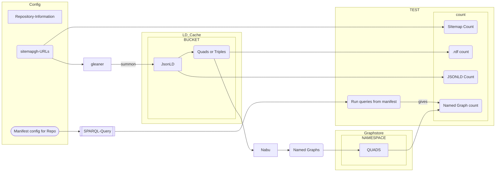
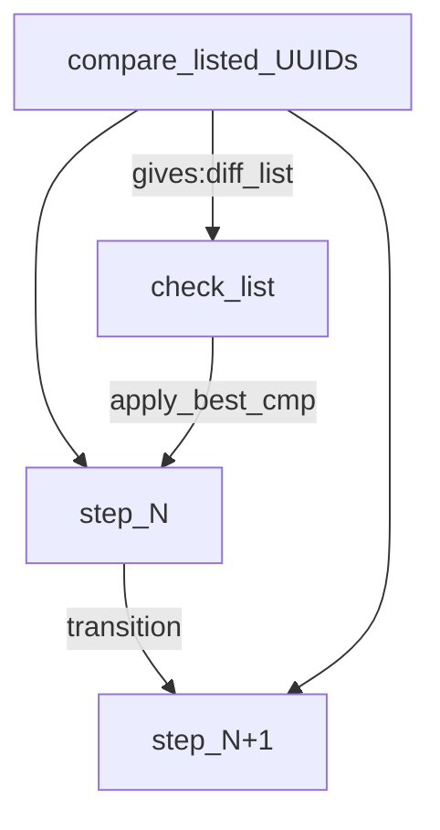
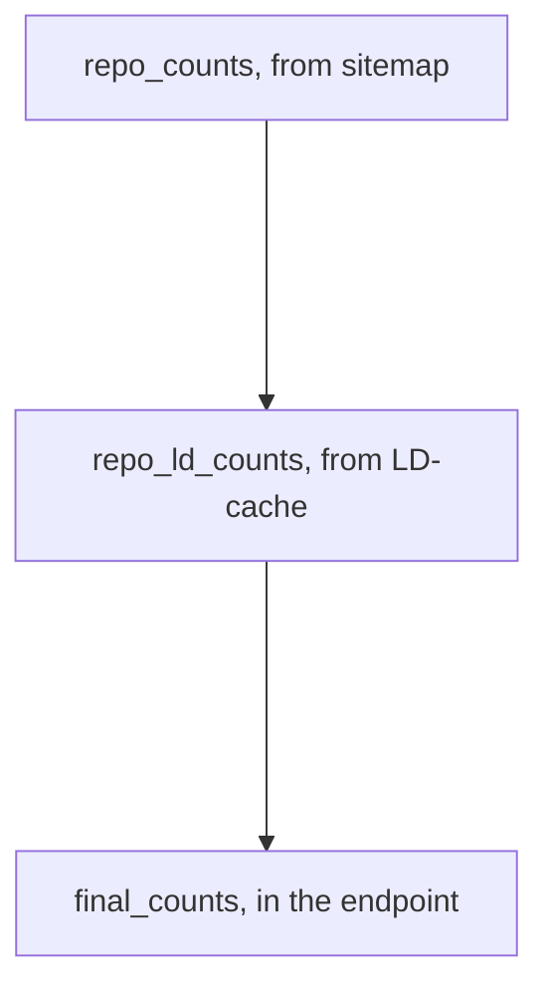

# From [ingestTesting.md](https://github.com/MBcode/ec/blob/master/test/ingestTesting.md) sec2: on (CI) spot testing
### The .md version derived from [.ipynb](ingesttesting.ipynb) version, with a focus on documentation only, and adding diagrams

Here are the parts that the doc was broken into:

1) How the [counts](https://github.com/MBcode/ec/blob/master/test/counts.md) from the repo-sitemaps sometimes fall off in the LD-cache (jsonld&ntriples), then also not getting into the endpoint
2) Then from the original cut of spot testing, but [now just new code and img below](https://github.com/MBcode/ec/blob/master/test/testing.md)=this page, is getting a rewrite to just focus on that
3) How to best [sample](https://github.com/MBcode/ec/blob/master/test/sample.md) from the sitemaps, which has become a test set, w/the hash naming in ec/test/standard/ summoned&milled

### Sec2: CI spot testing.md

Everything below is done against a gold-standard to test the workflow, has the same function

Different checks will be used for production, where we only have expected [counts](counts.md)

## what gets passed into the Notebook
This should be read from/passed to the notebook. Suggest as a JSON structure. Needs to be short and Hashcoded url

Though would like it if gleaner/nabu could be run w/o having to touch so many places.

|  Name | Description                                                           |
| ---------- |-----------------------------------------------------------------------|
| config name | name of config directory from glcon                                   |
| org        | short name or repo                                                    |
| sitemap | url of sitemap                                                        |
| LD-cache base | base of s3 url |
|  bucket | name of bucket |
| graph base | base url of graph endpoint |
| graph namespace | name of graph namespace |
| expected results | for testing we might pass in a set of (counts, etc) in json structure |
| pointer to csv | for CI testing  has queries, expected urn's |

## Data Loading: 
### Run end to end, show missing, check in cache, then know count at every stage
Basic Data loading flight testing:
* After each workflow stages transition
    * Get the UUID based IDs for the elements on each side of the transition
    * Get both the change in counts, and specifically which IDs might have been lost
* Use UUID/URN for filename is missing start to check the version just before the transition
    * Check the tranistion worthiness of the earlir vesion
    * If workflow spot testing is being done against a standard, also compare with that
* Scoped software use / blame
    * Gleaner does the crawl into the LD-Cache & 'nabu' transforms the format to put it into 'endpoint'
    * Testing is done with earthcube_utils that use the config info to get the state on both sides of a transition
      * and if spot testing also have the standard comparison data around for closer check
    * If ntriples in cache, but not in endpoint, then blame 'nabu' for not syncing it
    * If the file for the URN is not in the LD-cache as .rdf, then blame nabu
    * If the file for the URN is not in the LD-cache as .jsonld, then blame gleaner


even this diagram will get a little more simple, not needing all the test info
#### Scopes of workflow elements: Gleaner/nabu are the verbs transitioning the data-objects, that we can test for
* We always had the [counts.md](counts.md) fall off, but [now](http://geocodes.ddns.net/ec/test/counts/bucket_files.py) we can tell which of the intermediate data files are broken by diffs with expected listing, 
* then we can check the step before to see the transition worthiness of it
* and when we have expected results during workflow spot testing, we can also compare with that

The Config for normal crawls and spot testing each have a sitemap

Only spot testing of the workflow has expected results

The spot testing comparisons give the change in counts when compared with expected

normal crawls with no expected results need to use the [counts.md](counts.md) utils

spot tests, can still run this counts checking code, even though the comparison w/test set will give it

## How each workflow stage can be checked
given the available (data for) checks

## During a standard run best_compare will check worthiness for the transition
## During spot_testing of the workflow, we can also compare with the expected gold standard


### Report
* EC-Testing report of what made it through the Gleaner then nabu stages
   * Report counts at each stage
   * For workflow spot-testing can report any diffs as well
      * Endpoint comparison can give more than URN diffs.  We can track any value changes as well
      * Any graph that changes, when found can be diff'd with it's gold-standard version. To report those changes
* Count/diffs given with view of the scope of the workflow software
   * count(LD_cache jsonld missing or broken) assigned to gleaner
   * count(LD_cache ntriples missing or broken) assigned to nabu, if gleaner had the jsonld
   * count(QUADs missing) assigned to nabu, if earlier stage was there
      * (sitemap_count == spot expected URN_count) - (count_graphs(endpoint) == count(spot URNs expected)) == missing graphs/URNs
      * Can always get count.md number, but can only get diffs of broken by comparing with spot test gold standard
* SCHACL Validation reports [(TBD) for a repo_dashboard](repo-dashboard.md)

## Example of testing stages 
### where checks just get better during workflow spot check with standard data to compare with

### [counts.md](counts.md) now has crawl_dropoff() which can be done each time, 
It shows count-drop and URNs of files lost, and could do basic check for tranistion worthiness

### For spot checking a workflow, spot_crawl_dropoff() does all the above and checks with saved standard data
Here for a test-sitemap will also call all the check_urn_ jsonld|rdf if lost in next step
 
#### spot checks are done with one sitemap, while general runs can have many
 _when many sitemaps run, it can report from each names repo: in the quad store graphs, with: get_graph_per_repo()_
 
 _Above is an alternate way of doing the counts & checking compared to  below_ So I will incl/replace this soon

# GeoCODES ingest pipeline testing:

Update: Might be able to get which URNs went missing along with counts, btw all stages w/files names with the URN=shah UUID

Also, looks like can get some listings w/o depending on s3fs, wich is in utils now; from test/[counts](http://geocodes.ddns.net/ec/test/counts/)/bucket_files.py

Be able to 1) check how many of the expected datasets from the sitemap make it to differt stages
then 2) go back and see that some of what made it are correct/valid and similar to expected/saved test-set values  3) best way to get a test set sample

```python
ec.init_sparql()
```
```python
ec.setup_sitemap()
```


```python
ec.setup_s3fs() #now sets up web based access
```

## Now can get web based count dropoffs all in one call:


```python
 dropoff,lose_s2m, lose_m2u= ec.crawl_dropoff("https://raw.githubusercontent.com/earthcube/GeoCODES-Metadata/mb_sample/metadata/Dataset/standard/sitemap.xml",
                    "https://oss.geocodes-dev.earthcube.org/citesting","http://ideational.ddns.net:3030/geocodes_demo_datasets/sparql")
 print(dropoff)
```

    INFO:root:Getting https://raw.githubusercontent.com/earthcube/GeoCODES-Metadata/mb_sample/metadata/Dataset/standard/sitemap.xml


    summoned-URNs:['09517b808d22d1e828221390c845b6edef7e7a40', '11316929f925029101493e8a05d043b0ae829559', '1c1d4cefef851335a3311a6e3f964deaab6098e6', '23006491dd1bec061f6ab39e43278123ed59e359', '261c022db9edea9e4fc025987f1826ee7a704f06', '2a328e672986c936715c52e82c519b9c34c6fafa', '40d84a8722ddae799976a0714a7af73576d7f8c0', '44999966af64df27587cae4aec4a744e51ad852b', '4af74d8dd359a14000f48c3f6a1309d39d5142ce', '5288b5aa49d11829c5ab6777bb769cba4f40bd03', '67e446d6f86ce88ead6335842a7a9d610a03b071', '7435cba44745748adfe80192c389f77d66d0e909', '7b72dec10f2359b1ab72fa3b409b4f8e691cb699', '8d045db20860bef9ddb33e856f95c31d6eca8206', '8e590ac37fd8ff4442522304057a328fad5f5098', '9a17d3fe8da1fe10866333f856986df012bff341', 'b2fb074695be7e40d5ad5d524d92bba32325249b', 'b62d103d4812ac2df9f2f148d9f4a3933b51abb3', 'bcc801ddac04636689f5bcca5dd6910ae4f548d7', 'ce020471830dc75cb1639eae403a883f9072bb60', 'd8e168385b0f8e0c562af2c185d804e6a35aa248', 'ed2951175523219d05de578b6065cea156c68545', 'f4752b57d0e5434c4452136725294f755700313c', 'fe3c7c4f7ca08495b8962e079920c06676d5a166', 'fe897ff59f2f8478c24e6d17ea28df48c3bc8f69']
    milled-URNs:['09517b808d22d1e828221390c845b6edef7e7a40', '11316929f925029101493e8a05d043b0ae829559', '1c1d4cefef851335a3311a6e3f964deaab6098e6', '23006491dd1bec061f6ab39e43278123ed59e359', '261c022db9edea9e4fc025987f1826ee7a704f06', '2a328e672986c936715c52e82c519b9c34c6fafa', '40d84a8722ddae799976a0714a7af73576d7f8c0', '44999966af64df27587cae4aec4a744e51ad852b', '4af74d8dd359a14000f48c3f6a1309d39d5142ce', '5288b5aa49d11829c5ab6777bb769cba4f40bd03', '67e446d6f86ce88ead6335842a7a9d610a03b071', '7435cba44745748adfe80192c389f77d66d0e909', '7b72dec10f2359b1ab72fa3b409b4f8e691cb699', '8d045db20860bef9ddb33e856f95c31d6eca8206', '8e590ac37fd8ff4442522304057a328fad5f5098', '9a17d3fe8da1fe10866333f856986df012bff341', 'b2fb074695be7e40d5ad5d524d92bba32325249b', 'b62d103d4812ac2df9f2f148d9f4a3933b51abb3', 'bcc801ddac04636689f5bcca5dd6910ae4f548d7', 'ce020471830dc75cb1639eae403a883f9072bb60', 'd8e168385b0f8e0c562af2c185d804e6a35aa248', 'ed2951175523219d05de578b6065cea156c68545', 'f4752b57d0e5434c4452136725294f755700313c', 'fe3c7c4f7ca08495b8962e079920c06676d5a166', 'fe897ff59f2f8478c24e6d17ea28df48c3bc8f69']
    expected-URNs:['urn:7b72dec10f2359b1ab72fa3b409b4f8e691cb699', 'urn:b2fb074695be7e40d5ad5d524d92bba32325249b', 'urn:11316929f925029101493e8a05d043b0ae829559', 'urn:9a17d3fe8da1fe10866333f856986df012bff341', 'urn:40d84a8722ddae799976a0714a7af73576d7f8c0', 'urn:4af74d8dd359a14000f48c3f6a1309d39d5142ce', 'urn:fe897ff59f2f8478c24e6d17ea28df48c3bc8f69', 'urn:b62d103d4812ac2df9f2f148d9f4a3933b51abb3', 'urn:09517b808d22d1e828221390c845b6edef7e7a40', 'urn:ce020471830dc75cb1639eae403a883f9072bb60', 'urn:f4752b57d0e5434c4452136725294f755700313c', 'urn:d8e168385b0f8e0c562af2c185d804e6a35aa248', 'urn:1c1d4cefef851335a3311a6e3f964deaab6098e6', 'urn:bcc801ddac04636689f5bcca5dd6910ae4f548d7', 'urn:67e446d6f86ce88ead6335842a7a9d610a03b071', 'urn:509e465d0793506b237cea8069c3cb2d276fe9c2', 'urn:44999966af64df27587cae4aec4a744e51ad852b', 'urn:8e590ac37fd8ff4442522304057a328fad5f5098', 'urn:8d045db20860bef9ddb33e856f95c31d6eca8206', 'urn:fe3c7c4f7ca08495b8962e079920c06676d5a166', 'urn:23006491dd1bec061f6ab39e43278123ed59e359', 'urn:5288b5aa49d11829c5ab6777bb769cba4f40bd03', 'urn:ed2951175523219d05de578b6065cea156c68545', 'urn:7435cba44745748adfe80192c389f77d66d0e909', 'urn:2a328e672986c936715c52e82c519b9c34c6fafa', 'urn:261c022db9edea9e4fc025987f1826ee7a704f06']
    summoned:25-0=>milled:25--1=>graph:26
    sitemap:10 =>summoned:25-0=>milled:25--1=>graph:26


## and to spot_check the workflow against a gold standard, can also include those checks:
```python
dropoff,lose_s2m, s_check, lose_m2u, m_check= ec.spot_crawl_dropoff("https://raw.githubusercontent.com/earthcube/GeoCODES-Metadata/mb_sample/metadata/Dataset/standard/sitemap.xml",
                    "https://oss.geocodes-dev.earthcube.org/citesting","http://ideational.ddns.net:3030/geocodes_demo_datasets/sparql")
print(dropoff)
```

    INFO:root:Getting https://raw.githubusercontent.com/earthcube/GeoCODES-Metadata/mb_sample/metadata/Dataset/standard/sitemap.xml


    summoned-URNs:['09517b808d22d1e828221390c845b6edef7e7a40', '11316929f925029101493e8a05d043b0ae829559', '1c1d4cefef851335a3311a6e3f964deaab6098e6', '23006491dd1bec061f6ab39e43278123ed59e359', '261c022db9edea9e4fc025987f1826ee7a704f06', '2a328e672986c936715c52e82c519b9c34c6fafa', '40d84a8722ddae799976a0714a7af73576d7f8c0', '44999966af64df27587cae4aec4a744e51ad852b', '4af74d8dd359a14000f48c3f6a1309d39d5142ce', '5288b5aa49d11829c5ab6777bb769cba4f40bd03', '67e446d6f86ce88ead6335842a7a9d610a03b071', '7435cba44745748adfe80192c389f77d66d0e909', '7b72dec10f2359b1ab72fa3b409b4f8e691cb699', '8d045db20860bef9ddb33e856f95c31d6eca8206', '8e590ac37fd8ff4442522304057a328fad5f5098', '9a17d3fe8da1fe10866333f856986df012bff341', 'b2fb074695be7e40d5ad5d524d92bba32325249b', 'b62d103d4812ac2df9f2f148d9f4a3933b51abb3', 'bcc801ddac04636689f5bcca5dd6910ae4f548d7', 'ce020471830dc75cb1639eae403a883f9072bb60', 'd8e168385b0f8e0c562af2c185d804e6a35aa248', 'ed2951175523219d05de578b6065cea156c68545', 'f4752b57d0e5434c4452136725294f755700313c', 'fe3c7c4f7ca08495b8962e079920c06676d5a166', 'fe897ff59f2f8478c24e6d17ea28df48c3bc8f69']
    milled-URNs:['09517b808d22d1e828221390c845b6edef7e7a40', '11316929f925029101493e8a05d043b0ae829559', '1c1d4cefef851335a3311a6e3f964deaab6098e6', '23006491dd1bec061f6ab39e43278123ed59e359', '261c022db9edea9e4fc025987f1826ee7a704f06', '2a328e672986c936715c52e82c519b9c34c6fafa', '40d84a8722ddae799976a0714a7af73576d7f8c0', '44999966af64df27587cae4aec4a744e51ad852b', '4af74d8dd359a14000f48c3f6a1309d39d5142ce', '5288b5aa49d11829c5ab6777bb769cba4f40bd03', '67e446d6f86ce88ead6335842a7a9d610a03b071', '7435cba44745748adfe80192c389f77d66d0e909', '7b72dec10f2359b1ab72fa3b409b4f8e691cb699', '8d045db20860bef9ddb33e856f95c31d6eca8206', '8e590ac37fd8ff4442522304057a328fad5f5098', '9a17d3fe8da1fe10866333f856986df012bff341', 'b2fb074695be7e40d5ad5d524d92bba32325249b', 'b62d103d4812ac2df9f2f148d9f4a3933b51abb3', 'bcc801ddac04636689f5bcca5dd6910ae4f548d7', 'ce020471830dc75cb1639eae403a883f9072bb60', 'd8e168385b0f8e0c562af2c185d804e6a35aa248', 'ed2951175523219d05de578b6065cea156c68545', 'f4752b57d0e5434c4452136725294f755700313c', 'fe3c7c4f7ca08495b8962e079920c06676d5a166', 'fe897ff59f2f8478c24e6d17ea28df48c3bc8f69']
    expected-URNs:['urn:7b72dec10f2359b1ab72fa3b409b4f8e691cb699', 'urn:b2fb074695be7e40d5ad5d524d92bba32325249b', 'urn:11316929f925029101493e8a05d043b0ae829559', 'urn:9a17d3fe8da1fe10866333f856986df012bff341', 'urn:40d84a8722ddae799976a0714a7af73576d7f8c0', 'urn:4af74d8dd359a14000f48c3f6a1309d39d5142ce', 'urn:fe897ff59f2f8478c24e6d17ea28df48c3bc8f69', 'urn:b62d103d4812ac2df9f2f148d9f4a3933b51abb3', 'urn:09517b808d22d1e828221390c845b6edef7e7a40', 'urn:ce020471830dc75cb1639eae403a883f9072bb60', 'urn:f4752b57d0e5434c4452136725294f755700313c', 'urn:d8e168385b0f8e0c562af2c185d804e6a35aa248', 'urn:1c1d4cefef851335a3311a6e3f964deaab6098e6', 'urn:bcc801ddac04636689f5bcca5dd6910ae4f548d7', 'urn:67e446d6f86ce88ead6335842a7a9d610a03b071', 'urn:509e465d0793506b237cea8069c3cb2d276fe9c2', 'urn:44999966af64df27587cae4aec4a744e51ad852b', 'urn:8e590ac37fd8ff4442522304057a328fad5f5098', 'urn:8d045db20860bef9ddb33e856f95c31d6eca8206', 'urn:fe3c7c4f7ca08495b8962e079920c06676d5a166', 'urn:23006491dd1bec061f6ab39e43278123ed59e359', 'urn:5288b5aa49d11829c5ab6777bb769cba4f40bd03', 'urn:ed2951175523219d05de578b6065cea156c68545', 'urn:7435cba44745748adfe80192c389f77d66d0e909', 'urn:2a328e672986c936715c52e82c519b9c34c6fafa', 'urn:261c022db9edea9e4fc025987f1826ee7a704f06']
    summoned:25-0=>milled:25--1=>graph:26
    read_sd:https://raw.githubusercontent.com/earthcube/GeoCODES-Metadata/mb_sample/metadata/Dataset/standard/milled/geocodes_demo_datasets/09517b808d22d1e828221390c845b6edef7e7a40.rdf
    read_sd:https://oss.geocodes-dev.earthcube.org/citesting/milled/geocodes_demo_datasets/09517b808d22d1e828221390c845b6edef7e7a40.rdf
    read_sd:https://raw.githubusercontent.com/earthcube/GeoCODES-Metadata/mb_sample/metadata/Dataset/standard/milled/geocodes_demo_datasets/11316929f925029101493e8a05d043b0ae829559.rdf
    read_sd:https://oss.geocodes-dev.earthcube.org/citesting/milled/geocodes_demo_datasets/11316929f925029101493e8a05d043b0ae829559.rdf
    read_sd:https://raw.githubusercontent.com/earthcube/GeoCODES-Metadata/mb_sample/metadata/Dataset/standard/milled/geocodes_demo_datasets/1c1d4cefef851335a3311a6e3f964deaab6098e6.rdf
    read_sd:https://oss.geocodes-dev.earthcube.org/citesting/milled/geocodes_demo_datasets/1c1d4cefef851335a3311a6e3f964deaab6098e6.rdf
    read_sd:https://raw.githubusercontent.com/earthcube/GeoCODES-Metadata/mb_sample/metadata/Dataset/standard/milled/geocodes_demo_datasets/23006491dd1bec061f6ab39e43278123ed59e359.rdf
    read_sd:https://oss.geocodes-dev.earthcube.org/citesting/milled/geocodes_demo_datasets/23006491dd1bec061f6ab39e43278123ed59e359.rdf
    read_sd:https://raw.githubusercontent.com/earthcube/GeoCODES-Metadata/mb_sample/metadata/Dataset/standard/milled/geocodes_demo_datasets/261c022db9edea9e4fc025987f1826ee7a704f06.rdf
    read_sd:https://oss.geocodes-dev.earthcube.org/citesting/milled/geocodes_demo_datasets/261c022db9edea9e4fc025987f1826ee7a704f06.rdf
    read_sd:https://raw.githubusercontent.com/earthcube/GeoCODES-Metadata/mb_sample/metadata/Dataset/standard/milled/geocodes_demo_datasets/2a328e672986c936715c52e82c519b9c34c6fafa.rdf
    read_sd:https://oss.geocodes-dev.earthcube.org/citesting/milled/geocodes_demo_datasets/2a328e672986c936715c52e82c519b9c34c6fafa.rdf
    read_sd:https://raw.githubusercontent.com/earthcube/GeoCODES-Metadata/mb_sample/metadata/Dataset/standard/milled/geocodes_demo_datasets/40d84a8722ddae799976a0714a7af73576d7f8c0.rdf
    read_sd:https://oss.geocodes-dev.earthcube.org/citesting/milled/geocodes_demo_datasets/40d84a8722ddae799976a0714a7af73576d7f8c0.rdf
    read_sd:https://raw.githubusercontent.com/earthcube/GeoCODES-Metadata/mb_sample/metadata/Dataset/standard/milled/geocodes_demo_datasets/44999966af64df27587cae4aec4a744e51ad852b.rdf
    read_sd:https://oss.geocodes-dev.earthcube.org/citesting/milled/geocodes_demo_datasets/44999966af64df27587cae4aec4a744e51ad852b.rdf
    read_sd:https://raw.githubusercontent.com/earthcube/GeoCODES-Metadata/mb_sample/metadata/Dataset/standard/milled/geocodes_demo_datasets/4af74d8dd359a14000f48c3f6a1309d39d5142ce.rdf
    read_sd:https://oss.geocodes-dev.earthcube.org/citesting/milled/geocodes_demo_datasets/4af74d8dd359a14000f48c3f6a1309d39d5142ce.rdf
    read_sd:https://raw.githubusercontent.com/earthcube/GeoCODES-Metadata/mb_sample/metadata/Dataset/standard/milled/geocodes_demo_datasets/5288b5aa49d11829c5ab6777bb769cba4f40bd03.rdf
    read_sd:https://oss.geocodes-dev.earthcube.org/citesting/milled/geocodes_demo_datasets/5288b5aa49d11829c5ab6777bb769cba4f40bd03.rdf
    read_sd:https://raw.githubusercontent.com/earthcube/GeoCODES-Metadata/mb_sample/metadata/Dataset/standard/milled/geocodes_demo_datasets/67e446d6f86ce88ead6335842a7a9d610a03b071.rdf
    read_sd:https://oss.geocodes-dev.earthcube.org/citesting/milled/geocodes_demo_datasets/67e446d6f86ce88ead6335842a7a9d610a03b071.rdf
    read_sd:https://raw.githubusercontent.com/earthcube/GeoCODES-Metadata/mb_sample/metadata/Dataset/standard/milled/geocodes_demo_datasets/7435cba44745748adfe80192c389f77d66d0e909.rdf
    read_sd:https://oss.geocodes-dev.earthcube.org/citesting/milled/geocodes_demo_datasets/7435cba44745748adfe80192c389f77d66d0e909.rdf
    read_sd:https://raw.githubusercontent.com/earthcube/GeoCODES-Metadata/mb_sample/metadata/Dataset/standard/milled/geocodes_demo_datasets/7b72dec10f2359b1ab72fa3b409b4f8e691cb699.rdf
    read_sd:https://oss.geocodes-dev.earthcube.org/citesting/milled/geocodes_demo_datasets/7b72dec10f2359b1ab72fa3b409b4f8e691cb699.rdf
    read_sd:https://raw.githubusercontent.com/earthcube/GeoCODES-Metadata/mb_sample/metadata/Dataset/standard/milled/geocodes_demo_datasets/8d045db20860bef9ddb33e856f95c31d6eca8206.rdf
    read_sd:https://oss.geocodes-dev.earthcube.org/citesting/milled/geocodes_demo_datasets/8d045db20860bef9ddb33e856f95c31d6eca8206.rdf
    read_sd:https://raw.githubusercontent.com/earthcube/GeoCODES-Metadata/mb_sample/metadata/Dataset/standard/milled/geocodes_demo_datasets/8e590ac37fd8ff4442522304057a328fad5f5098.rdf
    read_sd:https://oss.geocodes-dev.earthcube.org/citesting/milled/geocodes_demo_datasets/8e590ac37fd8ff4442522304057a328fad5f5098.rdf
    read_sd:https://raw.githubusercontent.com/earthcube/GeoCODES-Metadata/mb_sample/metadata/Dataset/standard/milled/geocodes_demo_datasets/9a17d3fe8da1fe10866333f856986df012bff341.rdf
    read_sd:https://oss.geocodes-dev.earthcube.org/citesting/milled/geocodes_demo_datasets/9a17d3fe8da1fe10866333f856986df012bff341.rdf
    read_sd:https://raw.githubusercontent.com/earthcube/GeoCODES-Metadata/mb_sample/metadata/Dataset/standard/milled/geocodes_demo_datasets/b2fb074695be7e40d5ad5d524d92bba32325249b.rdf
    read_sd:https://oss.geocodes-dev.earthcube.org/citesting/milled/geocodes_demo_datasets/b2fb074695be7e40d5ad5d524d92bba32325249b.rdf
    read_sd:https://raw.githubusercontent.com/earthcube/GeoCODES-Metadata/mb_sample/metadata/Dataset/standard/milled/geocodes_demo_datasets/b62d103d4812ac2df9f2f148d9f4a3933b51abb3.rdf
    read_sd:https://oss.geocodes-dev.earthcube.org/citesting/milled/geocodes_demo_datasets/b62d103d4812ac2df9f2f148d9f4a3933b51abb3.rdf
    read_sd:https://raw.githubusercontent.com/earthcube/GeoCODES-Metadata/mb_sample/metadata/Dataset/standard/milled/geocodes_demo_datasets/bcc801ddac04636689f5bcca5dd6910ae4f548d7.rdf
    read_sd:https://oss.geocodes-dev.earthcube.org/citesting/milled/geocodes_demo_datasets/bcc801ddac04636689f5bcca5dd6910ae4f548d7.rdf
    read_sd:https://raw.githubusercontent.com/earthcube/GeoCODES-Metadata/mb_sample/metadata/Dataset/standard/milled/geocodes_demo_datasets/ce020471830dc75cb1639eae403a883f9072bb60.rdf
    read_sd:https://oss.geocodes-dev.earthcube.org/citesting/milled/geocodes_demo_datasets/ce020471830dc75cb1639eae403a883f9072bb60.rdf
    read_sd:https://raw.githubusercontent.com/earthcube/GeoCODES-Metadata/mb_sample/metadata/Dataset/standard/milled/geocodes_demo_datasets/d8e168385b0f8e0c562af2c185d804e6a35aa248.rdf
    read_sd:https://oss.geocodes-dev.earthcube.org/citesting/milled/geocodes_demo_datasets/d8e168385b0f8e0c562af2c185d804e6a35aa248.rdf
    read_sd:https://raw.githubusercontent.com/earthcube/GeoCODES-Metadata/mb_sample/metadata/Dataset/standard/milled/geocodes_demo_datasets/ed2951175523219d05de578b6065cea156c68545.rdf
    read_sd:https://oss.geocodes-dev.earthcube.org/citesting/milled/geocodes_demo_datasets/ed2951175523219d05de578b6065cea156c68545.rdf
    read_sd:https://raw.githubusercontent.com/earthcube/GeoCODES-Metadata/mb_sample/metadata/Dataset/standard/milled/geocodes_demo_datasets/f4752b57d0e5434c4452136725294f755700313c.rdf
    read_sd:https://oss.geocodes-dev.earthcube.org/citesting/milled/geocodes_demo_datasets/f4752b57d0e5434c4452136725294f755700313c.rdf
    read_sd:https://raw.githubusercontent.com/earthcube/GeoCODES-Metadata/mb_sample/metadata/Dataset/standard/milled/geocodes_demo_datasets/fe3c7c4f7ca08495b8962e079920c06676d5a166.rdf
    read_sd:https://oss.geocodes-dev.earthcube.org/citesting/milled/geocodes_demo_datasets/fe3c7c4f7ca08495b8962e079920c06676d5a166.rdf
    read_sd:https://raw.githubusercontent.com/earthcube/GeoCODES-Metadata/mb_sample/metadata/Dataset/standard/milled/geocodes_demo_datasets/fe897ff59f2f8478c24e6d17ea28df48c3bc8f69.rdf
    read_sd:https://oss.geocodes-dev.earthcube.org/citesting/milled/geocodes_demo_datasets/fe897ff59f2f8478c24e6d17ea28df48c3bc8f69.rdf
    sitemap:10 =>summoned:25-0=>milled:25--1=>graph:26

```python
print(f'check those that did not make it from summoned to milled:{s_check}')
print(f'check those that did not make it from milled to graph:{m_check}')
```

    check those that did not make it from summoned to milled:[]
    check those that did not make it from milled to graph:[True, True, True, True, True, True, True, True, True, True, True, True, True, True, True, True, True, True, True, True, True, True, True, True, True]


### This above can be done over every sitemap, and m_check will still work

also just added pulling the prov to get the sitemap mapped to the same UUID/urn space, so all stages will git URN diffs

## If many sitemaps go into the same graph in one run, use the last part of this section to split them out:


```python
breakdown= ec.get_graph_per_repo()
print(breakdown)
```

    got:290425 graphs
          3 milled:geocodes_demo_datasets
          5 milled:amgeo
         83 milled:iris
        182 milled:neon
        697 milled:lipidverse
        842 milled:usap-dc
        892 milled:designsafe
       1379 milled:linked.earth
       1649 milled:r2r
       1806 milled:cchdo
       1823 milled:earthchem
       2615 milled:opentopography
       5646 milled:hydroshare
       7807 milled:edi
      10793 milled:iedadata
      12743 milled:magic
      12902 milled:bco-dmo
      13379 milled:ucar

## all of the above should be able to replace all the original counts code below

# 1) Checking counts along the way:

repo_counts(from sitemap) -> repo_ld_counts(from LD-cache) -> final_counts(in the endpoint)



Then unit/end-to-end spot testing of crawl products, to check that code changes don't change outputs

